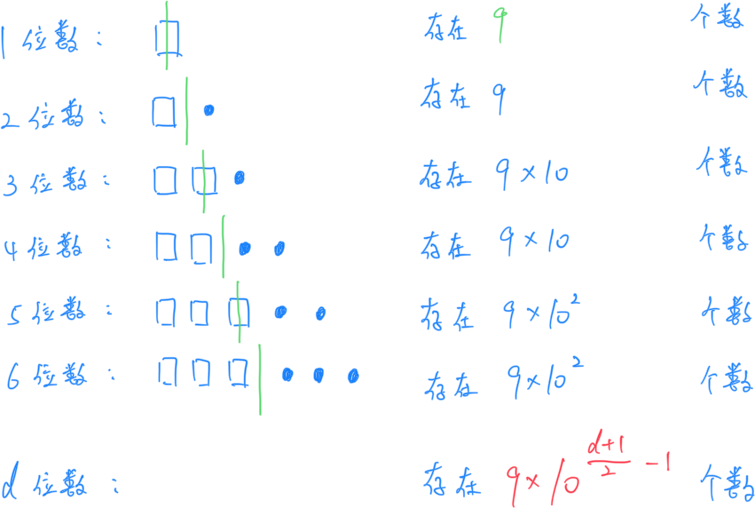
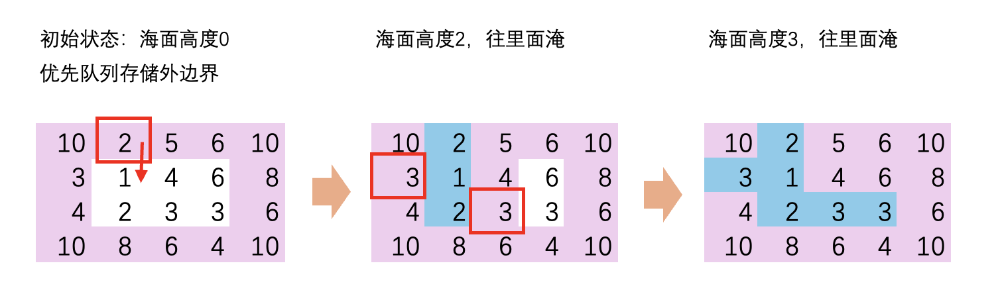

# **A - Piling Up**

、Problem：[A - Piling Up](https://atcoder.jp/contests/abc363/tasks/abc363_a)

省略

```c++
// Problem: https://atcoder.jp/contests/abc363/tasks/abc363_a

#include <bits/stdc++.h>
using namespace std;
typedef long long LL;
typedef pair<int, int> PII;

void solve() {
    int n;
    cin >> n;
    if (n >= 200)
        cout << 300 - n << endl;
    else if (n >= 100)
        cout << 200 - n << endl;
    else
        cout << 100 - n << endl;
}

int main() {
    cin.tie(0);
    ios_base::sync_with_stdio(false);
    solve();
    return 0;
}
```

# **B - Japanese Cursed Doll**

Problem：[B - Japanese Cursed Doll](https://atcoder.jp/contests/abc363/tasks/abc363_b)

省略。

```c++
// Problem: https://atcoder.jp/contests/abc363/tasks/abc363_b

#include <bits/stdc++.h>
using namespace std;
typedef long long LL;
typedef pair<int, int> PII;

const int N = 110;
int cnt[N];
int n, t, p;

void solve() {
    cin >> n >> t >> p;
    for (int i = 0; i < n; i++) {
        int x;
        cin >> x;
        cnt[x]++;
    }

    for (int i = 1; i < N; i++)
        cnt[i] += cnt[i - 1];

    // 遍历长度
    for (int len = 100; len >= 0; len--)
        // 长度为 i 以上的人数达到了 p 人
        if (cnt[100] - cnt[len - 1] >= p) {
            cout << max(0, t - len) << endl;
            break;
        }
}

int main() {
    cin.tie(0);
    ios_base::sync_with_stdio(false);
    solve();
    return 0;
}
```

# **C - Avoid K Palindrome 2**

Problem：[C - Avoid K Palindrome 2](https://atcoder.jp/contests/abc363/tasks/abc363_c)

模拟题。

## 题目：

给定长度为 $N$ 的小写字母字符串 $S$。求 $S$ 的排列数量，且其中不含长度为 $K$ 的回文串子串。

## 约束条件：

$2 \leq K \leq N \leq 10$

## 思路：

按照题目要求进行模拟即可。

关键技术有两个：

	1. 如何求 $S$ 的全排列：使用 `STL` 的全排列函数 `next_permutation` 即可。并且 `next_permutation` 会自动去重。时间复杂度 $O(n!)$。（注意，``next_permutation` 使用前要 `sort`，否则枚举会遗漏）
	1. 如何快速验证回文串：双指针左右向中间夹逼即可。时间复杂度 $O(\frac{n}{2})$

整体时间复杂度最极端情况下是 $O((n-k)\frac{n}{2}n!)$，在本题的规模下大约是 `1e8`，在约束时间范围内。

```c++
// Problem: https://atcoder.jp/contests/abc363/tasks/abc363_c

#include <bits/stdc++.h>
using namespace std;
typedef long long LL;
typedef pair<int, int> PII;

int n, k;
string s;

// 快速判断回文
bool check(int l, int r) {
    while (l < r)
        if (s[l++] != s[r--])
            return 0;
    return 1;
}

void solve() {
    cin >> n >> k;
    cin >> s;
    sort(s.begin(), s.end());

    int res = 0;
    int len = s.size();
    do {
        bool can = true;
        for (int i = 0; i + k - 1 < len; i++) {
            if (check(i, i + k - 1)) {
                can = false;
                break;
            }
        }
        if (can)
            res++;
    } while (next_permutation(s.begin(), s.end()));
    // 备注：next_permutation 在用的时候会自动去重

    cout << res << endl;
}

int main() {
    cin.tie(0);
    ios_base::sync_with_stdio(false);
    solve();
    return 0;
}
```


# **D - Palindromic Number**

Problem：[D - Palindromic Number](https://atcoder.jp/contests/abc363/tasks/abc363_d)

## 题目：

形如 $1221$ 或者 $12321$ 的数称为回文数。求第 $N$ 大的回文数。

## 约束条件：

$1 \leq N \leq 10^{18}$

## 思路：

当对比数字大小的时候，有如下规律：

1. 位数长的一定比位数短的数字大
2. 相同长度下，高位数大的数字大

对于一个回文串数，后半部分是前半部分的镜像，所以我们可以暂时忽略后半部分，仅仅使用上面两条规则，就可以比较出回文串数字的大小。

通过观察，实际可以发现有如下的关系。此时回文串数字的大小也是递增的。



根据上面规则，想要求出第 $N$ 大的数：

​	先通过迭代，确定这个数的位数范围，求出前面位数累计下来的回文串数 $N^\prime$ ；

​	然后直接根据 $N-N^\prime$ 确定在当前位数下的偏移量，再回文镜像生成需要的数字即可。

这个数字会非常的大，但是能够看出来，回文串的前半部分肯定能被 `long long` 存下。

```c++
// Problem: https://atcoder.jp/contests/abc363/tasks/abc363_d

// 找第n大的回文数
#include <bits/stdc++.h>
using namespace std;
typedef long long LL;
typedef pair<int, int> PII;

LL N;

// 快速幂模板
LL qpow(LL a, LL b) {
    LL res = 1;
    while (b) {
        if (b & 1)
            res *= a;
        a *= a;
        b >>= 1;
    }
    return res;
}

void solve() {
    cin >> N;

    // 特判
    if (N == 1) {
        cout << 0 << endl;
        return;
    }

    // 偏移量修正（把0给修正掉）
    N--;

    // 枚举回文串数字的位数
    for (int d = 1;; d++) {
        // 回文串数字对称轴左侧的位数
        int x = (d + 1) / 2;

        if (N <= 9 * qpow(10, x - 1)) {
            string S = to_string(qpow(10, x - 1) + N - 1);
            // 把S长度扩展为d，后面不足的位置用' '补充
            S.resize(d, ' ');

            // 把后面的空位补上
            for (int i = x; i < d; i++)
                S[i] = S[d - 1 - i];
            cout << S << endl;
            return;
        } else {
            N -= 9 * qpow(10, x - 1);
        }
    }
}

int main() {
    cin.tie(0);
    ios_base::sync_with_stdio(false);
    solve();
    return 0;
}
```

# **E - Sinking Land**

Problem：[E - Sinking Land](https://atcoder.jp/contests/abc363/tasks/abc363_e)

优先队列 BFS

## 题目：

给定一个 $H\times W$ 的网格，每个格点有高度值 $A_{i,j}$。网格外侧被海洋环绕，海平面以每单位 1 的速度上升。

输出 $1\sim Y$ 时刻，没有被水淹没的格点的数量。

## 约束条件：

$1 \leq H, W \leq 1000$

$1 \leq Y \leq 10^5$

$1 \leq A_{i,j} \leq 10^5$

## 思路：

经典的优先队列 BFS 模型。

如下图所示。由于水肯定是从外边界往中心走。在初始化的时候，将所有外边界的点（粉色区域）都存入优先队列中。这里使用小根堆模型。

取出最小值，可知当海平面高度为 2 的时候，会从这里开始灌水。此时将 2 周围的点存入优先队列，挨个弹出，直到优先队列最小值大于 2.

再取出优先队列的最小值 3，说明海平面高度为 3 的时候，会开始灌水…….依次循环。



所有的点都会进出一次优先队列，总时间复杂度为 $O(HW\log n)$。（备注：$\log n$ 是小根堆提供的时间复杂度）

```c++
// Problem: https://atcoder.jp/contests/abc363/tasks/abc363_e

#include <bits/stdc++.h>
using namespace std;
typedef long long LL;
typedef pair<int, int> PII;

int dx[4] = {-1, 0, 1, 0}, dy[4] = {0, 1, 0, -1};
struct Node {
    int x, y, t;
    bool operator<(const Node& a) const { return t > a.t; }
};
priority_queue<Node> Q;
const int N = 1010;
int H, W, Y;
int A[N][N];
bool st[N][N];
int res[100010];

void solve() {
    // 读入数据
    cin >> H >> W >> Y;
    for (int i = 1; i <= H; i++)
        for (int j = 1; j <= W; j++)
            cin >> A[i][j];

    // 把边缘的格子加入小根堆
    for (int i = 1; i <= H; i++)
        for (int j = 1; j <= W; j++)
            if (i == 1 || j == 1 || i == H || j == W) {
                st[i][j] = true;
                Q.push((Node){i, j, A[i][j]});
            }

    int T = 0;
    while (Q.size()) {
        // 拿出当前最低的格子
        Node now = Q.top();
        Q.pop();
        int x = now.x, y = now.y, t = now.t;
        T = max(T, t);
        res[T]++;  // T 高度被淹的格子数量+1

        // 看一下这个格子周围的四个方向
        for (int i = 0; i < 4; i++) {
            int a = x + dx[i], b = y + dy[i];
            // 越界
            if (a < 1 || a > H || b < 1 || b > W)
                continue;
            // 已经在队列中
            if (st[a][b])
                continue;

            // 入队
            Q.push((Node){a, b, A[a][b]});
            st[a][b] = true;
        }
    }

    // 计算前缀和（已知i时刻淹了的格子数量，就知道0~i时刻总共被淹的格子数量）
    for (int i = 1; i <= Y; i++)
        res[i] += res[i - 1];
    // 输出结果
    for (int i = 1; i <= Y; i++)
        cout << H * W - res[i] << endl;
}

int main() {
    cin.tie(0);
    ios_base::sync_with_stdio(false);
    solve();
    return 0;
}
```

# **F - Palindromic Expression**

Problem：[F - Palindromic Expression](https://atcoder.jp/contests/abc363/tasks/abc363_f)

DFS

## 题目：

给定一个整数 $N$，输出一个满足下面条件的表达式 $S$：

1. $S$ 长度在 $[1,1000]$ 以内，只包含数字 $1\sim 9$ 和 乘号 `*`
2. $S$ 是回文串，且第一个字符是数字
3. 表达式 $S$ 的计算结果等于 $N$

例如：``363` 可以拆成 `11*3*11` 或者直接输出 `363`

## 约束条件：

$1 \leq N \leq 10^{12}$

## 思路：

使用 DFS 搜索。

对于一个数字 n，我们可以先判断能否拆成 $x \times n^\prime \times y$ 的形式，并且 x 和 y 轴对称。然后再将 $n^\prime$ 作为输入，再向下继续 DFS，直到把它拆成一个形如 `121` 样子的回文串数字。最后拼接即可。

```c++
// Problem: https://atcoder.jp/contests/abc363/tasks/abc363_f

// DFS
#include <bits/stdc++.h>
using namespace std;
typedef long long LL;
typedef pair<int, int> PII;

LL N;

string dfs(LL n) {
    string s = to_string(n);
    string s_rev = s;
    reverse(s_rev.begin(), s_rev.end());
    int len = s.size();
    bool zero_flag = false;

    // 遍历看中间有没有 0 出现（因为我们想要的数中不能有0）
    for (int i = 0; i < len; i++)
        if (s[i] == '0')
            zero_flag = true;

    // 如果没有 0 出现，并且是回文，直接返回
    if (!zero_flag && s == s_rev)
        return s;
    for (int i = 2, l = sqrt(n); i <= l; i++) {
        if (n % i == 0) {
            bool flag = true;
            int t = i, j = 0;
            // 看看t里面是否有0（因为我们想要的数中不能有0）
            while (t) {
                if (t % 10 == 0)
                    flag = false;
                t /= 10;
            }
            t = i;
            // 中间出现 0 了，直接跳过
            if (!flag)
                continue;
            // 算出计算和 i 对称的数 j
            while (t)
                j = j * 10 + t % 10, t /= 10;
            // 如果找到了这一对对称的数，就继续往下面搜
            if ((n / i) % j == 0) {
                string ret = dfs(n / i / j);
                // 如果得到的结果不是空串
                if (ret != "")
                    return to_string(i) + "*" + ret + "*" + to_string(j);
            }
        }
    }
    return "";
}

void solve() {
    cin >> N;
    string ret = dfs(N);
    if (ret != "")
        cout << ret << endl;
    else
        cout << -1 << endl;
}

int main() {
    cin.tie(0);
    ios_base::sync_with_stdio(false);
    solve();
    return 0;
}
```

