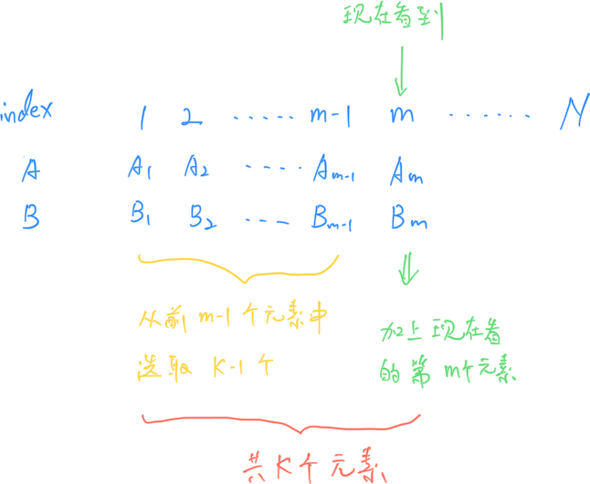

# **A - Candy Button**

Problem：[A - Candy Button](https://atcoder.jp/contests/abc376/tasks/abc376_a)

很简单的模拟题。

`````C++
// Problem: https://atcoder.jp/contests/abc376/tasks/abc376_a

// 模拟题
#include <bits/stdc++.h>
using namespace std;
typedef long long LL;
typedef pair<int, int> PII;

int n, c;
int res;
int last;
int t;

void solve() {
    cin >> n >> c;
    last = -c;  // 记录上次拿糖的时间，初始值设一个比较小的数即可
    for (int i = 1; i <= n; i++) {
        cin >> t;           // 读入当前时间
        if (t - last >= c)  // 间隔时间超过 c，就可以拿糖
            res++, last = t;
    }
    cout << res << endl;
}

int main() {
    cin.tie(0);
    ios_base::sync_with_stdio(false);
    solve();
    return 0;
}
`````

# **B - Hands on Ring (Easy)**

Problem：[B - Hands on Ring (Easy)](https://atcoder.jp/contests/abc376/tasks/abc376_b)

根据题目容易看出来，分成 6 种情况来讨论即可。

```c++
// Problem: https://atcoder.jp/contests/abc376/tasks/abc376_b

// 模拟题目
#include <bits/stdc++.h>
using namespace std;
typedef long long LL;
typedef pair<int, int> PII;

int n, Q;
int L, R;
char op[2];
int t;
int res;

// a 起点，b 障碍，c 终点
int move(int a, int b, int c) {
    if (a < b && b < c)
        return a + n - c;
    if (a < c && c < b)
        return c - a;
    if (b < c && c < a)
        return a - c;
    if (b < a && a < c)
        return c - a;
    if (c < a && a < b)
        return a - c;
    if (c < b && b < a)
        return c + n - a;
    return 0;
}

void solve() {
    cin >> n >> Q;
    L = 1, R = 2;
    while (Q--) {
        cin >> op >> t;
        if (*op == 'L')
            res += move(L, R, t), L = t;
        if (*op == 'R')
            res += move(R, L, t), R = t;
    }

    cout << res << endl;
}

int main() {
    cin.tie(0);
    ios_base::sync_with_stdio(false);
    solve();
    return 0;
}
```

# **C - Prepare Another Box**

Problem：[C - Prepare Another Box](https://atcoder.jp/contests/abc376/tasks/abc376_c)

贪心 + 二分

## 题目：

有编号为 1~N 的 N 个玩具，有编号为 1 ~ N-1 的 N-1 个盒子。

再买一个大小为 x 的盒子。将 N 个玩具放入这 N 个盒子，并保证任何盒子都大于等于玩具。

求最小的 x

## 约束条件：

$2 \leq N \leq 2 \times 10^5$

$1 \leq A_i, B_i \leq 10^9$

## 思路：

使用二分即可。

时间复杂度 $O(n\log^2 n)$。

`````C++
// Problem: https://atcoder.jp/contests/abc376/tasks/abc376_c

// 贪心题目
#include <bits/stdc++.h>
using namespace std;
typedef long long LL;
typedef pair<int, int> PII;

const int N = 2e5 + 10;
int n;
int A[N], B[N], c[N];

// 检查 x 能否让 B 满足条件
// true 表示满足条件，x 偏大，要向左边走
// false 表示不满足条件，x 太小，要向右边走
bool check(int x) {
    for (int i = 1; i < n; i++)
        c[i] = B[i];
    c[n] = x;
    sort(c + 1, c + n + 1);
    for (int i = 1; i <= n; i++)
        // 但凡出现了 false，说明插入的 x 太小了
        if (A[i] > c[i])
            return false;
    return true;
}

void solve() {
    // 读入数据
    cin >> n;
    for (int i = 1; i <= n; i++)
        cin >> A[i];  // 读入玩具的大小
    for (int i = 1; i <= n - 1; i++)
        cin >> B[i];  // 读入盒子的大小
    // 对 A 升序排序
    sort(A + 1, A + n + 1);

    int l = 1, r = A[n] + 1, ans = -1;
    while (l < r) {
        int mid = (r + l) / 2;
        if (check(mid))
            r = mid, ans = mid;
        else
            l = mid + 1;
    }

    cout << ans << endl;
}

int main() {
    cin.tie(0);
    ios_base::sync_with_stdio(false);
    solve();
    return 0;
}
`````

# **D - Cycle**

Problem：[D - Cycle](https://atcoder.jp/contests/abc376/tasks/abc376_d)

## 题目：

N个节点 M 条边的有向简单图。

判断是否有包含 1 节点的环。如果存在，求这个环的最小边数。

## 约束条件：

$2 \leq N \leq 2 \times 10^5$

$1 \leq M \leq \min \left( \frac{N(N-1)}{2},\ 2 \times 10^5 \right)$

## 思路：

本题使用两个方法来解。

### 方法 1：BFS

本题可以使用 BFS 的原因是：边权为 1。如果题目边权不为 1 的话，就没有办法使用 BFS 了

```c++
// Problem: https://atcoder.jp/contests/abc376/tasks/abc376_d

#include <bits/stdc++.h>
using namespace std;
typedef long long LL;
typedef pair<int, int> PII;

const int INF = 1e9 + 10;

void solve() {
    int n, m;
    cin >> n >> m;
    vector<vector<int>> g(n + 10);  // 声明图。+10 是为了留余量
    for (int i = 0; i < m; i++) {
        int a, b;
        cin >> a >> b;
        g[a].push_back(b);  // 添加边
    }

    queue<int> q;
    vector<int> dis(n + 10, INF);
    // 先把 1 周围的节点全部放入队列中
    for (auto v : g[1]) {
        q.push(v);
        dis[v] = 1;
    }

    // BFS
    while (!q.empty()) {
        int now = q.front();
        q.pop();

        for (auto next : g[now]) {
            if (dis[next] < dis[now] + 1)
                continue;
            // 更新 next 点的距离
            dis[next] = min(dis[next], dis[now] + 1);
            // 如果遇到了 1，直接退出
            if (next == 1)
                break;
            // 否则把 next 点加入队列
            q.push(next);
        }
    }

    cout << (dis[1] == INF ? -1 : dis[1]) << endl;
}

int main() {
    cin.tie(0);
    ios_base::sync_with_stdio(false);
    solve();
    return 0;
}
```

### 方法 2：通用做法

“1 节点能回到 1 节点” 意味着：( 1点能走到节点 K ) + ( 反向图 K 能走到 1 节点 )

这时问题就转化为 求 1-> k 的最短路 + k -> 1 的最短路

相当于两个图的最短路问题，使用两次堆优化版的 Dijkstra 即可。

为了方便，本题使用了结构体，来方便的实现两个图的 dijkstra。

```c++
// Problem: https://atcoder.jp/contests/abc376/tasks/abc376_d

#include <bits/stdc++.h>
using namespace std;
typedef long long LL;
typedef pair<int, int> PII;

const int N = 2e5 + 10;
int n, m, ans;

// 声明图的结构体
struct Graph {
    int h[N], e[N], ne[N], idx = 0;
    int dist[N];
    bool st[N];
    priority_queue<PII, vector<PII>, greater<PII>> heap;

    // 图初始化
    Graph() { memset(h, -1, sizeof h); }

    // 加边
    void add(int a, int b) { e[idx] = b, ne[idx] = h[a], h[a] = idx++; }

    // dijkstra 求最短路
    void dijkstra() {
        memset(dist, 0x3f, sizeof dist);
        dist[1] = 0;
        heap.push({0, 1});

        while (heap.size()) {
            auto t = heap.top();
            heap.pop();
            int ver = t.second, d = t.first;
            if (st[ver])
                continue;
            st[ver] = true;
            for (int i = h[ver]; i != -1; i = ne[i]) {
                int next = e[i];
                if (dist[next] > d + 1) {
                    dist[next] = d + 1;
                    heap.push({dist[next], next});
                }
            }
        }
    }
} G1, G2;  // 声明了两个图

void solve() {
    // 读入数据
    cin >> n >> m;
    // 建图
    for (int i = 1; i <= m; i++) {
        int a, b;
        cin >> a >> b;
        G1.add(a, b);  // 建正向图
        G2.add(b, a);  // 建反向图
    }

    G1.dijkstra();
    G2.dijkstra();
    ans = n + 1;

    for (int i = 2; i <= n; i++)
        ans = min(ans, G1.dist[i] + G2.dist[i]);
    if (ans > n)
        cout << -1 << endl;
    else
        cout << ans << endl;
}

int main() {
    cin.tie(0);
    ios_base::sync_with_stdio(false);
    solve();
    return 0;
}
```

# **E - Max × Sum**

Problem：[E - Max × Sum](https://atcoder.jp/contests/abc376/tasks/abc376_e)

贪心 + 大根堆

## 题目：

给定长度为 $N$ 的序列 $(A_1,A_2,...,A_N)$ 和 $(B_1,B_2,...,B_N)$

另 $S$ 是 $\lbrace1, 2, \dots, N\rbrace$ 的长度为 $K$ 的子集。求下面表达式的最小值：

$\displaystyle \left(\max_{i \in S} A_i\right) \times \left(\sum_{i \in S} B_i\right)$

有 $T$ 次询问。

## 约束条件：

$1 \leq T \leq 2 \times 10^5$

$1 \leq K \leq N \leq 2 \times 10^5$

$1 \leq A_i, B_i \leq 10^6$

## 思路：

先把表达式拆成两个部分分析一下：

对于一个大小为 $K$ 的子集 $S$，前半部分表示子集 $S$ 中 $A$ 的最大值，后半部分表示子集内所有元素 $B$ 的和。

### 子问题 1：如何枚举所有的可能性？

可以按照下图所示，从头遍历每个 $index$。假设当前看到了第 $m$ 号元素，那么从前面的 $1 \sim m-1$ 中选取 $K-1$ 个元素，就能够保证不重不漏的枚举出所有可能的子集 $S$



### 子问题 2：如何维护 $\left(\max_{i \in S} A_i\right)$的最大值？

提前将 A 数组升序排列，这样就能保证，如果当前看到的是编号 $m$ 的数，无论前面的 $1 \sim m-1$ 如何选 $K-1$ 个元素，都能保证 $A_m$ 就是能枚举出来的子集的最大值。

### 子问题 3：如何维护 $\left(\sum_{i \in S} B_i\right)$ 的最小值？

可以使用优先队列 `priority_queue`（大根堆）来维护。

核心问题转化为如何在 $B_1 \sim B_{m-1}$ 中间选择最小的 $K-1$ 个元素。那么只需要每次入栈一个数，再把最大的数字弹出。保证优先队列中只存在 $K-1$ 个数即可。

综上所述，算法总时间复杂度为 $O(n\log n + n\log n)$，前半部分排序消耗 $n\log n$，后半部分所有元素一进一出加上大根堆排序消耗 $n\log n$ 的时间复杂度。总时间复杂度在规定时间范围内。

```c++
// Problem: https://atcoder.jp/contests/abc376/tasks/abc376_e

#include <bits/stdc++.h>
using namespace std;
typedef long long LL;
typedef pair<int, int> PII;

const int MAXN = 2e5 + 10;
int T, K, N;
PII A[MAXN];
priority_queue<int> Q;  // 大根堆
LL ans, sum;

void solve() {
    cin >> T;
    while (T--) {
        cin >> N >> K;
        for (int i = 1; i <= N; i++)
            cin >> A[i].first;
        for (int i = 1; i <= N; i++)
            cin >> A[i].second;
        // 排序
        sort(A + 1, A + N + 1);
        // 初始化
        ans = 1e18, sum = 0;
        // 清空堆 （注：priority_queue没有clear函数）
        while (!Q.empty())
            Q.pop();

        // 处理前 K-1 个数
        for (int i = 1; i < K; i++) {
            Q.push(A[i].second);
            sum += (LL)A[i].second;
        }

        // 从第 K 个数开始
        for (int i = K; i <= N; i++) {
            sum += (LL)A[i].second;
            ans = min(ans, (LL)A[i].first * sum);
            Q.push(A[i].second);
            // 把看过的 B 的最大值弹出来去掉，就能保证 sum 的值是最小的
            sum -= (LL)Q.top();
            Q.pop();
        }

        cout << ans << endl;
    }
}

int main() {
    cin.tie(0);
    ios_base::sync_with_stdio(false);
    solve();
    return 0;
}
```

