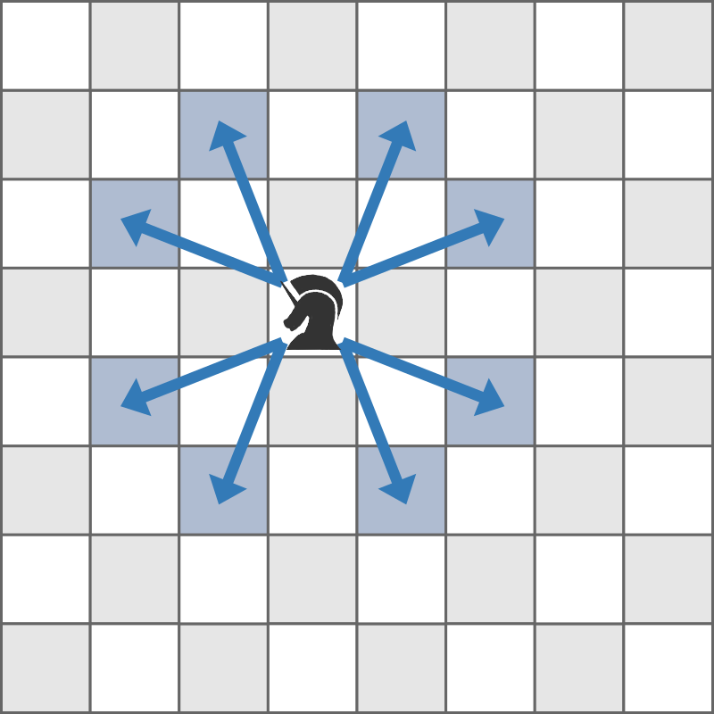
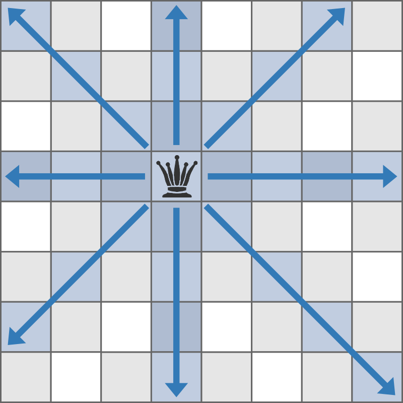
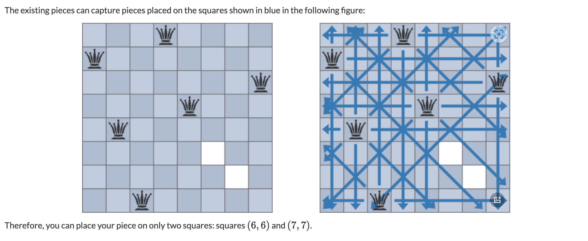

# **A - Rearranging ABC**

Problem：[A - Rearranging ABC](https://atcoder.jp/contests/abc377/tasks/abc377_a)

省略。

```c++
// Problem: https://atcoder.jp/contests/abc377/tasks/abc377_a

#include <bits/stdc++.h>
using namespace std;
typedef long long LL;
typedef pair<int, int> PII;

string s;

void solve() {
    cin >> s;
    sort(s.begin(), s.end());
    if (s == "ABC")
        cout << "Yes" << endl;
    else
        cout << "No" << endl;
}

int main() {
    cin.tie(0);
    ios_base::sync_with_stdio(false);
    solve();
    return 0;
}
```

# **B - Avoid Rook Attack**

Problem：[B - Avoid Rook Attack](https://atcoder.jp/contests/abc377/tasks/abc377_b)

省略。

```c++
// Problem: https://atcoder.jp/contests/abc377/tasks/abc377_b

#include <bits/stdc++.h>
using namespace std;
typedef long long LL;
typedef pair<int, int> PII;

const int N = 10;
char g[N][N];
int col[N], row[N];  // 记录该行该列是否被占用

void solve() {
    // 读入网格数据
    for (int i = 0; i < 8; i++)
        cin >> g[i];

    // 记录行列占用情况
    for (int i = 0; i < 8; i++)
        for (int j = 0; j < 8; j++)
            if (g[i][j] == '#')
                col[j] = row[i] = 1;

    // 判断每个点是否安全
    int res = 0;
    for (int i = 0; i < 8; i++)
        for (int j = 0; j < 8; j++)
            if (!row[i] && !col[j])
                res++;

    cout << res << endl;
}

int main() {
    cin.tie(0);
    ios_base::sync_with_stdio(false);
    solve();
    return 0;
}
```

# **C - Avoid Knight Attack**

Problem：[C - Avoid Knight Attack](https://atcoder.jp/contests/abc377/tasks/abc377_c)

STL

## 题目：

一个 N*N 的网格。骑士可以按照下面形式攻击周围的 8 个格子。



输出网格上有多少安全点。

## 约束条件：

$1\leq N\leq10^9$

$1\leq M\leq2\times10^5$

$1\leq a_k\leq N,1\leq b_k\leq N\ (1\leq k\leq M)$

$(a_k,b_k)\neq(a_l,b_l)\ (1\leq k\lt l\leq M)$

## 思路：

题目的关键在于如何“去重”。

### 方法 1：（稍微麻烦一些）

使用 `unordered_map<int, unordered_set<int> >`，其中，第一维度用来存储 x 坐标，第二维度用于存储 y 坐标，`unordered_set` 就会自动对 y 的坐标进行去重。

```c++
// Problem: https://atcoder.jp/contests/abc377/tasks/abc377_c

#include <bits/stdc++.h>
using namespace std;
typedef long long LL;
typedef pair<int, int> PII;

const int N = 2e5 + 10;

int dx[8] = {2, 1, -1, -2, -2, -1, 1, 2}, dy[8] = {1, 2, 2, 1, -1, -2, -2, -1};
int n, m;
int a[N], b[N];  // 存储棋子的放置位置
unordered_map<int, unordered_set<int> > occupation;

bool check(int x, int y) {
    // 如果超出范围
    if (x < 1 || x > N || y < 1 || y > N)
        return false;
    return true;
}

void solve() {
    // 读入数据
    cin >> n >> m;
    for (int i = 1; i <= m; i++) {
        cin >> a[i] >> b[i];
        // 将棋子的位置标记为已占用
        occupation[a[i]].insert(b[i]);
    }

    // 存储每一个棋子的攻击范围
    for (int i = 1; i <= m; i++) {
        for (int j = 0; j < 8; j++) {
            int next_a = a[i] + dx[j];
            int next_b = b[i] + dy[j];
            if (check(next_a, next_b)) {
                occupation[next_a].insert(next_b);
            }
        }
    }

    // 开始计算总共被占用了多少位置
    LL oc = 0;
    for (auto [x, y] : occupation)
        oc += (LL)y.size();

    // 计算剩下了多少位置
    cout << (LL)n * n - oc << endl;
}

int main() {
    cin.tie(0);
    ios_base::sync_with_stdio(false);
    solve();
    return 0;
}
```

### 方法 2：（好写一些）

`set<pair<int,int>>` 可以自动对整数对去重。但是 `unordered_set<pair<int,int>>`  不行。

```c++
// Problem: https://atcoder.jp/contests/abc377/tasks/abc377_c

#include <bits/stdc++.h>
using namespace std;
typedef long long LL;
typedef pair<int, int> PII;

const int N = 2e5 + 10;

int dx[8] = {2, 1, -1, -2, -2, -1, 1, 2}, dy[8] = {1, 2, 2, 1, -1, -2, -2, -1};
int n, m;
int a[N], b[N];  // 存储棋子的放置位置
set<PII> occupation;

bool check(int x, int y) {
    // 如果超出范围
    if (x < 1 || x > n || y < 1 || y > n)
        return false;
    return true;
}

void solve() {
    // 读入数据
    cin >> n >> m;
    for (int i = 1; i <= m; i++) {
        cin >> a[i] >> b[i];
        // 将棋子的位置标记为已占用
        occupation.insert({a[i], b[i]});
    }

    // 存储每一个棋子的攻击范围
    for (int i = 1; i <= m; i++) {
        for (int j = 0; j < 8; j++) {
            int next_a = a[i] + dx[j];
            int next_b = b[i] + dy[j];
            if (check(next_a, next_b))
                occupation.insert({next_a, next_b});
        }
    }

    // 计算剩下了多少位置
    LL res = (LL)n * n - occupation.size();
    cout << res << endl;
}

int main() {
    cin.tie(0);
    ios_base::sync_with_stdio(false);
    solve();
    return 0;
}
```

# **D - Many Segments 2**

Problem：[D - Many Segments 2](https://atcoder.jp/contests/abc377/tasks/abc377_d)

贪心

## 题目：

给定长度为 $N$ 的两个正整数数列 $(A_1, A_2, ..., A_N)$ 和 $(B_1, B_2, ..., B_N)$ 

给定正整数 $M$

求出满足下面条件的整数对 $(l,r)$ 的个数。

- $1\le l \le r \le M$
- 区间 $[l,r]$ 不会完整的包含区间 $[L_i,R_i]$

## 约束条件：

$1\le N,M\le 2\times 10^5$

$1\le L_i\le R_i\le M$

## 思路：

如果我们锁定一个 $l$，那么 $r$ 最多可以取到那些 $L>=l$ 的区间的右端点的最小值-1

做法：从大到小枚举 $l$，对于每个 $l$，统计那些 $L >= l$ 的区间的右端点的最小值

优化：双指针。从大到小枚举 $l$ 的时候，$L>=l$ 的区间会逐渐变多，所以统计右端点的最小值，实时更新即可。

我们先说明一个细节：

例如：当前区间为 $[10,14]$，那么以 $10$ 为左端点，不完全包含 $[10,14]$ 的区间有多少个：4 个，分别是 $[10,10], [10,11], [10,12], [10,13]$ 这四个。这个数量刚好对应于 $[10,14)$ 的 $14-10=4$ 数量。

也就是说，如果定好了左边界 $l$，如果右边完全没有区间，那结果的数量刚好对应于 $[l,M+1) = M+1-l$ 的数量

依次为基础，我们就可以逐渐的更新出所有的结果了。

时间复杂度为 $O(N+M)$

```c++
// Problem: https://atcoder.jp/contests/abc377/tasks/abc377_d

#include <bits/stdc++.h>
using namespace std;
typedef long long LL;
typedef pair<int, int> PII;

const int MAX_N = 2e5 + 10;

struct node {
    int l, r;
} a[MAX_N];

int n, m;        // n是区间数量，m是范围上限
int ans[MAX_N];  // 区间最近右端点
long long tot;   // 累计最终答案的变量

bool cmp(node x, node y) {
    return x.l > y.l;  // 按照左端点降序排序
}

void solve() {
    // 输入部分
    cin >> n >> m;
    for (int i = 1; i <= n; i++)
        cin >> a[i].l >> a[i].r;  // 读入n个区间的左右端点

    // 排序 nlogn（这里其实排不排序对结果都没有影响）
    // sort(a + 1, a + n + 1, cmp);  // 将区间按左端点降序排序

    // 初始化ans数组
    for (int i = 1; i <= m + 1; i++)
        ans[i] = m + 1;  // 初始化为最大可能值m+1(对应右开区间)

    // 第一次处理：对于每个位置，找到以该位置为左端点的区间中，右端点最小的值。O(n)
    for (int i = 1; i <= n; i++)
        ans[a[i].l] = min(ans[a[i].l], a[i].r);

    // 第二次处理：从右向左维护最小值 O(m)
    for (int i = m; i >= 1; i--) {
        ans[i] = min(ans[i], ans[i + 1]);  // 确保右边的值不会比当前值小
        tot += (ans[i] - i);  // 累加每个位置到其对应右端点的距离
    }

    cout << tot << endl;
}

int main() {
    cin.tie(0);
    ios_base::sync_with_stdio(false);
    solve();
    return 0;
}
```

# **E - Permute K times 2**

Problem：[E - Permute K times 2](https://atcoder.jp/contests/abc377/tasks/abc377_e)

**（TODO）**

## 题目：

给定一个 $(1,2,...,N)$ 的排列 $P = (P_1, P_2, ... , P_N)$

执行下面操作 K 次：

- 将 $P_i$ 更新到 $P_{P_i}$

输出最后的 $P$ 排列

## 约束条件：

$1\leq N\leq2\times10^5$

$1\leq K\leq10^{18}$

$1\leq P_i\leq N\ (1\leq i\leq N)$

$P_i\neq P_j\ (1\leq i\lt j\leq N)$

## 思路：

这道题太抽象了，我还没理解，暂时先空下。

```c++
// Problem: https://atcoder.jp/contests/abc377/tasks/abc377_e

#include <bits/stdc++.h>
using namespace std;
typedef long long LL;
typedef pair<int, int> PII;

int n, p[200100];              // n是数组长度，p存储置换数组
long long k;                   // k表示操作次数
int cnt[200100], ans[200100];  // ans存储最终答案
bool vis[200100];              // 记录某个位置是否被访问过

// 快速幂，计算 a^k %m 的值
long long fpow(long long a, long long b, long long m) {
    long long ans = 1;
    while (b) {
        if (b & 1)
            ans = (ans * a) % m;
        b >>= 1;
        a = (a * a) % m;
    }
    return ans;
}

void solve() {
    cin >> n >> k;  // 输入n和k
    for (int i = 1; i <= n; i++)
        cin >> p[i];  // 输入置换数组

    // 找循环
    for (int i = 1; i <= n; i++) {
        if (!vis[i]) {      // 如果当前位置未被访问
            vector<int> c;  // 用来存储当前循环中的所有数
            int j = i;
            while (!vis[j]) {  // 沿着置换一直往下走，直到遇到已访问的数
                vis[j] = 1;      // 标记已访问
                c.push_back(j);  // 将当前数加入循环
                j = p[j];        // 移动到下一个数
            }
            int len = c.size();          // 循环的长度
            int temp = fpow(2, k, len);  // 计算2^k mod len

            // 计算k次操作后每个位置的新位置
            for (int j = 0; j < len; j++) {
                ans[c[j]] = c[(j + temp) % len];
            }

            // cout << "第一次循环：" << endl;
            // for (auto x : c)
            //     cout << x << " ";
            // cout << endl;
        }
    }

    for (int i = 1; i <= n; i++)
        cout << ans[i] << ' ';  // 输出每个位置在k次操作后的新值
}

int main() {
    cin.tie(0);
    ios_base::sync_with_stdio(false);
    solve();
    return 0;
}
```

# **F - Avoid Queen Attack**

Problem：[F - Avoid Queen Attack](https://atcoder.jp/contests/abc377/tasks/abc377_f)

**TODO**

## 题目：

有一个 N*N 的棋盘。棋盘上放置了 M 个棋子。棋子可以攻击 所在行，列，主次对角线上的任何位置。

请问棋盘上剩余多少位置不会被攻击到？



示例：

如下图所示的放置条件下，整个棋盘只有 2 个位置是安全的。



## 约束条件：

$1\leq N\leq10^9$

$1\leq M\leq10^3$

$1\leq a_k\leq N,1\leq b_k\leq N\ (1\leq k\leq M)$

$(a_k,b_k)\neq(a_l,b_l)\ (1\leq k\lt l\leq M)$

## 思路：

**TODO**

# **G - Edit to Match**

Problem：[G - Edit to Match](https://atcoder.jp/contests/abc377/tasks/abc377_g)

Trie 树模板题。**TODO**

## 题目：

给定 N 个字符串 $S_1, S_2, ..., S_N$

令 $T=S_k$，进行下面两种操作之一

- 操作 1：删除 T 最后一个字母，cost 为 1
- 操作 2：给 T 最后添加一个字母，cost 为 1

求将 T 变为空串或者 $S_1, ..., S_{k-1}$ 中的任何一个串 所付出的最小代价。

## 约束条件

$1\le N\le 2\times 10^5$

$S_i$ 只包含小写字母

 $\displaystyle \sum_{i=1}^N |S_i|\le 2\times 10^5$

## 思路：

这是一道标准的 Tire 树模板题。

直观思路：先从 $T$ 的尾部删除若干字符，删除后应该变成某个 $S_i$ 的前缀，再开始添加字符。

使用字典树 / Tire 树 即可。

考虑对于 Trie 树上的每个节点，记录其到所有 $S_i$ 的节点的最短距离 d。

这个距离等价于：从这个节点代表的字符串开始，至少添加多少个字符能够到达一个 $S_i$。

查询的时候，从 $T$ 代表的节点不断向上爬，并统计（向上爬的步数+d）的最小值，就是答案。

```c++
// Problem: https://atcoder.jp/contests/abc377/tasks/abc377_g
// 这是一道标准的 Trie 树模板题

#include <bits/stdc++.h>
using namespace std;
typedef long long LL;
typedef pair<int, int> PII;

const int MAX_N = 2e5 + 10;
int son[MAX_N][26], d[MAX_N], idx;
int n;
string s[MAX_N];

void insert(string s) {
    int p = 0;  // 从根节点开始。根节点的 idx 为 0
    // 更新根节点到某个字符串结尾的最短距离
    // 注：d 表示当前节点到某个字符串结尾的最短距离
    // 注：s.size() 是一个 unsigned 整数，在 min 里使用要 int 强制转换一下
    d[p] = min(d[p], (int)s.size());
    // 挨个遍历字符串的每个字符
    for (int i = 0; i < s.size(); i++) {
        int u = s[i] - 'a';
        if (!son[p][u]) {
            son[p][u] = ++idx;
            d[idx] = INT_MAX;
        }
        p = son[p][u];
        // 更新 d
        d[p] = min(d[p], (int)s.size() - i - 1);
    }
}

int query(string s) {
    int p = 0;
    int ans = s.size();
    for (int i = 0; i < s.size(); i++) {
        int u = s[i] - 'a';
        if (!son[p][u])
            break;
        p = son[p][u];
        // 统计答案
        ans = min(ans, (int)s.size() - i - 1 + d[p]);
    }
    return ans;
}

void solve() {
    cin >> n;
    d[0] = INT_MAX;
    for (int i = 1; i <= n; i++) {
        cin >> s[i];
        int cur_ans = query(s[i]);
        insert(s[i]);
        cout << cur_ans << endl;
    }
}

int main() {
    cin.tie(0);
    ios_base::sync_with_stdio(false);
    solve();
    return 0;
}
```

