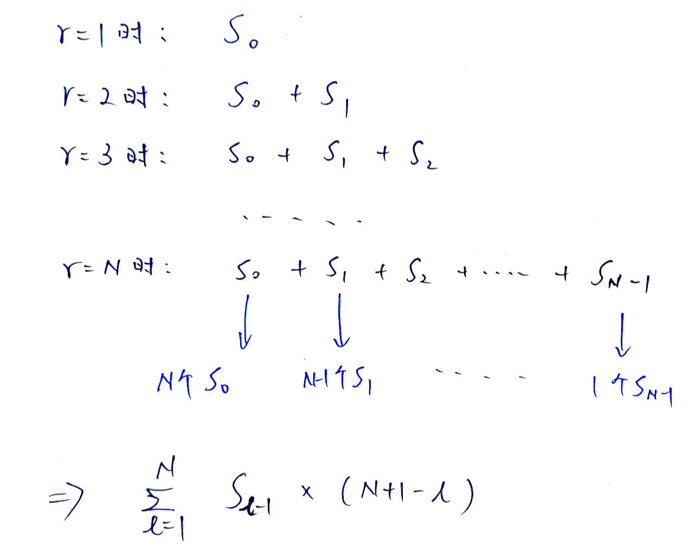
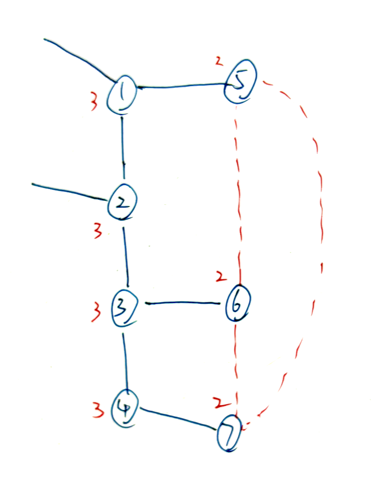

# **A - Pairing**

Problem：[A - Pairing](https://atcoder.jp/contests/abc378/tasks/abc378_a)

省略。

```c++
// Problem: https://atcoder.jp/contests/abc378/tasks/abc378_a

#include <bits/stdc++.h>
using namespace std;
typedef long long LL;
typedef pair<int, int> PII;

int f[4];

void solve() {
    for (int i = 0; i < 4; i++) {
        int c;
        cin >> c;
        f[c]++;
    }

    int res = 0;
    for (int i = 1; i <= 4; i++)
        res += f[i] / 2;

    cout << res << endl;
}

int main() {
    cin.tie(0);
    ios_base::sync_with_stdio(false);
    solve();
    return 0;
}
```

# **B - Garbage Collection**

Problem：[B - Garbage Collection](https://atcoder.jp/contests/abc378/tasks/abc378_b)

模拟题。

省略。

```c++
// Problem: https://atcoder.jp/contests/abc378/tasks/abc378_b

#include <bits/stdc++.h>
using namespace std;
typedef long long LL;
typedef pair<int, int> PII;

const int N = 110;
int q[N], r[N];
int n, Q;

void solve() {
    // 读入数据
    cin >> n;
    for (int i = 1; i <= n; i++)
        cin >> q[i] >> r[i];

    cin >> Q;
    for (int i = 1, t, d; i <= Q; i++) {
        cin >> t >> d;
        int tmp = d % q[t];

        // 如果 tmp 在 r[t] 前面，说明本轮就可以扔
        if (tmp <= r[t])
            cout << d + (r[t] - tmp) << endl;
        // 否则要等到下一轮才能扔
        else
            cout << d + q[t] - tmp + r[t] << endl;
    }
}

int main() {
    cin.tie(0);
    ios_base::sync_with_stdio(false);
    solve();
    return 0;
}
```

# **C - Repeating**

Problem：[C - Repeating](https://atcoder.jp/contests/abc378/tasks/abc378_c)

STL

输出一个数字前面，离他最近的相同数字的位置。没有就输出 `-1`。

思路非常的简单，使用一个 `unordered_map` 来存储每个数字的出现位置。

```c++
// Problem: https://atcoder.jp/contests/abc378/tasks/abc378_c

#include <bits/stdc++.h>
using namespace std;
typedef long long LL;
typedef pair<int, int> PII;

int n, a;
unordered_map<int, int> q;
void solve() {
    cin >> n;

    for (int i = 1; i <= n; i++) {
        cin >> a;
        if (!q.count(a))
            cout << -1 << " ";
        else
            cout << q[a] << " ";

        q[a] = i;
    }
}

int main() {
    cin.tie(0);
    ios_base::sync_with_stdio(false);
    solve();
    return 0;
}
```

# **D - Count Simple Paths**

Problem：[D - Count Simple Paths](https://atcoder.jp/contests/abc378/tasks/abc378_d)

DFS。

一道非常标准的 DFS 题目。难度不大。

```c++
// Problem: https://atcoder.jp/contests/abc378/tasks/abc378_d

#include <bits/stdc++.h>
using namespace std;
typedef long long LL;
typedef pair<int, int> PII;

const int N = 15;
string g[N];    // 存储网格
bool st[N][N];  // 存储遍历状态
int n, m, k;
int res;
int dx[4] = {-1, 0, 1, 0}, dy[4] = {0, 1, 0, -1};

void dfs(int x, int y, int k) {
    if (k == 0) {
        res++;
        return;
    }

    for (int i = 0; i < 4; i++) {
        int a = x + dx[i], b = y + dy[i];

        if (a < 1 || a > n || b < 1 || b > m)
            continue;
        if (g[a][b] == '#' || st[a][b])
            continue;

        st[a][b] = true;
        dfs(a, b, k - 1);
        st[a][b] = false;
    }
}

void solve() {
    // 读入数据，1-base
    cin >> n >> m >> k;
    for (int i = 1; i <= n; i++) {
        cin >> g[i];
        g[i] = " " + g[i];
    }

    // 对于每个点都 DFS 一遍
    for (int i = 1; i <= n; i++)
        for (int j = 1; j <= m; j++) {
            if (g[i][j] == '#')
                continue;

            st[i][j] = true;
            dfs(i, j, k);
            st[i][j] = false;
        }

    cout << res << endl;
}

int main() {
    cin.tie(0);
    ios_base::sync_with_stdio(false);
    solve();
    return 0;
}
```

# **E - Mod Sigma Problem**

Problem：[E - Mod Sigma Problem](https://atcoder.jp/contests/abc378/tasks/abc378_e)

推公式 + 树状数组BIT

## 题目：

给定一组长度为 $N$ 的序列 $(A_1 , A_2 , ... , A_N)$，给定一个正整数 $M$。

求 $ \sum_{1 \leq l \leq r \leq N} \left( \left(\sum_{l \leq i \leq r} A_i\right) \mathbin{\mathrm{mod}} M \right)$。

## 约束条件：

$1 \leq N \leq 2 \times 10^5$

$1 \leq M \leq 2 \times 10^5$

$0 \leq A_i \leq 10^9$

## 思路 ：

本题整体需要解决下面两个问题：

### 问题 1：公式化简

我们定义**带模前缀和**为 $S_i = (A_1+A_2+...+A_i) \bmod M$

那么我们就可以将原公式转化为 $ \sum_{1 \leq l \leq r \leq N} \left( \left(\sum_{l \leq i \leq r} A_i\right) \mathbin{\mathrm{mod}} M \right) = \sum_{1 \leq l \leq r \leq N}(S_r - S_{l-1}) \bmod M$

根据常用的知识点：$ (S_r - S_{l-1}) \mathbin{\mathrm{mod}} M = S_r - S_{l-1} + \begin{cases} 0 & (S_{l-1} \leq S_r) \\ M & (S_{l-1} > S_r)\end{cases}  $，我们就可以将 mod 符号从公式中去除掉，原公式转化为： 

$ \sum_{r=1}^N \sum_{l=1}^r (S_r - S_{l-1}) \mathbin{\mathrm{mod}} M = \sum_{r=1}^N \left( S_r \times r - \sum_{l=1}^r S_{l-1} + M \times X_r \right)  $

> 备注：照理说前缀和中，$S_i$ 是单调递增的，为什么会出现逆序对呢？
>
> 本题中使用的是带模前缀和，所以真实的 $S_i$ 值会呈现周期性的变化，当超过 $M$ 时候，又会跳回到一个比较小的数值范围，所以就可能出现 $S_i > S_j, (i < j)$ 的情况出现，就对应了本题中需要加入一个偏置 M 把结果“扳正”的情况。

从上面公式可以发现，公式最后可以被拆成 3 个部分：

- $\sum_{r=1}^N(S_r \times r)$：直接使用预处理好的带模前缀和计算，时间复杂度为 $O(N)$

- $- \sum_{r=1}^N\sum_{l=1}^r S_{l-1}$：类似于前缀和的前缀和，拆开之后可以发现下图规律。化简结果为：$- \sum_{l=1}^N (S_{l-1}\times (N+1-l))$。时间复杂度 $O(N)$。

  

- $M\times \sum_{r=1}^N X_r$：问题就转化为，**如何快速求出带模前缀和 s 的所有逆序对数量？** 使用树状数组 BIT 来解决。

### 问题 2：使用 BIT 求逆序对

逆序对的定义是：找到所有的 $(i,j)$ 使得 $i < j$ 并且 $a[i] > a[j]$。

如何使用 BIT 求逆序对的数量呢？

假设从左向右遍历数组，当处理到 $s[i]$ 的时候，数组 ${s[1] , s[2] , ... , s[i-1]}$ 都已经被放入了 BIT 中。将数字 $s[i]$ 作为 index，将出现次数作为 BIT 内存的值。我们可以很容易就求出，已经存入的数字中，比 $s[i]$ 小的数字有 $query(s[i])$ 个。相应的，比 $s[i]$ 大的数字数量为 $i-1-query(s[i])$

这一步的时间复杂度为 $O(N\log N)$

### 总结：

本题的整体思路为：首先将公式进行推到化简，可以发现分别求出三个部分的值就可以得出最终的结果。最麻烦的是如何求整体的逆序对数量，这里使用了 BIT 的数据结构。

整体的时间复杂度为 $O(2\times N + N\log N)$。

```c++
// Problem: https://atcoder.jp/contests/abc378/tasks/abc378_e

#include <bits/stdc++.h>
using namespace std;
typedef long long LL;
typedef pair<int, int> PII;

const int N = 2e5 + 10;
int n, m;
int a[N];   // 储存原数组
int s[N];   // 储存：带模前缀和
int tr[N];  // BIT

int lowbit(int x) {
    return x & -x;
}

// 更新 BIT 的值
void add(int x, int k) {
    x++;
    for (int i = x; i <= N; i += lowbit(i))
        tr[i] += k;
}

// 求前x个数的数量和
int sum(int x) {
    x++;
    int res = 0;
    for (int i = x; i; i -= lowbit(i))
        res += tr[i];
    return res;
}

void solve() {
    // 读入数据
    cin >> n >> m;
    for (int i = 1; i <= n; i++) {
        cin >> a[i];
        // 预处理带模前缀和
        s[i] = (s[i - 1] + a[i]) % m;
    }

    LL res = 0;
    // 计算公式的第一部分
    for (int r = 1; r <= n; r++)
        res += 1ll * s[r] * r;
    // 计算公式的第二部分
    for (int l = 1; l <= n; l++)
        res -= 1ll * s[l - 1] * (n - l + 1);

    // 计算逆序对
    LL cnt = 0;
    for (int i = 1; i <= n; i++) {
        cnt += (i - 1 - sum(s[i]));
        add(s[i], 1);
    }
    // 计算公式第三部分
    res += 1ll * m * cnt;

    // 输出结果
    cout << res << endl;
}

int main() {
    cin.tie(0);
    ios_base::sync_with_stdio(false);
    solve();
    return 0;
}
```

# **F - Add One Edge 2**

Problem：[F - Add One Edge 2](https://atcoder.jp/contests/abc378/tasks/abc378_f)

## 题目：

给定一个树，有 N 个节点，N-1 条边。

给树增加一条边，能把树变成恰好带一个环的图。

请问有多少个图满足条件：简单图，环上的所有顶点读数为 3。

## 约束条件：

$3 \leq N \leq 2 \times 10^5$

$1 \leq u_i, v_i \leq N$

## 思路：

这道题目结论比较暴力：

​	直接找度数为 $3$ 的连通块，然后向外找度数为 $2$ 的点。假设度数为 $2$ 的点数量为 $cnt$，那么这些度数为 $2$ 的点直接两两相连，都能形成题目要求的环。形成环的数量为 $cnt\times (cnt-1) / 2$

由于是把所有的点都看过，所以极限状态下的时间复杂度为 $O(2N)$。



```c++
// Problem: https://atcoder.jp/contests/abc378/tasks/abc378_f

#include <bits/stdc++.h>
using namespace std;
typedef long long LL;
typedef pair<int, int> PII;

const int N = 2e5 + 10, M = 4e5 + 10;
int h[N], e[M], ne[M], idx;  // 存储图
int n;
int deg[N];  // 记录度数
bool st[N];  // 记录是否被看过
int cnt;     // 记录点的数量
LL res;      // 记录结果

// 建图加边
void add(int a, int b) {
    e[idx] = b;
    ne[idx] = h[a];
    h[a] = idx++;
}

// DFS
void dfs(int now, int fa = 0) {
    // 如果当前点度数不为 3
    if (deg[now] != 3) {
        // 如果度数是 2，就计数
        cnt += (deg[now] == 2);
        return;
    }

    // 此点标记
    st[now] = true;
    // 看一下周围的点
    for (int i = h[now]; i != -1; i = ne[i]) {
        int next = e[i];
        // 如果是来时的点就跳过
        if (next == fa)
            continue;
        // 向下搜
        dfs(next, now);
    }
}

void solve() {
    // h 数组初始化
    memset(h, -1, sizeof h);

    // 读入数据，同时预处理各个节点的度数
    cin >> n;
    for (int i = 1; i <= n - 1; i++) {
        int u, v;
        cin >> u >> v;
        add(u, v), add(v, u);
        deg[u]++, deg[v]++;
    }

    // 依次遍历每个节点
    for (int i = 1; i <= n; i++) {
        // 度数不为 3，直接跳过
        if (deg[i] != 3)
            continue;
        // 如果这个点已经看过了，跳过
        if (st[i])
            continue;

        // 计算当前连通块，周围度数为 2 的点的数量
        cnt = 0;
        dfs(i);
        res += 1ll * cnt * (cnt - 1) / 2;
    }

    // 输出结果
    cout << res << endl;
}

int main() {
    cin.tie(0);
    ios_base::sync_with_stdio(false);
    solve();
    return 0;
}
```

