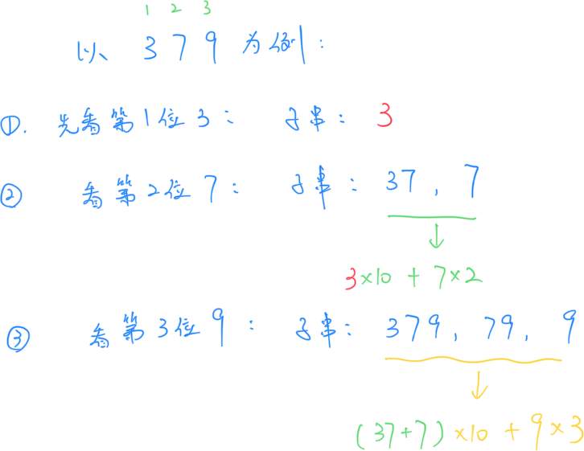
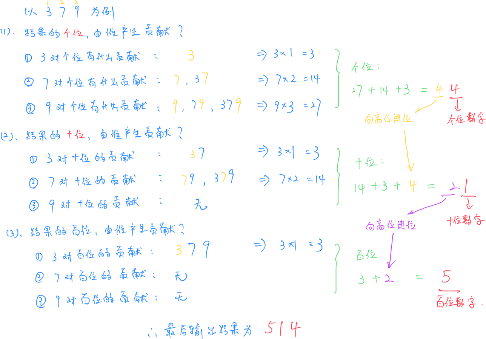

# **A - Cyclic**

Problem：[A - Cyclic](https://atcoder.jp/contests/abc379/tasks/abc379_a)

太简单，省略。

```c++
// Problem: https://atcoder.jp/contests/abc379/tasks/abc379_a

#include <bits/stdc++.h>
using namespace std;
typedef long long LL;
typedef pair<int, int> PII;

string s;

void solve() {
    cin >> s;
    cout << s[1] << s[2] << s[0] << " " << s[2] << s[0] << s[1] << endl;
}

int main() {
    cin.tie(0);
    ios_base::sync_with_stdio(false);
    solve();
    return 0;
}
```


# **B - Strawberries**

Problem：[B - Strawberries](https://atcoder.jp/contests/abc379/tasks/abc379_b)

STL + 贪心。

```c++
// Problem: https://atcoder.jp/contests/abc379/tasks/abc379_b

#include <bits/stdc++.h>
using namespace std;
typedef long long LL;
typedef pair<int, int> PII;

string s;
int n, k;

void solve() {
    cin >> n >> k >> s;

    string gd(k, 'O');  // 健康牙齿的 pattern
    string bd(k, 'X');  // 蛀牙的 pattern

    int res = 0;
    // 找健康牙齿的 pattern
    while (s.find(gd) != s.npos) {
        s.replace(s.find(gd), k, bd);  // 替换成蛀牙 pattern
        res++;                         // 计数
    }

    cout << res << endl;
}

int main() {
    cin.tie(0);
    ios_base::sync_with_stdio(false);
    solve();
    return 0;
}
```


# **C - Sowing Stones**

Problem：[C - Sowing Stones](https://atcoder.jp/contests/abc379/tasks/abc379_c)

推公式

## 题目：

编号 $1 \sim N$ 的 $N$ 个格子排成一列。其中 $M$ 个格子有石子，格子 $X_i$ 含有 $A_i$ 个石子。

执行下面操作任意次（可以为 0）

- 如果 $i$ 格子有石子，就从 $i$ 移动一个石子到 $i+1$

让 $N$ 个格子恰好每个只有一个石子，则最少进行多少次操作。如果不能，输出 `-1`

## 约束条件：

$2 \leq N \leq 2 \times 10^{9}$

$1 \leq M \leq 2 \times 10^{5}$

$M \leq N$

$1 \leq X_i \leq N$ $(1 \leq i \leq M)$

$X_i \neq X_j$ $(1 \leq i < j \leq M)$

$1 \leq A_i \leq 2 \times 10^{9}$ $(1 \leq i \leq M)$

## 思路：

这道题思路是比较抽象的。

1. 我们希望通过若干次操作，使每个格子中都恰好有 $1$ 个石子。

​	那么首先必须保证：**石子的总量等于 N**。

​	其次，必须保证：**前 $i$ 个格子中，至少有 $i$ 个石子才能填满前面的空位**。要求初始分布中的石子满足这个要求。即：如果从前往后看到 $X_i$ 格子时，已累计的石子数量少于 $X_{i-1}$ 时，就无法填满前面的格子。

2. 这里引入一个概念：**位置和**

​	如果一个石子在位置 $i$ 上，那么这颗石子对位置和的贡献就是 $i \times 1$

​	每进行一次操作，就会使某一颗石子的位置编号增加 $1$。相当于是这颗石子从位置 $i$ 移动到了 $i+1$，相应的对位置和的贡献从 $i \times 1$ 变成了 $(i+1） \times 1$

​	意味着：如果初始位置和是 $S_{\text{initial}}$，最终位置和是 $S_{\text{final}}$，那么要从 $S_{\text{initial}}$ 增加到 $S_{\text{final}}$，就必须执行 $(S_{\text{final}} - S_{\text{initial}})$ 次增加位置和 $1$ 的操作。

3. **如何求操作次数呢？**

​	初始状态下，石子的位置和为：$\sum_{i=1}^M X_i \times A_i$

​	最终状态下，石子的位置和为：$1 + 2 + 3 + \cdots + N = \frac{N(N+1)}{2}$

​	每一次操作是将一颗石子从位置 $i$ 移动到 $i+1$，相当于是位置和增加 $1$

​	因此为了从初始位置和变成最终位置和，需要的操作次数是：$\frac{N(N+1)}{2}-\displaystyle \sum_{i=1}^{M}X_i \times A_i $

总时间复杂度为 $O(m\log m + m)$，前半部分是排序的复杂度，后半部分是从头到后遍历一次。

综上思路，代码如下：

```c++
// Problem: https://atcoder.jp/contests/abc379/tasks/abc379_c

#include <bits/stdc++.h>
using namespace std;
typedef long long LL;
typedef pair<int, int> PII;

const int N = 2e5 + 10;

LL n, m;
struct Node {
    LL x;  // 存储位置
    LL a;  // 存储石子数量
} stone[N];

bool cmp(const Node& a, const Node& b) {
    return a.x < b.x;
}

void solve() {
    // 读入数据
    cin >> n >> m;
    for (int i = 0; i < m; i++)
        cin >> stone[i].x;
    for (int i = 0; i < m; i++)
        cin >> stone[i].a;

    // 升序排列
    sort(stone, stone + m, cmp);

    LL sum = 0;      // 记录石子数量的累计和
    LL pos_sum = 0;  // 记录累计的位置和

    for (int i = 0; i < m; i++) {
        // 如果石子的累计数量 无法填满前面的空格，结束程序
        if (sum < stone[i].x - 1) {
            cout << -1 << endl;
            return;
        }

        sum += stone[i].a;                   // 更新石子数量的累计和
        pos_sum += stone[i].x * stone[i].a;  // 更新累计的位置和
    }

    // 如果石子数量不对
    if (sum != n) {
        cout << -1 << endl;
        return;
    }

    // 输出结果
    cout << n * (n + 1) / 2 - pos_sum << endl;
}

int main() {
    cin.tie(0);
    ios_base::sync_with_stdio(false);
    solve();
    return 0;
}
```

# **D - Home Garden**

Problem：[D - Home Garden](https://atcoder.jp/contests/abc379/tasks/abc379_d)

队列

## 题目：

高桥有很多花盆。最开始没有种植物。

按照顺序处理 $Q$ 次询问。询问有下面三种：

- `1` ：准备一个空花盆，种一棵植物，初始高度为 $0$
- `2 T` ：等待 $T$ 天。这之后，所有的植物高度都会增加 $T$
- `3 H`：收割所有高度高于 $H$ 的植物，并输出收割了多少。

## 约束条件：

$1 \leq Q \leq 2 \times 10^{5}$ 

$1 \leq T,H \leq 10^{9}$

## 思路：

两个核心的思想：

​	先种的植物肯定先被收获。（后种的植物不可能比前面种的植物长得更高）。先进先出就可以使用队列。

​	队列里面存什么？存种下的时间 $t$。那么经过一段时间后，现在的时间 $now$ 减去种下的时间 $t$，差值就是植物的高度 $h$。满足条件就可以 `pop`（也就是收割）。

综上：使用队列来管理种入的时间。并额外维护一个当前的时间。

整体的时间复杂度为 $O(Q)$ ，同时所有的数据最多进队出队仅一次。

```c++
// Problem: https://atcoder.jp/contests/abc379/tasks/abc379_d

#include <bits/stdc++.h>
using namespace std;
typedef long long LL;
typedef pair<int, int> PII;

int q;
int op;
LL x;

void solve() {
    cin >> q;

    queue<LL> Q;  // 队列
    LL now = 0;   // 记录当前时间

    while (q--) {
        cin >> op;
        // 种植物
        if (op == 1) {
            Q.push(now);
        }
        // 等待 x 天
        else if (op == 2) {
            cin >> x;
            now += x;
        }
        // 收割高于 x 的植物
        else {
            cin >> x;
            int res = 0;
            while (Q.size() && now - Q.front() >= x) {
                res++;
                Q.pop();
            }
            cout << res << endl;
        }
    }
}

int main() {
    cin.tie(0);
    ios_base::sync_with_stdio(false);
    solve();
    return 0;
}
```

# **E - Sum of All Substrings**

Problem：[E - Sum of All Substrings](https://atcoder.jp/contests/abc379/tasks/abc379_e)


## 题目：

给定长度为 $N$ 的字符串 $S$，只包含数字 $1 \sim 9$

对于每一个整数对 $(i,j)$，定义 $f(i,j)$ 为 $S$ 的从 $i$ 到 $j$ 的子串转化为整数后得到的值。

求 $\sum_{i=1}^{N} \sum_{j=i}^{N} f(i,j)$

## 约束条件：

$1 \leq N \leq 2 \times 10^5$

## 思路：

直观来看有两种思路，下面将分别介绍：

### 思路 1：看字符串中的每一位对结果的贡献

我们举如下的例子进行分析：



从上面的例子我们可以分析出：

- 第一位 $3$：能构成的子串只有 `3`，为最终的结果做出的贡献是 $3$
- 第二位 $7$：与前面的各个位置构成的子串是 `37 7`，相加的结果可以转换为 $3 \times 10 + 7 \times 2 = 44$
- 第三位 $9$：与前面的各个位置构成的子串是 `379 79 9`，相加的结果可以转换为 $44\times 10 + 9 \times 3 = 467$
- 最后所有相加得 $3+44+467=514$，刚好是正确的结果

我们可以发现，在前一个位数中计算出来的结果，可以在下一位中乘以 10 倍，加上当前位置数字和出现次数的乘积，就是本轮结果为最终答案做出的贡献。

由于原字符串数字位数非常的大，所以要使用高精度来进行结算。

但是分析可知，时间复杂度非常的巨大，是 $O(n^2)$，在本题目会超时。

### 思路 2：看结果中的每一位，是从字符串哪些地方来的

简单来说，我们可以分析一下结果中的个位，十位和百位的数字，都是从原字符串中的什么地方贡献出来的。



根据上面的例子，我们可以分析出结果的每一位，是由原字符串的哪些部分贡献出来的。

很容易发现，绿色的部分，实际上是前缀和。

本题可以视为是 C 题 “位置和” 思路的延续。最终时间复杂度为 $O(n)$。

```c++
// Problem: https://atcoder.jp/contests/abc379/tasks/abc379_e

#include <bits/stdc++.h>
using namespace std;
typedef long long LL;
typedef pair<int, int> PII;

const int N = 22e6 + 10;
LL a[N];  // 存储字符串每一位的原数字
LL b[N];  // 存储前缀和
int n;    // 字符串长度
string s;

void solve() {
    // 读入数据
    cin >> n >> s;

    // 将每一位转化为数字，存在 a 数组中
    // 并且将 0-base 转化为 1-base
    for (int i = 1; i <= n; i++)
        a[i] = s[i - 1] - '0';

    // 计算每一位，对该位置的权重
    for (int i = 1; i <= n; i++)
        b[i] = a[i] * i;

    // 计算前缀和
    for (int i = 1; i <= n; i++)
        b[i] += b[i - 1];

    // 从后往前，对每一位进行大数进位
    for (int i = n; i >= 1; i--) {
        // 计算进位
        b[i - 1] += b[i] / 10;
        // 求出当前位的数值
        b[i] %= 10;
    }

    // b[0] 存储最后的进位
    if (b[0] != 0)
        cout << b[0];
    // 从高位到低位输出
    for (int i = 1; i <= n; i++)
        cout << b[i];
    cout << endl;
}

int main() {
    cin.tie(0);
    ios_base::sync_with_stdio(false);
    solve();
    return 0;
}
```

# **F - Buildings 2**

Problem：[F - Buildings 2](https://atcoder.jp/contests/abc379/tasks/abc379_f)
