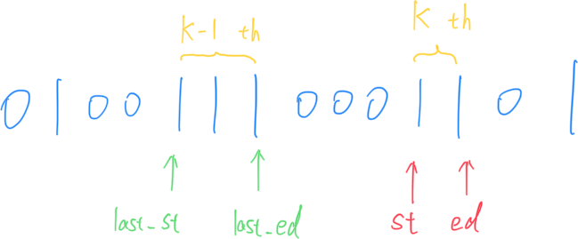
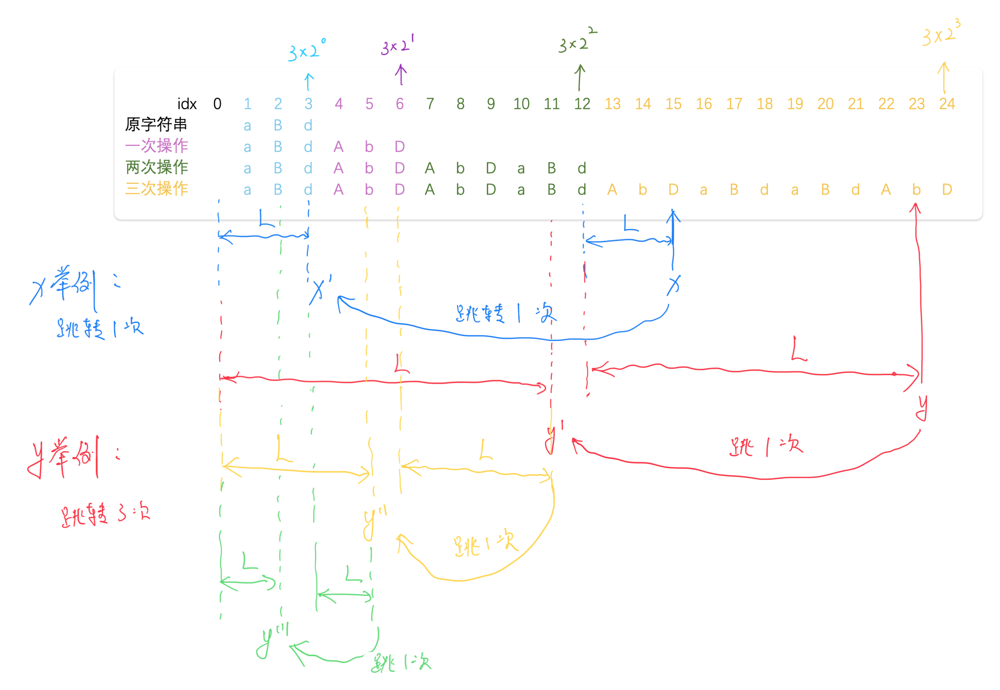

# **A - 123233**

Problem：[A - 123233](https://atcoder.jp/contests/abc380/tasks/abc380_a)

## 题目：

给定一个 6 位整数 $N$。判断这个整数内是否刚好出现了 $1$ 次 `1`, $2$ 次 `2`, $3$ 次 `3`。

## 思路：

按照字符串读入，直接排序，看结果和 `122333` 是否相同即可。

```c++
// Problem: https://atcoder.jp/contests/abc380/tasks/abc380_a

#include <bits/stdc++.h>
using namespace std;
typedef long long LL;
typedef pair<int, int> PII;

// 无脑写法
void solve1() {
    string s;
    cin >> s;
    int a = 0, b = 0, c = 0;
    for (auto x : s) {
        if (x == '1')
            a++;
        if (x == '2')
            b++;
        if (x == '3')
            c++;
    }

    if (a == 1 && b == 2 && c == 3)
        cout << "Yes" << endl;
    else
        cout << "No" << endl;
}

// 推荐写法：
void solve2() {
    string s;
    cin >> s;
    sort(s.begin(), s.end());
    cout << (s == "122333" ? "Yes" : "No") << endl;
}

int main() {
    cin.tie(0);
    ios_base::sync_with_stdio(false);
    // solve1();  // 解法 1
    solve2();  // 解法 2
    return 0;
}
```

# **B - Hurdle Parsing**

Problem：[B - Hurdle Parsing](https://atcoder.jp/contests/abc380/tasks/abc380_b)

## 题目：

给定一个字符串$S$，仅由 `|` 和 `-` 构成。输出两个 `|` 之间 `-` 的数量。

## 思路：

维护一个变量 `now`：

​	当遇到 `-` 时 `now` 自增计数；

​	当遇到 `|` 时保存 `now` 的值，并清零。

```c++
// Problem: https://atcoder.jp/contests/abc380/tasks/abc380_b

#include <bits/stdc++.h>
using namespace std;
typedef long long LL;
typedef pair<int, int> PII;

// 双指针做法
void solve1() {
    string s;
    cin >> s;

    vector<int> res;
    int last = 0;
    for (int i = 1; i < s.size(); i++) {
        int j = i;
        while (j < s.size() && s[j] != '|')
            j++;
        res.push_back(j - last - 1);
        i = j;
        last = j;
    }

    for (auto x : res)
        cout << x << " ";
    cout << endl;
}

// 推荐写法：更具有编程思维
void solve2() {
    string s;
    cin >> s;

    vector<int> res;
    int now = 0;
    for (int i = 0; i < s.size(); i++) {
        if (s[i] == '|')
            res.push_back(now), now = 0;
        else
            now++;
    }

    for (int i = 1; i < res.size(); i++)
        cout << res[i] << " ";
    cout << endl;
}

int main() {
    cin.tie(0);
    ios_base::sync_with_stdio(false);
    // solve1();
    solve2();
    return 0;
}
```

# **C - Move Segment**

Problem：[C - Move Segment](https://atcoder.jp/contests/abc380/tasks/abc380_c)

## 题目：

给定长度为 $N$ 的字符串 $S$，仅由 `0` 和 `1` 构成。

把第 $K$ 个 `1` block 移动到第 $K-1$ 个 `1` block 后面，重新输出字符串。

## 思路：

### 解法 1：

按照块来寻找。每次找到当前 `1` block 的起点 `st` 和终点 `ed`，同时保存上一个 `1` block 的起点 `last_st` 和终点 `last_ed`。数到第 $K$ 个 `1` block 的时候，使用 `substr` 将字符串重新拼接输出即可。



### 解法 2：

将原字符串整理到一个 `vector<PII>` 中。每个 `PII` 元素同时保存了出现的字符 和 出现的次数。

只需将第 $K$ 次出现 `1` 和他前面的元素交换位置，重新输出即可。


```c++
// Problem: https://atcoder.jp/contests/abc380/tasks/abc380_c

#include <bits/stdc++.h>
using namespace std;
typedef long long LL;
typedef pair<int, int> PII;

// 解法 1：使用字符串拼接
void solve1() {
    int n, k;
    cin >> n >> k;
    string s;
    cin >> s;

    string res;

    int last_start = 0, last_ed = 0;
    int start = 0, ed = 0;
    int cnt = 0;
    for (int i = 0; i < s.size(); i++) {
        int j = i;
        // 找第一次 1 出现的起点
        while (j < s.size() && s[j] != '1')
            j++;
        start = j;

        // 找 1 出现的终点
        while (j < s.size() && s[j] == '1')
            j++;
        ed = j - 1;

        if (cnt == 0) {
            last_start = start, last_ed = ed;
        }

        cnt++;

        if (cnt == k) {
            res = s.substr(0, last_ed + 1) + s.substr(start, ed - start + 1) +
                  s.substr(last_ed + 1, start - last_ed - 1) + s.substr(ed + 1);
            break;
        }
        i = j - 1;
        if (cnt > 1) {
            last_start = start, last_ed = ed;
        }
    }

    cout << res << endl;
}

// 解法 2：
void solve2() {
    int n, k;
    string s;
    cin >> n >> k >> s;

    s += ".";  // 技巧：防止越界，保证最后一段也被记录
    vector<PII> v;
    int now = s[0], num = 0;
    for (int i = 0; i < s.size(); i++) {
        if (s[i] == now)
            num++;  // 计算段内长度
        else {
            v.push_back({now - '0', num});  // 记录这一段的数据:{符号，长度}
            now = s[i], num = 1;
        }
    }

    int cnt = 0;
    for (int i = 0; i < v.size(); i++) {
        // 找到第 k 段为 1 的位置
        if (v[i].first == 1) {
            cnt++;
            if (cnt == k)
                // 交换位置
                swap(v[i], v[i - 1]);
        }
    }

    // 重新输出
    for (auto x : v) {
        for (int i = 0; i < x.second; i++)
            cout << x.first;
    }
    cout << endl;
}

int main() {
    cin.tie(0);
    ios_base::sync_with_stdio(false);
    // solve1();
    solve2();
    return 0;
}
```

# **D - Strange Mirroring**

Problem：[D - Strange Mirroring](https://atcoder.jp/contests/abc380/tasks/abc380_d)

递归

## 题目：

给定一个字符串 $S$，包含大小写字母。

对 $S$ 执行下面操作 $10^{100}$ 次。

​	创建字符串 $T$，是将 $S$ 中的大小写颠倒。然后将 $T$ 接到 $S$ 后面。

进行 $Q$ 次查询：返回 $S$ 的第 $K_i$ 个字母。

## 约束条件：

$S$ is a string consisting of uppercase and lowercase English letters, with length between $1$ and $2 \times 10^5$, inclusive.

$Q$ and $K_i$ are integers.

$1 \le Q \le 2 \times 10^5$

$1 \le K_i \le 10^{18}$

## 思路：

这道题思路很抽象。如下图，以 `aBd` 为例。

可以发现经过 $i$ 次操作后，字符串总长度变为了 $3\times 2^i$。

对于查询位置 `x` 的字符，我们总是能够找到 `x` 前面距离最近的 $3\times 2^i$，计算出与他的距离 `L`，我们就能推导出它在上一步操作中的位置。以此为递归的依据，最终能够找到它在原始字符串中的位置。

根据记录的跳转次数：

​	如果是奇数次，则发生大小写转换；

​	如果是偶数次，则保持原样。

因此，对于任意大的数字，都可以在 $O(\log n)$ 的时间复杂度内完成单次查询。

完成 $Q$ 次查询总时间复杂度为 $O(n\log n)$。



```c++
// Problem: https://atcoder.jp/contests/abc380/tasks/abc380_d

// 这是一道非常典型的递归题目
#include <bits/stdc++.h>
using namespace std;
typedef long long LL;
typedef pair<int, int> PII;

string s;
int t;

// 大小写转换
// ascii 码中：A 为65，a 为 97，相差 32
char change(char ch) {
    return ch >= 'a' ? (ch - 32) : (ch + 32);
}

// 递归
char f(LL x, bool is_reverse) {
    // 如果已经到了最前面
    if (x <= s.size()) {
        // 如果需要翻转
        if (is_reverse)
            return change(s[x - 1]);
        // 不需要翻转
        else
            return s[x - 1];
    }

    LL k = s.size();
    // 找到距离 x 左边最近的倍数
    while (k * 2 < x)
        k *= 2;
    // 减去这个长度，向前找
    return f(x - k, !is_reverse);
}

void solve() {
    cin >> s >> t;
    while (t--) {
        LL x;
        cin >> x;
        cout << f(x, false) << " ";
    }
    cout << endl;
}

int main() {
    cin.tie(0);
    ios_base::sync_with_stdio(false);
    solve();
    return 0;
}
```

# **E - 1D Bucket Tool**

Problem：[E - 1D Bucket Tool](https://atcoder.jp/contests/abc380/tasks/abc380_e)

并查集处理区间染色问题。

## 题目：

有编号 $1\sim N$ 的 $N$ 个格子排成一行。每个格子的初始颜色为 $i$ 。

给定 $Q$ 次查询，查询有下面两种情况：

​	`1 x c` ：把 `x` 能到达的所有格子都涂成 `c` 颜色。

​	`2 c`：打印颜色为 `c` 的格子的数量。

## 约束条件：

$1 \leq N \leq 5 \times 10^5$

$1 \leq Q \leq 2 \times 10^5$

……

## 思路：

使用并查集来处理区间染色问题。

并查集在记录连通块的同时，还要维护额外的三个数组值：

- 区间的左端点 `l`

- 区间的右端点 `r`

- 集合内部的节点数 `cnt`

详细参照下面代码：

```c++
// Problem: https://atcoder.jp/contests/abc380/tasks/abc380_e

// 使用并查集处理区间染色问题
#include <bits/stdc++.h>
using namespace std;
typedef long long LL;
typedef pair<int, int> PII;

const int N = 2e6 + 10;

// 节点的父节点，每个集合的节点数，集合的最左端点，集合的最右端点
int fa[N], cnt[N], l[N], r[N];
int color[N];      // 节点 i 的颜色
int color_cnt[N];  // 颜色 i 的数量
int n, q;

// 查找节点 x 所属的集合
int _find(int x) {
    // 如果 x 是根节点，就返回 x
    // 如果不是，就继续找祖宗。同时进行路径压缩
    return x == fa[x] ? x : fa[x] = _find(fa[x]);
}

// 将 x 所在集合涂成颜色 c
void paint(int x, int c) {
    x = _find(x);                   // 找 x 的祖宗
    color_cnt[color[x]] -= cnt[x];  // 从原来的颜色计数中减去整个集合的大小
    color[x] = c;                   // 染色
    color_cnt[c] += cnt[x];  // 新颜色计数中添加整个集合大小
}

// 合并两个集合
void _union(int x, int y) {
    int fx = _find(x), fy = _find(y);  // 找到两个节点的祖宗节点
    fa[fx] = fy;                       // fx 的祖宗改为 fy
    l[fy] = min(l[fx], l[fy]);         // 更新合并后集合的左边界
    r[fy] = max(r[fx], r[fy]);         // 更新合并后集合的右边界
    cnt[fy] += cnt[fx];                // 更新合并后集合的节点数量
}

void solve() {
    // 读入数据
    cin >> n >> q;
    // 将每个节点
    for (int i = 1; i <= n; i++) {
        // 初始化：每个节点的颜色，父节点，左边界，右边界
        color[i] = fa[i] = l[i] = r[i] = i;
        cnt[i] = 1;  // 初始化：每个集合计数，只有一个节点
        color_cnt[i] = 1;  // 初始化：每种颜色只有一个节点
    }

    while (q--) {
        int op;
        cin >> op;
        // 操作 1：染色操作
        if (op == 1) {
            int x, c;
            cin >> x >> c;  // 读入要染色的节点和 x 和目标颜色 c
            paint(x, c);    // 染色

            // 检查并合并相邻的同色集合
            int L = l[_find(x)], R = r[_find(x)];
            // 如果左边相邻集合同色
            if (color[_find(L - 1)] == c)
                _union(L - 1, x);
            // 如果右边相邻集合同色
            if (color[_find(R + 1)] == c)
                _union(R + 1, x);
        }
        // 操作 2：查询操作
        else {
            int c;
            cin >> c;
            cout << color_cnt[c] << endl;
        }
    }
}

int main() {
    cin.tie(0);
    ios_base::sync_with_stdio(false);
    solve();
    return 0;
}
```

