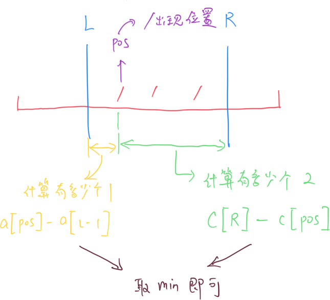
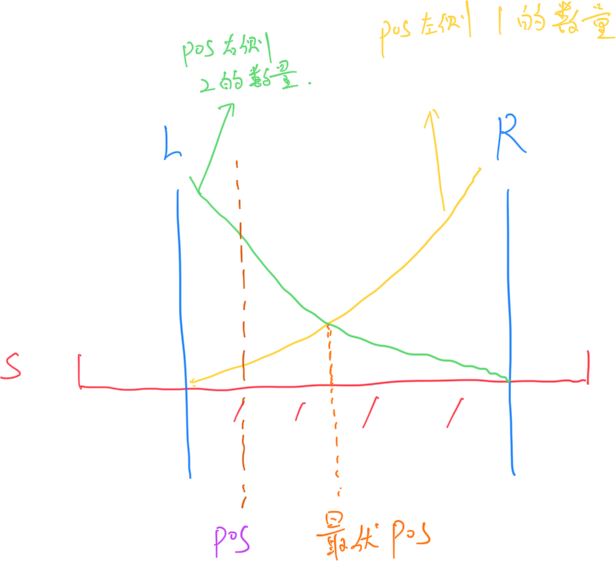

# **A - 11/22 String**

Problem：[A - 11/22 String](https://atcoder.jp/contests/abc381/tasks/abc381_a)

## 题目：

判断输入的字符串是否是形如 `11/22` 或者 `111/222` 的字符串。

## 思路：

字符串长度为偶数：肯定不是

字符串长度为奇数：判断构造的字符串是否和原始字符串相同即可。

```c++
// Problem: https://atcoder.jp/contests/abc381/tasks/abc381_a

#include <bits/stdc++.h>
using namespace std;
typedef long long LL;
typedef pair<int, int> PII;

int n;
string s;

void solve() {
    cin >> n >> s;

    if (n % 2 != 1)
        cout << "No" << endl;
    else {
        string res = string(n / 2, '1') + "/" + string(n / 2, '2');
        if (s != res)
            cout << "No" << endl;
        else
            cout << "Yes" << endl;
    }
}

int main() {
    cin.tie(0);
    ios_base::sync_with_stdio(false);
    solve();
    return 0;
}
```

# **B - 1122 String**

Problem：[B - 1122 String](https://atcoder.jp/contests/abc381/tasks/abc381_b)

## 问题：

`1122`  字符串：形如 `aabb`  `aaccdd` 的字符串，且各字母在字符串中只出现 $2$ 次。

判断输入的字符串是否为  `1122`  字符串。

## 思路：

字符串长度为奇数：肯定不是

字符串长度为偶数：使用 `unordered_map` 记录每个字符出现的次数。依次判断字符串中，$2i-1$ 与 $2i$ 前后两个字符是否相同即可。

```c++
// Problem: https://atcoder.jp/contests/abc381/tasks/abc381_b

#include <bits/stdc++.h>
using namespace std;
typedef long long LL;
typedef pair<int, int> PII;

void solve() {
    string s;
    cin >> s;
    int len = s.size();

    if (len % 2 != 0)
        cout << "No" << endl;
    else {
        s = "." + s;
        unordered_map<int, int> h;
        for (int i = 1; i <= len; i++)
            h[s[i] - 'a']++;

        for (int i = 1; i <= len / 2; i++) {
            if (s[2 * i] != s[2 * i - 1] || h[s[i] - 'a'] != 2) {
                cout << "No" << endl;
                return;
            }
        }
        cout << "Yes" << endl;
    }
}

int main() {
    cin.tie(0);
    ios_base::sync_with_stdio(false);
    solve();
    return 0;
}
```

# **C - 11/22 Substring**

Problem：[C - 11/22 Substring](https://atcoder.jp/contests/abc381/tasks/abc381_c)

## 题目：

给定字符串 $S$，求连续的最长的 `11/22` 子串。

## 思路：

双指针。

遍历字符串 $S$，找到`/` 后，用双指针分别向两边前进，找到满足条件的最长长度即可。时间复杂度 $O(n)$。

```c++
// Problem: https://atcoder.jp/contests/abc381/tasks/abc381_c

#include <bits/stdc++.h>
using namespace std;
typedef long long LL;
typedef pair<int, int> PII;

string s;
int n;

void solve() {
    cin >> n >> s;

    int res = 0;

    for (int i = 0; i < s.size(); i++) {
        if (s[i] == '/') {
            int j = 1;
            while (i - j >= 0 && i + j < n && s[i - j] == '1' &&
                   s[i + j] == '2')
                j++;
            res = max(res, 2 * j - 1);
        }
    }

    cout << res << endl;
}

int main() {
    cin.tie(0);
    ios_base::sync_with_stdio(false);
    solve();
    return 0;
}
```

# **D - 1122 Substring**

Problem：[D - 1122 Substring](https://atcoder.jp/contests/abc381/tasks/abc381_d)

## 题目：

找到字符串 $S$ 中的最长 `1122`  连续子串。

## 思路：

双指针 / 滑动窗口。

关键是维护 `left` 和 `right` 两个指针。随着遍历 `left` 一点点向右边移动，都能找到一个延伸的最远的 `right`，使得 `right-left` 就是子串的最大长度。使用 `unordered_map` 来维护滑动窗口内部各个字母的数量。

极端情况下是 $O(n\log n)$ 的时间复杂度。

```c++
// Problem: https://atcoder.jp/contests/abc381/tasks/abc381_d

// 双指针 / 滑动窗口
#include <bits/stdc++.h>
using namespace std;
typedef long long LL;
typedef pair<int, int> PII;

const int N = 2e5 + 10;
int A[N];

void solve() {
    int n;
    cin >> n;
    for (int i = 0; i < n; i++)
        cin >> A[i];

    int res = 0;
    unordered_map<int, int> h;
    for (int left = 0, right = 0; left < n - 1; left++) {
        // 如果出现连续三个以上的相同字符，落到最后一对相同字符上面
        while (left + 2 < n && A[left] == A[left + 1] &&
               A[left + 1] == A[left + 2])
            left++;

        // 如果left 和 left+1 字符相同
        if (A[left] == A[left + 1]) {
            // 就向右继续搜
            if (right < left || (right - left) % 2) {
                right = left;
                h.clear();
            }

            // 约束条件：1. 不越界 2. 前后相同 3. 没出现过
            while (right + 1 < n && A[right] == A[right + 1] && !h[A[right]]) {
                h[A[right]] = 2;
                // right 向右跳两格
                right += 2;
            }

            res = max(res, right - left);

            // left 向右跳
            left++;
            h[A[left]] = 0;
        }
    }

    cout << res << endl;
}

int main() {
    cin.tie(0);
    ios_base::sync_with_stdio(false);
    solve();
    return 0;
}
```

# **E - 11/22 Subsequence**

Problem：[E - 11/22 Subsequence](https://atcoder.jp/contests/abc381/tasks/abc381_e)

## 题目：

给定长度为 $N$ 的字符串 $S$。有 $Q$ 次查询。每次查询返回 $[L,R]$ 范围内最长的 `11/22` 子串。子串可以不连续。

## 约束条件：

$1 \leq N \leq 10^5$

$1 \leq Q \leq 10^5$ 

$S$ is a string of length $N$ consisting of `1`, `2`, and `/`. 

$1 \leq L \leq R \leq N$ 

$N$, $Q$, $L$, and $R$ are integers.

## 思路：

前缀和 + 2次二分

对于字符串 S，提前预处理出来`1`， `/`， `2`  的前缀和数组 `a` ，`b` 和 `c`。同时用数组 `v` 记录所有 `/` 出现的位置。

对于与每一个查询的 L 与 R，都可以使用二分，在 `v` 中找到在区间 [L,R] 内出现的一组位置 `pos`。然后针对每一个`pos`，都可以用 $O(1)$ 的时间复杂度计算出在 $[L,pos]$ 中出现 `1` 的个数，在 $[pos,R]$ 区间中出现 `2` 的个数。就可以快速的求出来 $[L,R]$ 区间内 `11/22` 字符串的最大长度了。极端情况下是 $O(n^2\log n)$。



由于上面的方法需要枚举 $[L,R]$ 区间内的所有 `/` 出现的位置，在极端情况下时间复杂度还是很大。需要考虑对其进行优化。通过下图我们可以发现，在 $[L,R]$ 区间内，左侧的 1 数量在逐渐增多，右侧的 2 数量在逐渐减少。越靠近中央，越是可以得到最优解。此处我们再次引入一次二分，找到 `左侧 1 数量` 第一次大于 `右侧 2 数量` 的位置，那么最优解一定在这个位置的前后。这样就可以将时间复杂度限制在 $O(n\log n \log n)$，可以在限制时间内跑完程序了。




```c++
// Problem: https://atcoder.jp/contests/abc381/tasks/abc381_e

// 前缀和 + 2次二分
#include <bits/stdc++.h>
using namespace std;
typedef long long LL;
typedef pair<int, int> PII;

const int N = 2e5;
int a[N], b[N], c[N];  // 分别记录 '1' '/' '2' 的前缀和（出现次数）
int n, q;
string s;
int v[N];  // 存储每个/的位置

bool check(int mid, int L, int R) {
    int num_1 = a[mid] - a[L - 1];
    int num_2 = c[R] - c[mid];
    return num_1 >= num_2;
}

void solve() {
    cin >> n >> q >> s;
    s = " " + s;

    // 预处理前缀和数组
    int cnt = 0;
    for (int i = 1; i <= n; i++) {
        a[i] = a[i - 1], b[i] = b[i - 1], c[i] = c[i - 1];
        if (s[i] == '1')
            a[i]++;
        if (s[i] == '/') {
            b[i]++;
            v[cnt++] = i;
        }
        if (s[i] == '2')
            c[i]++;
    }
    int n;

    // 存储每个查询
    vector<PII> k;
    for (int i = 0; i < q; i++) {
        int L, R;
        cin >> L >> R;
        k.push_back({L, R});
    }

    // 遍历每一个查询
    for (auto t : k) {
        int res = 0;
        int L = t.first, R = t.second;

        // 找到 [L,R] 范围内 '/' 的出现范围
        int l = lower_bound(v, v + cnt, L) - v;
        int r = upper_bound(v, v + cnt, R) - v - 1;

        // 如果区间内没有 ‘/’，直接输出 0
        if (r < l) {
            cout << 0 << endl;
            continue;
        }

        // 找到 左侧1数量 大于等于 右侧2数量 的最小值
        while (l < r) {
            int mid = (l + r) / 2;
            if (check(v[mid], L, R))
                r = mid;
            else
                l = mid + 1;
        }

        int len = min(a[v[l]] - a[L - 1], c[R] - c[v[l]]);
        // 看一下前面那个点的情况，取长度的最大值
        if (l - 1 >= 0 && v[l - 1] >= L)
            len = max(len, min(a[v[l - 1]] - a[L - 1], c[R] - c[v[l - 1]]));

        res = 2 * len + 1;
        cout << res << endl;
    }
}

int main() {
    cin.tie(0);
    ios_base::sync_with_stdio(false);
    solve();
    return 0;
}
```

# **F - 1122 Subsequence**

Problem：[F - 1122 Subsequence](https://atcoder.jp/contests/abc381/tasks/abc381_f)

## 题目：

给定长度为 $N$ 的序列 $A$，求序列中最长的 `1122` 字符串子串。

