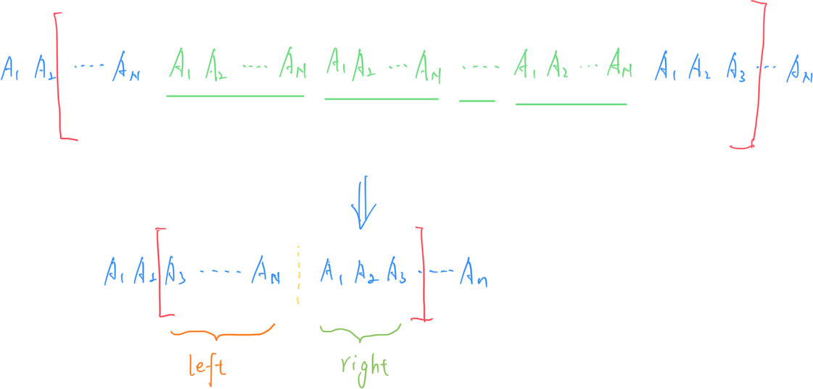

# **A - aaaadaa**

Problem：[A - aaaadaa](https://atcoder.jp/contests/abc384/tasks/abc384_a)

签到题。将字符串 $S$ 中不是 `a` 的字符全部改成 `b`。

```c++
// Problem: https://atcoder.jp/contests/abc384/tasks/abc384_a

#include <bits/stdc++.h>
using namespace std;
typedef long long LL;
typedef pair<int, int> PII;

int n;
char a, b;
string s;

void solve() {
    cin >> n >> a >> b >> s;
    for (auto& x : s)
        if (x != a)
            x = b;

    cout << s << endl;
}

int main() {
    cin.tie(0);
    ios_base::sync_with_stdio(false);
    solve();
    return 0;
}
```

# **B - ARC Division**

Problem：[B - ARC Division](https://atcoder.jp/contests/abc384/tasks/abc384_b)

模拟题。

按照题目要求做条件判断即可。

- 如果参加的是 div1 并且当前 rating 在 [1600,2799] 之间，就可以计入成绩
- 如果参加的是 div2 并且当前 rating 在 [1200,2399] 之间，就可以计入成绩
- 其他情况直接跳过

```c++
// Problem: https://atcoder.jp/contests/abc384/tasks/abc384_b

#include <bits/stdc++.h>
using namespace std;
typedef long long LL;
typedef pair<int, int> PII;

int n, r;
int d, a;

bool check_div1(int r) {
    if (r >= 1600 && r <= 2799)
        return true;
    return false;
}
bool check_div2(int r) {
    if (r >= 1200 && r <= 2399)
        return true;
    return false;
}

void solve() {
    cin >> n >> r;
    for (int i = 1; i <= n; i++) {
        cin >> d >> a;
        // 参加 div1，并且 rating 在 [1600,2799] 之间
        if (d == 1 && check_div1(r))
            r += a;
        // 参加 div2，并且 rating 在 [1200,2399] 之间
        else if (d == 2 && check_div2(r))
            r += a;
        // 否则跳过
        else
            continue;
    }
    cout << r << endl;
}

int main() {
    cin.tie(0);
    ios_base::sync_with_stdio(false);
    solve();
    return 0;
}
```

# **C - Perfect Standings**

Problem：[C - Perfect Standings](https://atcoder.jp/contests/abc384/tasks/abc384_c)

位运算 + STL

## 题目：

A B C D E 题分别对应 a b c d e 五个分值。

从只做出 A 题到全部做完 ABCDE ，共有 31 种组合情况。

按照分值从大到小输出各种做题的可能性，分值相同的时候，按照字典序输出。

## 思路：

这道题虽然使用最暴力的手工枚举也可以做，但是太过麻烦。下面是更加通用的方法。

需要解决两个问题：

1. 如何枚举所有的做题状态？

   本题总共有五位，所以可以使用一个五位的二进制数就可以枚举出各个题的解答状态。

2. 如何按照分数降序 和 字典序升序的方式排列。

   使用 struct 的时候，单独定义 cmp 比较算子。

```c++
// Problem: https://atcoder.jp/contests/abc384/tasks/abc384_c

// 位运算
#include <bits/stdc++.h>
using namespace std;
typedef long long LL;
typedef pair<int, int> PII;

int a[5];

struct Score {
    int s;       // 存储分值
    int st;      // 存储二进制状态
    string str;  // 存储对应的做题方案
} s[50];

// 自定义算子
bool cmp(const Score& a, const Score& b) {
    if (a.s != b.s) {
        return a.s > b.s;  // s 不同时按 s 降序
    }
    return a.str < b.str;  // s 相同时按 str 字典序升序
}

// 将二进制状态转化为字符串
string make_str(int x) {
    string s = "";
    for (int i = 0; i < 5; i++)
        if (x >> i & 1)
            s += 'A' + i;
    sort(s.begin(), s.end());
    return s;
}

// 计算当前二进制状态的分值
int cal_score(int x) {
    int res = 0;
    for (int i = 0; i < 5; i++)
        if (x >> i & 1)
            res += a[i];
    return res;
}

void solve() {
    // 读入各个题目的分值
    for (int i = 0; i < 5; i++)
        cin >> a[i];

    // 遍历所有 32 种状态，同时计算 分值 和 对应的字符串
    for (int i = 0; i <= 31; i++) {
        s[i].st = i;
        s[i].s = cal_score(i);
        s[i].str = make_str(i);
    }

    // 排序
    sort(s, s + 32, cmp);

    // 输出结果（只输出前 31 个结果，第 32 个结果是空集，跳过）
    for (int i = 0; i < 31; i++)
        cout << s[i].str << endl;
}

int main() {
    cin.tie(0);
    ios_base::sync_with_stdio(false);
    solve();
    return 0;
}
```

# **D - Repeated Sequence**

Problem：[D - Repeated Sequence](https://atcoder.jp/contests/abc384/tasks/abc384_d)

思维题

## 题目：

给定长度为 $N$ 的序列 $A_1 , A_2 , ....., A_N$。以这组序列为模板，无限重复循环。

是否能截取连续出子序列，使和恰好为 $S$。

## 约束条件

$1\leq N\leq2\times10 ^ 5$

$1\leq A _ i\leq 10 ^ 9$

$1\leq S\leq 10 ^ {18}$

## 思路：

根据下图示例，我们可以发现，选取的子段由三部分组成：一个后缀，若干个周期 pattern，一个前缀。

由于任意的 $A_i$ 都是正数，所以我们可以直接知道可以有多少个完整的 pattern，即 $\frac{S}{(A_1+...+A_N)}$。

如果去除中间重复的 pattern，最后一定会剩下左边的一部分 `left` 和右边的一部分 `right`。那么 $left + right =S^{\prime}= S \% (A_1+…+A_N)$

问题转化为，能不能找到一个后缀和一个前缀，使二者的和等于 $S^{\prime}$。



最后剩下的部分，和的范围应该是 $[0,2sum]$。

所以我们依次遍历左边部分的后缀和，同时维护一个 `set`，判断 `set` 里面有没有我们想要的值即可。总时间复杂度为 $O(n\log n)$。（或者也可以直接使用二分，也可以达成相同的目的）

```c++
// Problem: https://atcoder.jp/contests/abc384/tasks/abc384_d

#include <bits/stdc++.h>
using namespace std;
typedef long long LL;
typedef pair<int, int> PII;

const int N = 2e5 + 10;
int A[N];
LL sum[N];
LL n, s;
set<LL> h;

void solve() {
    // 读入数据，维护 前缀和 和 set
    cin >> n >> s;
    for (int i = 1; i <= n; i++) {
        cin >> A[i];
        sum[i] = sum[i - 1] + A[i];
        h.insert(sum[i]);
    }

    s %= sum[n];
    sum[n + 1] = sum[n];
    bool can = false;

    // 从后往前逐个遍历
    for (int i = n + 1; i >= 1; i--) {
        // 计算出后缀和
        LL left = sum[n + 1] - sum[i - 1];
        // 计算出期待的前缀和
        LL right = s - left;
        // 看是否存在
        if (h.count(right))
            can = true;
        if (h.count(right + sum[n]))
            can = true;
        if (can)
            break;
    }
    if (can)
        cout << "Yes" << endl;
    else
        cout << "No" << endl;
}

int main() {
    cin.tie(0);
    ios_base::sync_with_stdio(false);
    solve();
    return 0;
}
```

# **E - Takahashi is Slime 2**

Problem：[E - Takahashi is Slime 2](https://atcoder.jp/contests/abc384/tasks/abc384_e)

优先队列 BFS。本题和 ABC 383 的 [E - Sinking Land](https://atcoder.jp/contests/abc363/tasks/abc363_e) 题目非常相似。

## 题目：

给定 $H\times W$ 的网格。每个网格中有一个数值 $S_{i,j}$。起始点位于 $(P,Q)$。

从起点向四方向移动。只有数值 $S_{i,j}$ 严格小于当前累计值 `res` 的 $\frac{1}{X}$ 的时候，才能吃掉这个格子。

求最大累加值。

## 约束条件：

$1\leq H,W\leq500$

$1\leq X\leq10^9$

$1\leq S _ {i,j}\leq10^{12}$

## 思路：

标准的优先队列 BFS 题目。按照题目写即可。

需要注意的一个细节点：

​	题目要求“数值 $S_{i,j}$ 严格小于当前累计值 `res` 的 $\frac{1}{X}$ 的时候，才能吃掉这个格子”。这里的严格小于应该如何处理。如果直接写 `s * X < res` 的话，在本题规模下会溢出。这里只需要计算$\lceil \frac{res}{X} \rceil$ 即可。代码写作 `s < (res+X-1)/X` 。

```c++
// Problem: https://atcoder.jp/contests/abc384/tasks/abc384_e

// 优先队列 BFS
#include <bits/stdc++.h>
using namespace std;
typedef long long LL;
typedef pair<int, int> PII;

int dx[4] = {-1, 0, 1, 0}, dy[4] = {0, 1, 0, -1};
const int N = 510;
LL g[N][N];
LL P, Q;
LL H, W, X;
LL res;
bool st[N][N];

// 创建结构体
struct Node {
    LL x, y, score;
    // 重置小于符号（为小根堆做准备）
    bool operator<(const Node& a) const { return score > a.score; }
};
priority_queue<Node> que;

void solve() {
    // 读入数据
    cin >> H >> W >> X >> P >> Q;
    for (int i = 1; i <= H; i++)
        for (int j = 1; j <= W; j++) {
            cin >> g[i][j];
        }

    // 初始化
    que.push((Node){P, Q, g[P][Q]});
    st[P][Q] = true;
    res = 0;

    // 优先队列 BFS
    /*
        注意：题目中要求，吸收单元格的 score 值必须严格小于 res/X
        这里直接使用上取整，即 score <(res+X-1)/X 即可满足要求
    */
    while (que.size() && (res == 0 || que.top().score < (res + X - 1) / X)) {
        Node now = que.top();
        que.pop();
        res += now.score;
        for (int i = 0; i < 4; i++) {
            int a = now.x + dx[i], b = now.y + dy[i];
            // 越界
            if (a < 1 || a > H || b < 1 || b > W)
                continue;
            // 已经被看过了
            if (st[a][b])
                continue;

            // 加入优先队列
            que.push((Node){a, b, g[a][b]});
            st[a][b] = true;
        }
    }

    // 输出结果
    cout << res << endl;
}

int main() {
    cin.tie(0);
    ios_base::sync_with_stdio(false);
    solve();
    return 0;
}
```

# **F - Double Sum 2**

Problem：[F - Double Sum 2](https://atcoder.jp/contests/abc384/tasks/abc384_f)

数论题目。（这道题非常的抽象，很难理解）

## 题目：

给定正整数 $x$。定义 $f(x)$ ：只要 $x$ 还是偶数，就让他一直除以 2，最终剩下的值作为 $f(x)$ 的结果。

给定序列 $A_1,A_2,…..,A_N$，求 $\sum_{i=1}^{N} \sum_{j=i}^{N} f(A_i + A_j)$ 的值。

## 约束条件：

$1\le N\le 2\times 10^5$

$1\le A_i\le 10^7$

## 思路：

> 技巧：
> 	统计顺序的更改。核心思想：本题要求出 $N^2$ 个数字的和，如果一个个统计，肯定会超时。可以把数字分成组，一次算出一组的和，最后再相加。

**整体思路：**

1. 定义 $d_k$ 为满足下面条件的所有 $(i,j)$ 对应的 $A_i+A_j$ 的总和

- 条件 1：$1 \leq i \leq j \leq N$
- 条件 2：$A_i+A_j$ 是 $2^k$ 的倍数

​	也就是说，$d_k$ 是所有满足 $A_i + A_j \equiv 0 (\bmod 2^k)$ 的配对 $(i,j)$ 的 $A_i + A_j$ 的总和。

2. 那么，如果 $A_i+A_j$ 恰好能被 $2^k$ 整除的 $A_i + A_j$ 的和为 $d_k - d_{k+1}$。

​	备注：这里可能稍微有点难理解。举个例子，一个数 $x=24$ 如果能被 $8 = 2^3$ 整除，那么它一定能被 $4 = 2^2$ 整除。那么只能被 8 整除的部分的总和就是 $d_3 - d_4$

3. 最终所求的答案就是：将所有 $k$ 的这种“刚好被 $2$ 除以 $k$ 次”的和，在分别除以 $2^k$ 后再累加起来，即 $\sum_{k \geq 0} \frac{d_k-d_{k+1}}{2^k}$。

**细节问题处理：**

根据上面的思路，于是问题就转变为：如何快速的求出 $d_k$ 的值？

我们可以知道：$\sum_{\substack{1 \leq i \leq j \leq N \\ A_i+A_j \equiv 0 (\bmod 2^k)}} (A_i+A_j)$ ，如果直接双层遍历，时间复杂度是 $O(n^2)$ ，显然不行。

技巧：同余条件 $A_i+A_j \equiv 0(\bmod 2^k)$ 等价于 $A_j \equiv -A_i(\bmod 2^k)$ 也就等价于 $A_j \equiv (2^k - (A_i \bmod 2^k)) \bmod 2^k$ 。

所以当处理 $j$ 位置时，我们希望知道：

- 在 $i < j$ 的部分中，有多少个 $A_i$ 满足 $A_j \equiv -A_i(\bmod 2^k)$
- 在 $i = j $ 的时候，若 $A_i + A_j = 2A_i$ 能够被 $2^k$ 整除，则这一对也要计入

为了方便计数求和，我们可以用一个以 $A_i \bmod 2^k$ 为键的“字典 map” 来维护已经出现过的 $A_i$ 的计数和总和。

map：

- 键 key：$A_i \bmod 2^k$
- 值 value：在当前余数下出现的所有 $A_i$ 的个数和总和

因此，当我们要处理 j 时，先计算出 $key= (-A_j \bmod 2^k)$，然后在 map 中查找这个 key 是否存在。

若存在，就可以得到相匹配的 $C_j$（满足条件的个数） 和 $S_j$ （满足条件的和），就可以快速求出 $d_k = \sum_{j=1}^{N} (C_j A_j +S_j)$。

然后根据前面的公式

```c++
// Problem: https://atcoder.jp/contests/abc384/tasks/abc384_f

#include <bits/stdc++.h>
using namespace std;
// typedef long long LL;
#define int long long  // 本题中大量使用 ll，为了方便直接定义为 int
typedef pair<int, int> PII;

const int N = 2e5 + 10, M = 2e7 + 10;
int n;
int a[N];
int sum[M];  // 存储累计和，A_i的上限是2e7，所以mp的idx不会超过这个数
int cnt[M];  // 存储计数
int d[30];   // 存储所有中间的 d 值

void solve() {
    // 读入原始数据
    cin >> n;
    for (int i = 1; i <= n; i++)
        cin >> a[i];

    int k = 1;  // 即 2^0
    // 遍历阶次
    for (int j = 0; j <= 24; j++) {
        // 从头遍历数组中的每个数
        for (int i = 1; i <= n; i++) {
            int key = a[i] % k;
            // mp[r]是a[i]%k后余数为r的所有数a[i]的累计和
            sum[key] += a[i];
            // cnt[r]是a[i]%k后余数为r的所有数出现次数
            cnt[key]++;
            // 累计获得 d_j 的值
            d[j] += sum[(k - a[i] % k) % k] + a[i] * cnt[(k - a[i] % k) % k];
        }
        // mp 与 cnt 重置
        for (int i = 1; i <= n; i++) {
            int key = a[i] % k;
            sum[key] = 0;
            cnt[key] = 0;
        }
        k = k * 2;
    }

    // 计算出结果
    int res = 0;
    k = 1;
    for (int i = 0; i <= 24; i++) {
        res += (d[i] - d[i + 1]) / k;
        k *= 2;
    }
    cout << res << endl;
}

signed main() {
    cin.tie(0);
    ios_base::sync_with_stdio(false);
    solve();
    return 0;
}
```

