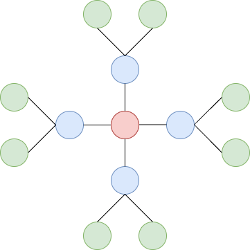
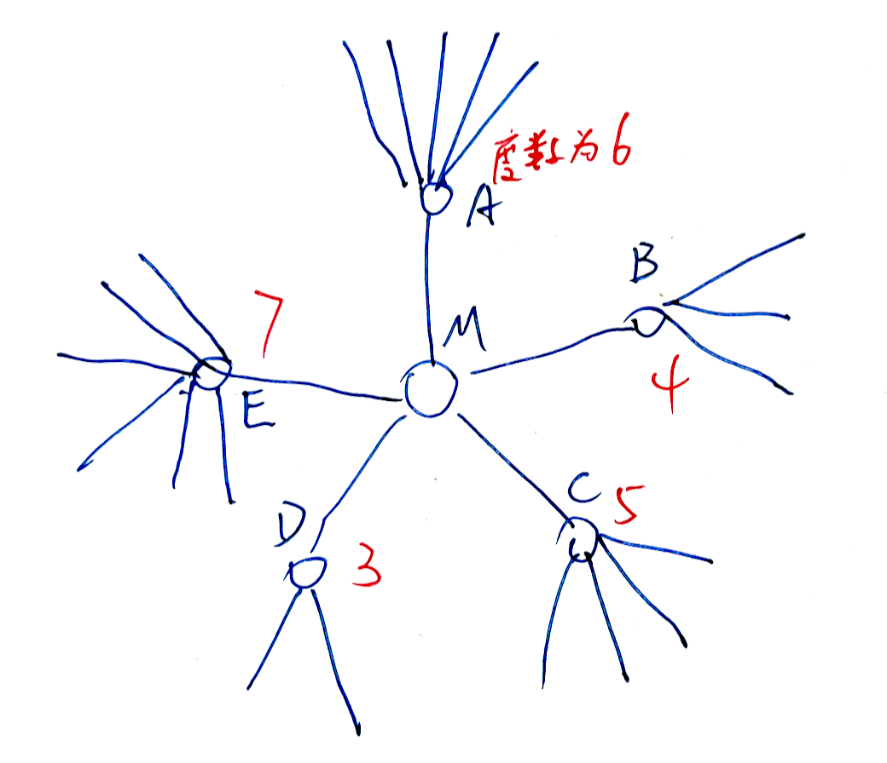

# **A - Equally**

Problem：[A - Equally](https://atcoder.jp/contests/abc385/tasks/abc385_a)

有两种思路。

	1. 分成四种情况来讨论
	1. 只要 abc 的总和能被 abc 中的最大值整除，就意味着能被分开。（很巧妙）

```c++
// Problem: https://atcoder.jp/contests/abc385/tasks/abc385_a

#include <bits/stdc++.h>
using namespace std;
typedef long long LL;
typedef pair<int, int> PII;

int a, b, c;

// 解法 1：分成四种情况来讨论
void solve1() {
    cin >> a >> b >> c;
    if (a + b == c || a + c == b || b + c == a || (a == b && b == c))
        cout << "Yes" << endl;
    else
        cout << "No" << endl;
}

// 解法 2：只要 sum 能被 abc 中的最大值整除即可
void solve2() {
    cin >> a >> b >> c;
    int mx = max({a, b, c});
    int sum = a + b + c;
    if (sum % mx == 0)
        cout << "Yes" << endl;
    else
        cout << "No" << endl;
}

int main() {
    cin.tie(0);
    ios_base::sync_with_stdio(false);
    solve1();
    // solve2();
    return 0;
}
```

# **B - Santa Claus 1**

Problem：[B - Santa Claus 1](https://atcoder.jp/contests/abc385/tasks/abc385_b)

模拟题。

```c++
// Problem: https://atcoder.jp/contests/abc385/tasks/abc385_b

#include <bits/stdc++.h>
using namespace std;
typedef long long LL;
typedef pair<int, int> PII;

const int N = 110;
char g[N][N];
int h, w, x, y;
string s;
bool st[N][N];
int dx[4] = {-1, 1, 0, 0}, dy[4] = {0, 0, -1, 1};
int res;

// 转换函数：把 UDLR 转换为 idx
int trans(char c) {
    if (c == 'U')
        return 0;
    else if (c == 'D')
        return 1;
    else if (c == 'L')
        return 2;
    else
        return 3;
}

void solve() {
    // 读入数据
    cin >> h >> w >> x >> y;
    for (int i = 0; i < h; i++)
        for (int j = 0; j < w; j++)
            cin >> g[i][j];
    cin >> s;
    // 1-base 转换为 0-base
    x--, y--;
    // 遍历每个指令
    for (auto c : s) {
        int d = trans(c);
        // 计算下一个点的坐标
        int a = x + dx[d], b = y + dy[d];
        // 越界
        if (a < 0 || a >= h || b < 0 || b >= w)
            continue;
        // 撞墙
        if (g[a][b] == '#')
            continue;
        // 如果是第一次遇见'@'，计数+1
        if (g[a][b] == '@' && !st[a][b]) {
            st[a][b] = true;
            res++;
        }
        // 更新坐标
        x = a, y = b;
    }

    // 输出结果
    cout << x + 1 << " " << y + 1 << " " << res << endl;
}

int main() {
    cin.tie(0);
    ios_base::sync_with_stdio(false);
    solve();
    return 0;
}
```

# **C - Illuminate Buildings**

Problem：[C - Illuminate Buildings](https://atcoder.jp/contests/abc385/tasks/abc385_c)

DP

## 题目：

N 栋建筑排成一列。高度为 H_i

想要给建筑点灯，有下面要求：

- 选中的建筑物要有相同的高度
- 选中建筑物之间间隔相同

求能选出的最多建筑。

## 约束条件：

$1 \leq N \leq 3000$
$1 \leq H_i \leq 3000$

## 思路：

DP 的最长子序列问题。

令 `f[i][j]` 表示：以第 `i` 个位置结尾，且前后两个相同数字的距离是 `j` 时，最大长度。

时间复杂度为 $O(n^2)$，本题中为 $3000^2 = 9,000,000 $ 的时间复杂度。

```c++
// Problem: https://atcoder.jp/contests/abc385/tasks/abc385_c

// DP
#include <bits/stdc++.h>
using namespace std;
typedef long long LL;
typedef pair<int, int> PII;

const int N = 3010;
int a[N];
int f[N][N];
int n, res;

void solve() {
    // 读入数据
    cin >> n;
    for (int i = 1; i <= n; i++)
        cin >> a[i];

    // dp 数组初始化
    for (int i = 0; i <= n; i++)
        for (int j = 0; j <= n; j++)
            f[i][j] = 1;

    // f[i][j] 表示：以第i个位置结尾，且前后两个相同数字距离是j时，最大长度
    for (int i = 1; i <= n; i++)
        for (int j = 1; j <= n; j++) {
            if (i - j >= 1 && a[i] == a[i - j])
                f[i][j] = max(f[i][j], f[i - j][j] + 1);
            res = max(res, f[i][j]);
        }

    cout << res << endl;
}

int main() {
    cin.tie(0);
    ios_base::sync_with_stdio(false);
    solve();
    return 0;
}
```

# **D - Santa Claus 2**

Problem：[D - Santa Claus 2](https://atcoder.jp/contests/abc385/tasks/abc385_d)

STL + 二分

## 题目：

二维平面上有坐标为 $(X_1,Y_1), ... ,(X_N,Y_N)$ 共 $N$ 个房子。

最开始，圣诞老人在起点 $(S_x,S_y)$ 处，按照序列 $(D_1,C_1), ... ,(D_M,C_M)$ 方式移动

- 若 $(x,y)$ 是当前点坐标
  - 若 $D_i$ 是 `U`，则沿着直线从 $(x,y)$ 移动到 $(x, y+C_i)$
  - 若 $D_i$ 是 `D`，则沿着直线从 $(x,y)$ 移动到 $(x, y-C_i)$
  - 若 $D_i$ 是 `L`，则沿着直线从 $(x,y)$ 移动到 $(x-C_i, y)$
  - 若 $D_i$ 是 `R`，则沿着直线从 $(x,y)$ 移动到 $(x+C_i, y)$

求出完成所有移动后，圣诞老人经过的房子的数量。（若多次经过相同房间，只计算 1 次）

## 约束条件：

$1 \leq N \leq 2\times 10^5$

$1 \leq M \leq 2\times 10^5$

$-10^9 \leq X_i,Y_i \leq 10^9$

There is no house at $(S_x,S_y)$.

$1 \leq C_i \leq 10^9$

## 思路：

有两个核心问题：

1. 如何快速知道一次移动中会经过多少个房子
2. 如何筛选掉已经走过的房子

容易发现，每次的移动都是直上直下或者水平的移动，也就是说在移动的时候，其中一个坐标轴的坐标是固定的。

解决方法：

- 维护一个特殊的数据结构：`map<int , set<int>>`，再使用二分。

举例：对于数据结构 `map<int , set<int>> mx` 来说，key 存储的是每个房子的 x 坐标，value 存的是相同 x 坐标的所有 y 坐标的值。那么在一次移动中，一定会对应左右端点。那么使用二分在 set 中查找左右端点，中间的值就是经过的点。将这几个点从 set 中清除掉，就实现了只计算一次经过的功能。

时间复杂度为 $O(m*2\log n)$，对应的是 m 次移动，每次移动中会进行两次二分查找。

```c++
// Problem: https://atcoder.jp/contests/abc385/tasks/abc385_d

#include <bits/stdc++.h>
using namespace std;
typedef long long LL;
typedef pair<int, int> PII;

using Map = map<int, set<int>>;

Map mx, my;
vector<int> temp;
int n, m;  // 点的数量，移动次数
LL x, y;   // 起始坐标
LL res;
char d;  // 临时变量，记录移动方向
LL c;    // 临时变量，记录移动距离

//
void run(LL x, LL y, LL u, LL v, Map& i, Map& j) {
    // 判断点的位置是否合法
    if (i[x].empty())
        return;
    if (abs(x) > 1e9 || abs(y) > 1e9)
        return;

    temp.clear();

    auto bg = i[x].lower_bound(y + u);
    auto ed = i[x].upper_bound(y + v);

    // 从 bg 到 ed 之间所有的元素都要删除并计数
    for (auto it = bg; it != ed; it++) {
        res++;
        temp.push_back((*it));
    }

    // 在原始数组中删除经过的点
    for (auto p : temp) {
        i[x].erase(p);
        j[p].erase(x);
    }
}

void solve() {
    // 读入数据
    cin >> n >> m >> x >> y;
    for (int i = 1, u, v; i <= n; i++) {
        cin >> u >> v;
        mx[u].insert(v);  // x 下有多少个 y
        my[v].insert(u);  // y 下有多少个 x
    }
    // 处理所有移动
    for (int i = 1; i <= m; i++) {
        char d;
        cin >> d >> c;  // 读入移动方向和距离

        if (d == 'U')
            run(x, y, 0, c, mx, my), y += c;
        if (d == 'D')
            run(x, y, -c, 0, mx, my), y -= c;
        if (d == 'L')
            run(y, x, -c, 0, my, mx), x -= c;
        if (d == 'R')
            run(y, x, 0, c, my, mx), x += c;
    }

    cout << x << " " << y << " " << res << endl;
}

int main() {
    cin.tie(0);
    ios_base::sync_with_stdio(false);
    solve();
    return 0;
}
```

# **E - Snowflake Tree**

Problem：[E - Snowflake Tree](https://atcoder.jp/contests/abc385/tasks/abc385_e)

贪心

## 题目：

定义“雪花树”：

- 整数 x 与 y
- 选中一个中心点
- 中心点向外连接 x 个节点，作为中间层
- 中间层的每个节点，各向外连接 y 个节点，作为最外层

例如：x=4，y=2 的情况为：



给定一个1~N 共 N 个节点的树 T，有 N-1 条边。

若删除部分节点能让这棵树变成“雪花树”，输出最少删除多少个节点。

## 约束条件：

$3 \leq N \leq 3 \times 10^5$

$1 \leq u_i < v_i \leq N$

## 思路：

我们很容易发现，对于一棵 $(x,y)$ 的 “雪花树”，它所含有的节点数肯定为 $1 + x + x \times y = 1 + x \times (y+1)$，表示的含义是：中心有 1 个节点，周围有 x 个节点，最外侧有 $x\times y$ 个节点。

也就意味着，对于 N 个节点的树，如果能确定下来“雪花树”的尺寸为 $1+x(y+1)$，那么被删掉的节点数就是 $N - (1+x(y+1))$。

问题就转化为了：对于一个中心点，如何求出它的 “雪花树”？使用贪心的思想。

使用下图举例：



我们假设有上面的这棵树。确定中心点 M 后，我们就可以知道中心点周围有多少个点。根据度数，实际就可以知道再向外最多扩展多少个点。$(y+1)$ 刚好就是扩展点的度数。

我们将所有的点按照度数大小降序排列。将会依次遍历 EACBD 几个点。

- 先看 E 点：E 点向外最多扩展 6 个节点，意味着此时生成的 “雪花树” 大小为 $(1,6) = 1+1(6+1)=8$
- 再看 A 点：A 点向外最多扩展 5 个节点，意味着此时生成的 “雪花树” 大小为 $(2,5) = 1+2(5+1) = 13$

- 再看 C 点：C 点向外最多扩展 4 个节点，意味着此时生成的 “雪花树” 大小为 $(3 , 4) = 1+3(4+1) = 16$

​	……

通过遍历，我们实际就可以知道能够生成的最大的 “雪花树” 的尺寸了，相应的，也就知道最少删除多少节点，就能生成该 “雪花树” 了。

时间复杂度为 $O(n\log n)$。最大的瓶颈是排序部分。

### 写法 1：数组存图

使用数组来存储图（这个写法稍微麻烦一点，但是比 vector 快）

注意：这里会遇到一个坑：

​	如果使用 memset 重置 d 数组，有 $O(N)$ 的时间复杂度，会导致程序 TLE。但实际上用 cnt 维护 d 的长度，不用重置 d 数组也没有关系。

```c++
// Problem: https://atcoder.jp/contests/abc385/tasks/abc385_e

#include <bits/stdc++.h>
using namespace std;
typedef long long LL;
typedef pair<int, int> PII;

const int N = 3e5 + 10, M = 6e5 + 10;
int h[N], e[M], ne[M], idx;  // 存储图
int deg[N];                  // 存储所有节点的度数
int d[N], cnt;               // 存储中心点周围点的度数
int n;

// 加边
void add(int a, int b) {
    e[idx] = b;
    ne[idx] = h[a];
    h[a] = idx;
    idx++;
}

void solve() {
    // h 数组初始化
    memset(h, -1, sizeof h);

    // 读入边数据，建边，同时计算各个点的度数
    cin >> n;
    for (int i = 0, a, b; i < n - 1; i++) {
        cin >> a >> b;
        add(a, b), add(b, a);
        deg[a]++, deg[b]++;
    }

    int res = n;
    // 遍历每个点作为中心点
    for (int now = 1; now <= n; now++) {
        /*
            注意：这里有个坑。照理说 d 数组每次都应该清空再用。
            但是 memset d 重置为 0 要 O(N) 的时间复杂度。
            这里重置 d 的话，就会超时，程序 TLE
            实际上使用 cnt 来维护 d 的长度，不用重置也可以。
        */
        // memset(d, 0, sizeof d);
        cnt = 0;
        for (int j = h[now]; j != -1; j = ne[j]) {
            int next = e[j];       // 获取 now 周围的点
            d[cnt++] = deg[next];  // 记录点的度数
        }

        sort(d, d + cnt, greater<int>());  // 降序排列

        // 分别计算“雪花树”的尺寸，更新最少删除点的值
        for (int i = 1; i <= cnt; i++) {
            int tmp = 1 + i * d[i - 1];
            res = min(res, n - tmp);
        }
    }

    // 输出结果
    cout << res << endl;
}

int main() {
    cin.tie(0);
    ios_base::sync_with_stdio(false);
    solve();
    return 0;
}
```

### 写法 2：vector 存图

使用 vector 存储图。虽然略微慢一点，但是很好写。

```c++
// Problem: https://atcoder.jp/contests/abc385/tasks/abc385_e

#include <bits/stdc++.h>
using namespace std;
typedef long long LL;
typedef pair<int, int> PII;

int n, a, b;

void solve() {
    cin >> n;

    vector<vector<int>> tree(n);
    vector<int> deg(n, 0);

    for (int i = 0; i < n - 1; i++) {
        cin >> a >> b;
        a--, b--;

        tree[a].push_back(b);
        tree[b].push_back(a);

        deg[a]++;
        deg[b]++;
    }

    int res = n;
    // 遍历每个节点
    for (int v = 0; v < n; v++) {
        vector<int> d;
        // 获取和 v 相连的点的度数
        for (auto to : tree[v])
            d.push_back(deg[to]);
        // 按照度数降序排列
        sort(d.begin(), d.end(), greater<int>());

        for (int i = 1; i <= d.size(); i++) {
            int num = d[i - 1] * i + 1;
            res = min(res, n - num);
        }
    }

    cout << res << endl;
}

int main() {
    cin.tie(0);
    ios_base::sync_with_stdio(false);
    solve();
    return 0;
}
```


