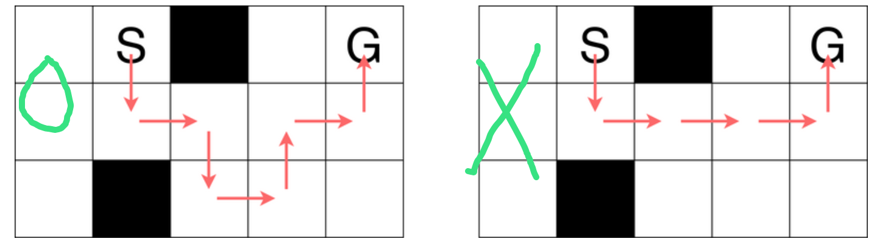

# **A - Happy New Year 2025**

Problem：[A - Happy New Year 2025](https://atcoder.jp/contests/abc387/tasks/abc387_a)

计算 A+B 的平方。签到题。

```c++
// Problem: https://atcoder.jp/contests/abc387/tasks/abc387_a

#include <bits/stdc++.h>
using namespace std;
typedef long long LL;
typedef pair<int, int> PII;

int a, b;

void solve() {
    cin >> a >> b;
    cout << (a + b) * (a + b) << endl;
}

int main() {
    cin.tie(0);
    ios_base::sync_with_stdio(false);
    solve();
    return 0;
}
```

# **B - 9x9 Sum**

Problem：[B - 9x9 Sum](https://atcoder.jp/contests/abc387/tasks/abc387_b)

判断 x 是否在 99 乘法表中出现，并计算乘法表剩余的数字的总和。签到题。

```c++
// Problem: https://atcoder.jp/contests/abc387/tasks/abc387_b

#include <bits/stdc++.h>
using namespace std;
typedef long long LL;
typedef pair<int, int> PII;

int x;

void solve() {
    cin >> x;

    LL res = 0;
    for (int i = 1; i <= 9; i++)
        for (int j = 1; j <= 9; j++)
            if (i * j != x)
                res += 1ll * i * j;

    cout << res << endl;
}

int main() {
    cin.tie(0);
    ios_base::sync_with_stdio(false);
    solve();
    return 0;
}
```

# **C - Snake Numbers**

Problem：[C - Snake Numbers](https://atcoder.jp/contests/abc387/tasks/abc387_c)

# **D - Snaky Walk**

Problem：[D - Snaky Walk](https://atcoder.jp/contests/abc387/tasks/abc387_d)

## 题目：

给定一个 H*W 的网格。

`S` 为起点，`G` 为终点，`#` 为障碍物，`.` 为可以行走的格子。

可以四方向行走。但是要求为：如果前一次为水平移动，下一次要上下移动；如果前一次为上下移动，下一次要水平移动。

求从 `S` 移动到 `G` 的最短距离。如果不能走到，输出 `-1`

示例：



## 约束条件：

$1 \leq H,W \leq 1000$

## 思路：

本题求最短距离显然使用 BFS。

但是由于对移动方向有限制，使用 BFS 的时候需要多开一个维度来记录来时的方向。

```c++
// Problem: https://atcoder.jp/contests/abc387/tasks/abc387_d

#include <bits/stdc++.h>
using namespace std;
typedef long long LL;
typedef pair<int, int> PII;

const int N = 1010;

char g[N][N];      // 存储网格
bool st[N][N][2];  // 存储每个点的遍历状态
int dis[N][N][2];  // 存储每个点的距离
int dx[4] = {0, 0, -1, 1}, dy[4] = {-1, 1, 0, 0};  // 按照 左右上下 的方向
struct Node {
    int x, y, d;
};
int n, m;

// 判断当前点是否合法
bool check(int x, int y, int d) {
    if (x < 1 || y < 1 || x > n || y > m)
        return false;
    if (g[x][y] == '#' || st[x][y][d])
        return false;
    return true;
}

void solve() {
    // 读入数据，保存起始点
    cin >> n >> m;
    int x, y;
    for (int i = 1; i <= n; i++)
        for (int j = 1; j <= m; j++) {
            cin >> g[i][j];
            if (g[i][j] == 'S')
                x = i, y = j;
        }

    // 队列初始化
    queue<Node> q;
    q.push({x, y, 0});
    q.push({x, y, 1});
    st[x][y][0] = st[x][y][1] = true;

    // BFS
    while (q.size()) {
        Node now = q.front();
        q.pop();
        int x = now.x, y = now.y, d = now.d;

        // 如果遇到终点，就输出（第一次遇到终点也就是距离最短的时候）
        if (g[x][y] == 'G') {
            cout << dis[x][y][d] << endl;
            return;
        }

        // 遍历下个方向
        for (int i = 2 * d; i < 2 + 2 * d; i++) {
            // d=0时，i=0 1，向左右走 ； d=1时，i= 2 3，向上下走
            int nx = x + dx[i], ny = y + dy[i];
            if (check(nx, ny, !d)) {
                q.push({nx, ny, !d});
                dis[nx][ny][!d] = dis[x][y][d] + 1;
                st[nx][ny][!d] = true;
            }
        }
    }

    cout << -1 << endl;
}

int main() {
    cin.tie(0);
    ios_base::sync_with_stdio(false);
    solve();
    return 0;
}
```

