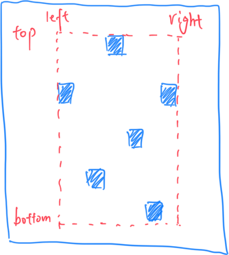
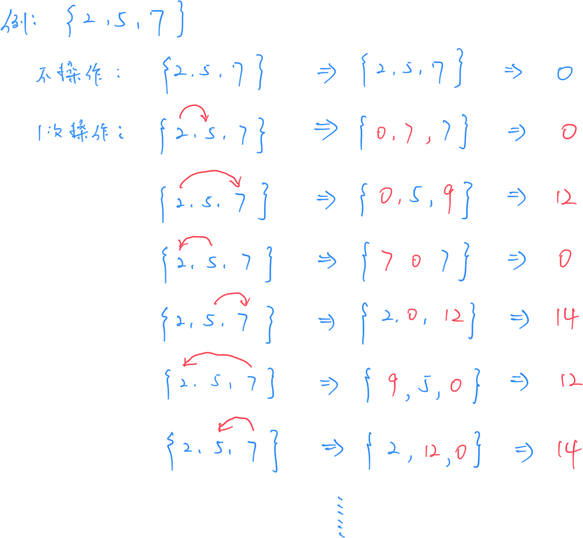
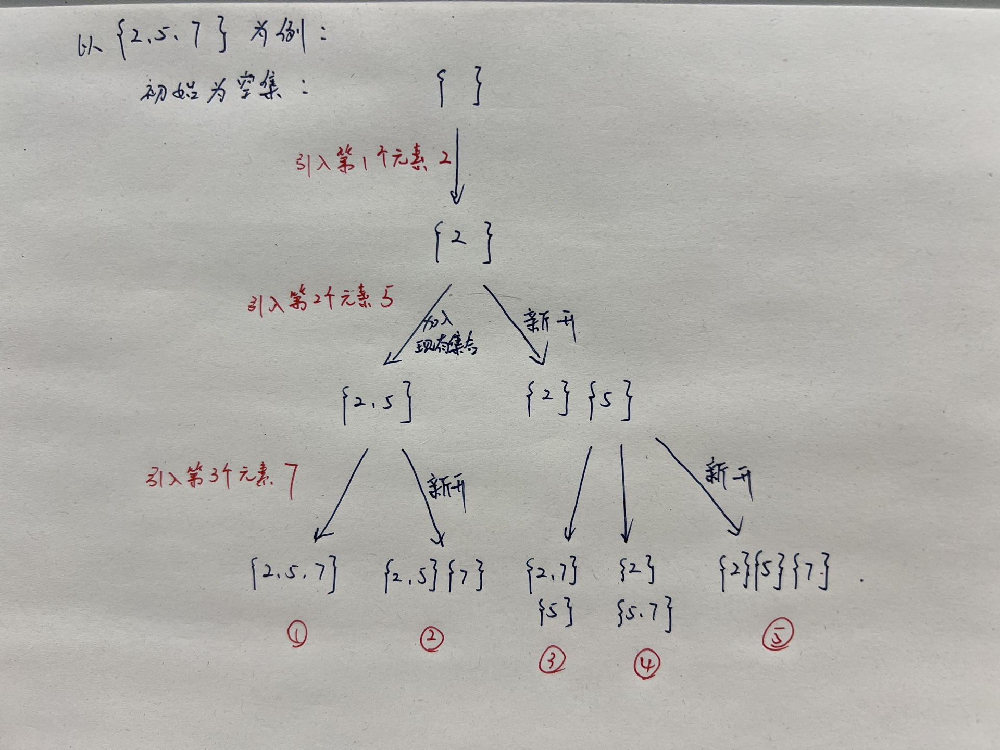
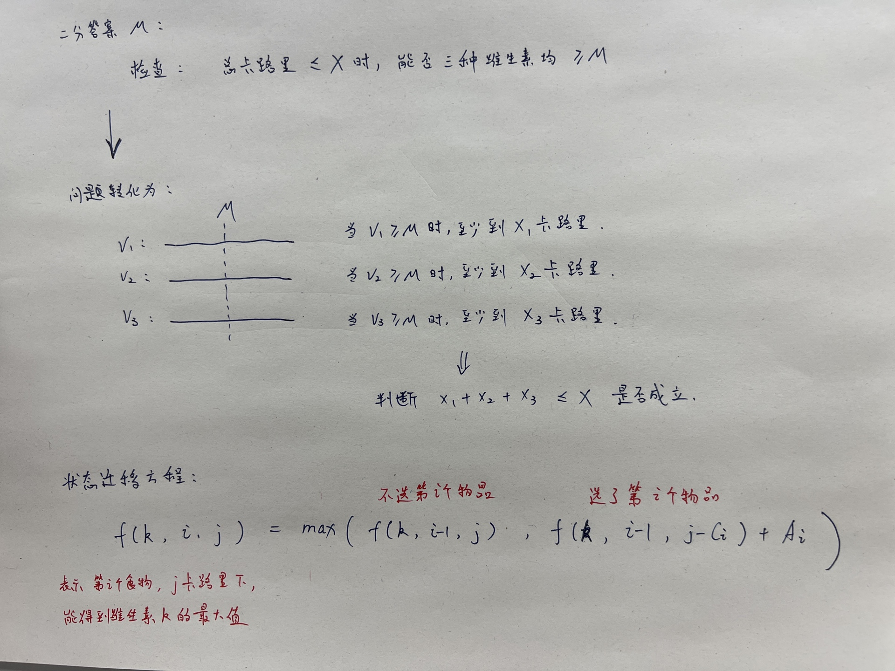

# **A - 12435**

Problem：[A - 12435](https://atcoder.jp/contests/abc390/tasks/abc390_a)

## 题目：

给定长度为 5 的整数序列。判断能否只交换一次相邻元素，就将序列变为 $(1,2,3,4,5)$

## 思路：

题目非常的简单。

```c++
// Problem: https://atcoder.jp/contests/abc390/tasks/abc390_a

#include <bits/stdc++.h>
using namespace std;
typedef long long LL;
typedef pair<int, int> PII;

char c;

void solve() {
    // 读入每个数字，并拼接成字符串
    string s;
    for (int i = 0; i < 5; i++) {
        cin >> c;
        s += c;
    }

    // 看一下，如果前后换一下位置，能不能凑成 12345
    bool flag = false;
    for (int i = 0; i < 4; i++) {
        swap(s[i], s[i + 1]);
        if (s == "12345")
            flag = true;
        swap(s[i], s[i + 1]);
    }

    // 输出结果
    if (flag)
        cout << "Yes" << endl;
    else
        cout << "No" << endl;
}

int main() {
    cin.tie(0);
    ios_base::sync_with_stdio(false);
    solve();
    return 0;
}
```

# **B - Geometric Sequence**

Problem：[B - Geometric Sequence](https://atcoder.jp/contests/abc390/tasks/abc390_b)

## 题目：

给定长度为 N 的正数列 $A=(A_1,A_2,\ldots,A_N)$

判断它是否为等比数列。

## 约束条件：

$2 \leq N \leq 100$

$1 \leq A_i \leq 10^9$

## 思路：

为了判断是否为等比数列，如果直接使用除法的话，很容易出现小数，非常难以处理。

根据等比数列的定义，我们可以把公式转换为乘法形式：

$$\frac{a_{i+1}}{a_{i}} = \frac{a_{i+2}}{a_{i+1}} \Rightarrow a_{i+1}^2 = a_i \times a_{i+2}$$

```c++
// Problem: https://atcoder.jp/contests/abc390/tasks/abc390_b

#include <bits/stdc++.h>
using namespace std;
typedef long long LL;
typedef pair<int, int> PII;

const int N = 110;
int n;
LL a[N];

void solve() {
    // 读入所有数据
    cin >> n;
    for (int i = 0; i < n; i++)
        cin >> a[i];

    bool flag = true;

    // 如果数列包含三个以上的数字，为了避免除法出现小数，只需要满足下面条件即可：
    // 条件：a_{i+1}^2 == a_{i}*a_{i+2}
    // 注意： 1<= a_i <= 10^9，为了避免相乘后溢出，需要使用 LL
    if (n >= 3) {
        for (int i = 0; i < n - 2; i++) {
            if (a[i + 1] * a[i + 1] != a[i] * a[i + 2])
                flag = false;
        }
    }

    if (flag)
        cout << "Yes" << endl;
    else
        cout << "No" << endl;
}

int main() {
    cin.tie(0);
    ios_base::sync_with_stdio(false);
    solve();
    return 0;
}
```

# **C - Paint to make a rectangle**

Problem：[C - Paint to make a rectangle](https://atcoder.jp/contests/abc390/tasks/abc390_c)

## 题目：

给定 H 行 W 列的网格。

每个格子内有一个符号：

- `#` 表示涂黑
- `.` 表示涂白
- `？` 表示还没涂颜色

高桥想要涂一个最小的黑色矩形，使它内部包含所有的已经涂黑的格子，并且没有白色的格子。

请问是否能够实现要求？

## 约束条件：

$1 \leq H, W \leq 1000$

## 思路：

思路并不复杂。对于网格中已经存在的所有黑色格子，我们可以很容易的找出他们的上下边界 `top` 和 `bottom`，左右边界 `left` 和 `right`。

在这个矩形范围内遍历，只要没有白色格子存在，就能够实现要求。反之则不行。



代码如下：

```c++
// Problem: https://atcoder.jp/contests/abc390/tasks/abc390_c

#include <bits/stdc++.h>
using namespace std;
typedef long long LL;
typedef pair<int, int> PII;

const int N = 1010;
char g[N][N];
int h, w;

void solve() {
    cin >> h >> w;
    // 设定初始值
    int left = w, top = h;
    int right = 1, bottom = 1;

    // 读入每一个格子的颜色
    for (int i = 1; i <= h; i++)
        for (int j = 1; j <= w; j++) {
            cin >> g[i][j];
            // 如果遇到黑色格子，就更新一下四个边界参数
            if (g[i][j] == '#') {
                left = min(left, j);
                right = max(right, j);
                top = min(top, i);
                bottom = max(bottom, i);
            }
        }

    // 开始看边界范围内，是否存在白格子
    bool flag = true;
    for (int i = top; i <= bottom; i++)
        for (int j = left; j <= right; j++)
            if (g[i][j] == '.')
                // 只要存在一个白格子，就不能实现要求
                flag = false;

    // 输出结果
    if (flag)
        cout << "Yes" << endl;
    else
        cout << "No" << endl;
}

int main() {
    cin.tie(0);
    ios_base::sync_with_stdio(false);
    solve();
    return 0;
}
```

# **D - Stone XOR**

Problem：[D - Stone XOR](https://atcoder.jp/contests/abc390/tasks/abc390_d)

## 题目：

有 N 个背包，里面装着 $A_i$ 个石子。

高桥可以执行下面操作任意次（包括 0 次）：

> 选择两个背包 A 和 B，将 A 的石子全部装进 B 中。

最后将所有包裹内的石子做 XOR 运算：$B_1 \oplus B_2 \oplus \cdots \oplus B_N = res$

求 res 的种类。

## 示例：



如果初始数组为 $\{2,5,7 \}$，最后有三种状态分别为 $\{0,12,14\}$，总共有 3 种结果。

## 约束条件：

$2 \leq N \leq 12$

$1 \leq A_i \leq 10^{17}$

## 思路：

可以发现，N 最大不过才 12，提醒我们可以往指数级的算法上去想。

### 前置知识 1：XOR 的性质

XOR 有一些重要的性质：

1. **可逆性**：如果 $c = a \oplus b$，那么 $c \oplus b= a$，也就是说再次 XOR 同一个数就相当于把它 “消去”
2. **自我抵消**：任何数字和他本身做 XOR，结果都是0，即 $a \oplus a = 0$
3. **恒等性**：任何数字 a 和 0 做 XOR，结果不变，即 $a \oplus 0 = a$
4. **无序性**：一堆数字求 XOR，与顺序无关。$a \oplus b \oplus c = b \oplus a \oplus c = c \oplus a \oplus b$

### 前置知识 2：贝尔数（Bell number）

参考资料：https://oi-wiki.org/math/combinatorics/bell/

#### 1. 基本概念

**贝尔数**，通常用 $B_{n}$表示，是组合数学中的一组整数数列。$B_{n}$ 表示将 $n$ 个不同的元素划分为不同非空子集的总数。

例如：

- $ B_1 = 1 $： 只有一种方式划分 $\{A\}$，即 $\{\{A\}\}$。

- $ B_2 = 2 $： 集合 $\{A, B\}$ 可以划分为：
  - $\{\{A\}, \{B\}\}$
  - $\{\{A, B\}\}$

- $ B_3 = 5 $： 集合 $\{A, B, C\}$ 的划分方式如下：
  - $\{\{A\}, \{B\}, \{C\}\}$
  - $\{\{A, B\}, \{C\}\}$
  - $\{\{A, C\}, \{B\}\}$
  - $\{\{B, C\}, \{A\}\}$
  - $\{\{A, B, C\}\}$

#### 2. 常用贝尔数列

常用的贝尔数列为：$B_0,...,B_{13} = 1, 1, 2, 5, 15, 52, 203, 877, 4140, 21147, 115975, 678570, 4213597, 27644437$

本题中用到的$B_{12} = 4213597$ 规模也不过才四百万，完全可以暴力枚举。

参考 Link ：https://oeis.org/A000110

#### 3. 贝尔数列通项公式

贝尔数可以通过下面递推公式计算：

$$ B_{n+1} = \sum_{k=0}^{n} \binom{n}{k} B_k $$

贝尔数也可以通过指数型生成函数来计算：

$$ B(x) = e^{e^x - 1} = \sum_{n=0}^{\infty} B_n \frac{x^n}{n!} $$

### 本题思路：

本题核心问的是：如何将 n 个元素划分为若干个集合。因为 n 最大才 12，根据贝尔数，最大划分种类也才 四百万规模。所以使用暴力搜索即可。

那么如何暴搜集合的划分种类呢？

对于每一个新的元素，在划分是只有两种可能性：

- 加入到现在存在的某一个集合
- 新开一个集合

举例：



按照上面的例子，就可以完整的枚举出所有的 5 种情况了。

```c++
// Problem: https://atcoder.jp/contests/abc390/tasks/abc390_d

#include <bits/stdc++.h>
using namespace std;
typedef long long LL;
typedef pair<int, int> PII;

const int N = 15;
LL a[N];  // 存储原数组
LL b[N];  // 存储分组后的情况

int n;
// 存储结果，unordered_set 可以自动去重，同时不会有排序带来的额外开销
unordered_set<LL> S;

// DFS
// k：表示目前看到第 k 个数
// cnt：表示目前开了 cnt 个组
void dfs(int k, int cnt) {
    // 如果到底了，就开始算当前分组情况的 XOR 的值
    if (k > n) {
        LL res = 0;
        // 计算 XOR 值
        for (int i = 1; i <= cnt; i++)
            res ^= b[i];
        S.insert(res);
        return;
    }

    // 新开一组
    b[cnt + 1] = a[k];
    dfs(k + 1, cnt + 1);

    // 放入目前存在的一个组里
    for (int i = 1; i <= cnt; i++) {
        b[i] += a[k];  // 将a[k] 加入到当前组中
        dfs(k + 1, cnt);
        b[i] -= a[k];  // 恢复原状
    }
}

void solve() {
    // 读入数据
    cin >> n;
    for (int i = 1; i <= n; i++)
        cin >> a[i];

    // 向下搜
    dfs(1, 0);

    // 输出结果
    cout << S.size() << endl;
}

int main() {
    cin.tie(0);
    ios_base::sync_with_stdio(false);
    solve();
    return 0;
}
```

# **E - Vitamin Balance**

Problem：[E - Vitamin Balance](https://atcoder.jp/contests/abc390/tasks/abc390_e)

背包 DP + 二分

## 题目：

有 N 个食物，每个食物刚好含有1~3 号的其中一种维生素。

吃掉第 $i$ 个食物，会获得 $A_i$ 单位的维生素 $V_i$ 和 $C_i$ 的卡路里。

可以选择任意个食物吃，只要总卡路里数不超过 X

求最大的可能值：摄取的三种维生素的最小值。

## 约束条件：

$1 \leq N \leq 5000$

$1 \leq X \leq 5000$

$1 \leq V_i \leq 3$

$1 \leq A_i \leq 2 \times 10^5$

$1 \leq C_i \leq X$

## 思路：

对于求“最大的最小值”类的问题，都会使用二分的方法来处理。



整体的思路如上所示。

```c++
// Problem: https://atcoder.jp/contests/abc390/tasks/abc390_e

#include <bits/stdc++.h>
using namespace std;
typedef long long LL;
typedef pair<int, int> PII;

const int N = 5010;
int a[3][N], c[3][N];  // 记录每个食物的维生素的量 和 卡路里的量
int n, x;
int cnt[3];  // 记录三个维生素对应的食物的数量
// f[k][i][j] 表示第 i 个食物，在 j 卡路里下，能得到 k 维生素的最大值
int f[3][N][N];

bool check(int m) {
    int res = 0;
    for (int k = 0; k < 3; k++) {
        bool ok = false;
        // 遍历一下卡路里的可能性
        for (int i = 0; i <= x; i++) {
            // 如果只消耗 i 卡路里，就能摄取 m 的维生素
            if (f[k][cnt[k]][i] >= m) {
                res += i;
                ok = true;
                break;
            }
        }
        // 说明所有食物都吃掉了，维生素的量都不够 m，则返回 false
        if (!ok)
            return false;
    }
    // 如果三类都能达到，且总预算不超过 x，则返回 true
    return res <= x;
}

void solve() {
    // 读入数据
    cin >> n >> x;
    // 读入 1~n 的食物，按照维生素分成三组，分别存储维生素的量 a 和卡路里数 c
    for (int i = 1; i <= n; i++) {
        int v, A, C;
        cin >> v >> A >> C;
        v--;               // 维生素为 0,1,2
        cnt[v]++;          // 记录 v 号维生素的食物的数量
        a[v][cnt[v]] = A;  // 记录这个食物的维生素的量
        c[v][cnt[v]] = C;  // 记录这个食物的卡路里的量
    }

    // 遍历三种维生素
    for (int k = 0; k < 3; k++) {
        // 对于维生素 k，把 1~cnt[k] 的所有食物看一遍
        for (int i = 1; i <= cnt[k]; i++) {
            // 不选第 i 个食物，能获取的维生素的最大值
            // （这句略微有些难理解，下面两行就是解释）
            memcpy(f[k][i], f[k][i - 1], sizeof(f[k][i]));
            // for (int j = 0; j <= x; j++)
            //     f[k][i][j] = f[k][i-1][j];

            // 选第 i 个食物，更新获得的最大 k 维生素的量
            for (int j = c[k][i]; j <= x; j++) {
                f[k][i][j] =
                    max(f[k][i][j], f[k][i - 1][j - c[k][i]] + a[k][i]);
            }
        }
    }

    // 开始二分
    int l = 0, r = 1e9;
    while (l < r) {
        int mid = (l + r + 1) / 2;
        if (check(mid))
            l = mid;
        else
            r = mid - 1;
    }

    // 输出结果
    cout << l << endl;
}

int main() {
    cin.tie(0);
    ios_base::sync_with_stdio(false);
    solve();
    return 0;
}
```
