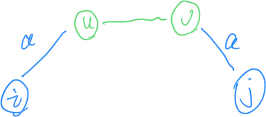
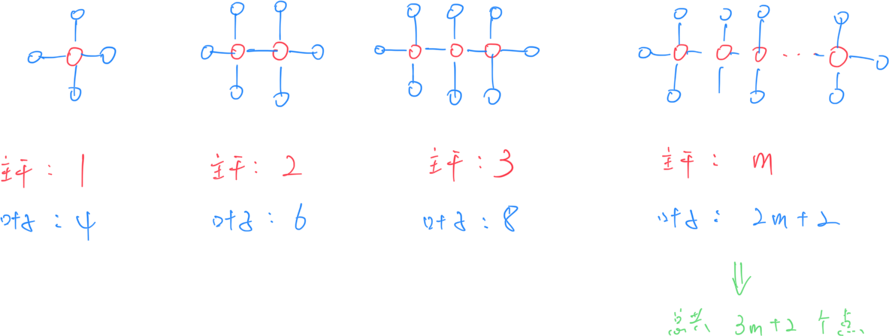
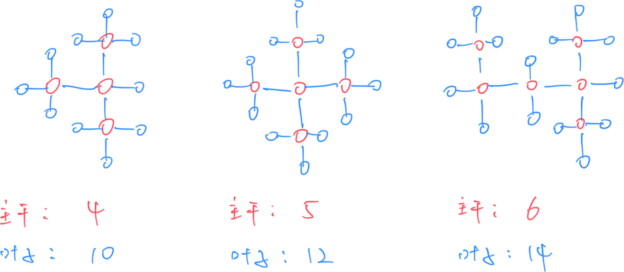
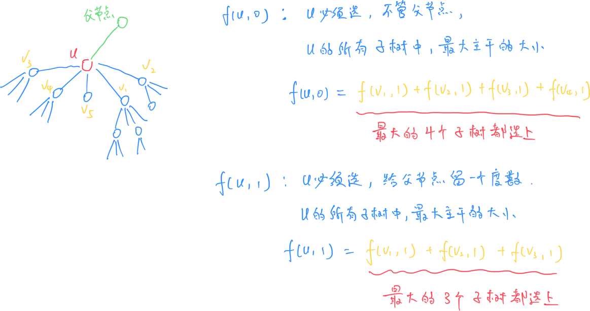

#  **A - 22222**

Problem：[A - 22222](https://atcoder.jp/contests/abc394/tasks/abc394_a)

模拟题。

```c++
// Problem: https://atcoder.jp/contests/abc394/tasks/abc394_a

#include <bits/stdc++.h>
using namespace std;
typedef long long LL;
typedef pair<int, int> PII;

string s;
int cnt;

void solve() {
    cin >> s;
    for (auto x : s)
        if (x == '2')
            cnt++;  // 计算有多少个 2
    // 输出
    cout << string(cnt, '2') << endl;
}

int main() {
    cin.tie(0);
    ios_base::sync_with_stdio(false);
    solve();
    return 0;
}
```

# **B - cat**

Problem：[B - cat](https://atcoder.jp/contests/abc394/tasks/abc394_b)

模拟题。

## 题目：

有 n 个字符串。把这些字符串按照长度，从小到大连接起来。

## 思路：

### 解法 1：

使用一个 PII 存储 {字符串长度，字符串编号}，然后按照字符串长度升序排列，从前往后输出即可。

```c++
// Problem: https://atcoder.jp/contests/abc394/tasks/abc394_b

#include <bits/stdc++.h>
using namespace std;
typedef long long LL;
typedef pair<int, int> PII;

const int N = 55;
string s[N];
PII tmp[N];  // 存储 字符串长度 和 字符串编号
int n;

void solve() {
    cin >> n;
    for (int i = 0; i < n; i++) {
        cin >> s[i];
        // 把 {字符串长度，字符串编号} 存入 tmp
        tmp[i] = {s[i].size(), i};
    }
    // 按照字符串长度升序排列
    sort(tmp, tmp + n);
    // 输出
    for (int i = 0; i < n; i++)
        cout << s[tmp[i].second];
}

int main() {
    cin.tie(0);
    ios_base::sync_with_stdio(false);
    solve();
    return 0;
}
```

### 解法 2：

自定义一个 cmp 算子。

```c++
// Problem: https://atcoder.jp/contests/abc394/tasks/abc394_b

#include <bits/stdc++.h>
using namespace std;
typedef long long LL;
typedef pair<int, int> PII;

const int N = 55;
int n;
string s[N];

// 自定义 cmp 算子
bool cmp(string& a, string& b) {
    return a.size() < b.size();
}

void solve() {
    cin >> n;
    for (int i = 0; i < n; i++)
        cin >> s[i];
    // 升序排序
    sort(s, s + n, cmp);

    // 从前往后输出
    for (int i = 0; i < n; i++)
        cout << s[i];
    cout << endl;
}

int main() {
    cin.tie(0);
    ios_base::sync_with_stdio(false);
    solve();
    return 0;
}
```

# **C - Debug**

Problem：[C - Debug](https://atcoder.jp/contests/abc394/tasks/abc394_c)

双指针

## 题目：

字符串 `S`。把连续出现的 `WA` 替换为 `AC`，再输出。

## 约束条件：

S 长度最大 $3\times 10^5$

## 思路：

### 解法 1：从前往后

这道题实际上是找出连续出现的诸如 `WWWWWA` 串，改成 `ACCCCC`。

### 解法 2：从后往前

思路会更容易一些。

```c++
// Problem: https://atcoder.jp/contests/abc394/tasks/abc394_c

#include <bits/stdc++.h>
using namespace std;
typedef long long LL;
typedef pair<int, int> PII;

string s;

// 从前往后做法
void solve() {
    cin >> s;
    for (int i = 0; i < s.size(); i++) {
        int right = i;
        if (s[i] == 'W') {
            while (right + 1 < s.size() && s[right + 1] == 'W')
                right++;
            if (right + 1 < s.size() && s[right + 1] == 'A') {
                string tmp = "A" + string(right + 1 - (i + 1) + 1, 'C');
                s.replace(i, right + 1 - i + 1, tmp);
            }
            i = right;
        }
    }
    cout << s << endl;
}

// 从后往前做法
void solve2() {
    cin >> s;
    int n = s.size();
    s = " " + s;

    for (int i = n; i > 1; i--) {
        if (s[i - 1] == 'W' && s[i] == 'A')
            s[i - 1] = 'A', s[i] = 'C';
    }

    cout << s.substr(1) << endl;
}

int main() {
    cin.tie(0);
    ios_base::sync_with_stdio(false);
    solve2();
    return 0;
}
```

# **D - Colorful Bracket Sequence**

Problem：[D - Colorful Bracket Sequence](https://atcoder.jp/contests/abc394/tasks/abc394_d)

栈的使用

## 题目：

给定字符串 S，只包含 `(`, `)`, `[`, `]`, `<`, `>` 几种字符。

请问给定的括号之间是否能够闭合？

## 约束条件：

S 最长为 $2\times 10^5$

## 思路：

标准的栈的使用方法。

```c++
// Problem: https://atcoder.jp/contests/abc394/tasks/abc394_d

#include <bits/stdc++.h>
using namespace std;
typedef long long LL;
typedef pair<int, int> PII;

stack<char> stk;
string s;

bool check(char x) {
    if (x == ')' && stk.top() == '(')
        return true;
    else if (x == ']' && stk.top() == '[')
        return true;
    else if (x == '>' && stk.top() == '<')
        return true;
    else
        return false;
}

void solve() {
    cin >> s;

    for (auto x : s) {
        // 遇到左括号，就入栈
        if (x == '(' || x == '[' || x == '<')
            stk.push(x);
        // 遇到右括号
        else {
            // 如果栈已经空了，遇到右括号肯定不能正常运行
            // 如果不能正常消掉右括号，肯定也不能正常运行
            // 程序直接结束就行了
            if (stk.empty() || !check(x)) {
                cout << "No" << endl;
                return;
            }
            stk.pop();
        }
    }

    // 看一下最后栈是否为空
    cout << (stk.empty() ? "Yes" : "No") << endl;
}

int main() {
    cin.tie(0);
    ios_base::sync_with_stdio(false);
    solve();
    return 0;
}
```

# **E - Palindromic Shortest Path**

Problem：[E - Palindromic Shortest Path](https://atcoder.jp/contests/abc394/tasks/abc394_e)

BFS

## 题目：

给定 N 个节点的有向图。

使用邻接矩阵 C 来表示图。

- 如果 $C_{i,j}$ 为 `-`，表示节点 `i` 与节点 `j` 之间没有边
- 如果 $C_{i,j}$ 为小写字母，表示有一条节点 `i` 指向节点 `j` 的边，且边的代码为这个小写字母

对于每一个整数对 $(i,j)$，回答下面问题：

- 从 i 到 j，是否存在最短的回文串路径。如果存在，输出距离；如果不存在，输出 `-1`

## 约束条件：

$1 \leq N \leq 100$

## 思路：

这是一道思路有些抽象但是非常巧妙的 BFS题目。

如果我们希望 `i -> j` 之间能够连成回文串，那么一定会有下面条件成立：

- `i -> u`（i 连向 u） 并且 `v -> j`（v 连向 j） 并且这两条边的字符相同
- `u -> v` （u 能够到达 v）并且本身就是回文串

所以我们实际上不断的向下迭代，最最基本的 `u -> v` 的元素，只可能是两种：

- u 与 v 相同，此时距离为 0
- u 与 v 连了一条边，此时距离为 1



使用 BFS 可以保证，第一次触达未接触的点时，他们的距离就是最短的。

```c++
// Problem: https://atcoder.jp/contests/abc394/tasks/abc394_e

#include <bits/stdc++.h>
using namespace std;
typedef long long LL;
typedef pair<int, int> PII;

const int INF = 1e9 + 10;
const int N = 110;
int n;
char s[N][N];
int res[N][N];

void solve() {
    cin >> n;
    for (int i = 1; i <= n; i++)
        cin >> (s[i] + 1);

    memset(res, 0x3f, sizeof res);
    queue<PII> q;

    // 点到自己本身的距离为 0
    for (int i = 1; i <= n; i++) {
        q.push({i, i});  // 入队
        res[i][i] = 0;   // 距离为 0
    }

    // 有临边的，举例设为 1
    for (int i = 1; i <= n; i++)
        for (int j = 1; j <= n; j++) {
            if (i == j || s[i][j] == '-')
                continue;
            q.push({i, j});
            res[i][j] = 1;  // 距离设为 1
        }

    // BFS
    // 备注：在某些情况下可能会卡常，STL 的 queue 比较花时间，可以手写一个 queue
    while (q.size()) {
        // 取出当前的路径
        auto now = q.front();
        q.pop();
        int u = now.first, v = now.second;
        // 遍历所有的点对
        for (int i = 1; i <= n; i++)
            for (int j = 1; j <= n; j++) {
                // 如果 i->u 或者 v->j 不相连，跳过
                if (s[i][u] == '-' || s[v][j] == '-')
                    continue;
                // 如果 i->j 距离已经被更新过，跳过
                if (res[i][j] != 0x3f3f3f3f)
                    continue;
                // 如果 i->u 与 v->j 的边的字母相同，说明可以入队
                if (s[i][u] == s[v][j]) {
                    res[i][j] = res[u][v] + 2;
                    q.push({i, j});
                }
            }
    }

    // 输出结果
    for (int i = 1; i <= n; i++) {
        for (int j = 1; j <= n; j++)
            cout << (res[i][j] == 0x3f3f3f3f ? -1 : res[i][j]) << " ";
        cout << endl;
    }
}

int main() {
    cin.tie(0);
    ios_base::sync_with_stdio(false);
    solve();
    return 0;
}
```

# **F - Alkane**

Problem：[F - Alkane](https://atcoder.jp/contests/abc394/tasks/abc394_f)

树形 DP + 贪心

## 题目：

当一个图满足下面条件时，定位为烷烃：

- 图是一棵无向树
- 每个顶点的度数为 1 或 4，且至少有一个顶点的度数是 4

有 N 个顶点的一棵无向树 T。判断 T 是否存在一个烷烃的子图。求该子图的最大顶点数。

## 约束条件：

$1 \leq N \leq 2 \times 10^5$

$1 \leq A_i, B_i \leq N$

## 思路：

### 问题拆分 1：

通过分析烷烃的结构，我们很容易发现下面的规律：




并且，哪怕结构形式变一下，也是相同的规律：




本题的问题可以转化为：**原图中，能找到的度数等于 4 的点的最大连通块是多少**。只要能找到这个最大的连通块（相当于知道了主干包含的点数 m），就可以计算出烷烃的最大顶点数为 3m+2

### 问题拆分 2：

那么这里有一个小问题。如果一个点的度数大于 4，这里我们肯定只会保留周围的 4 个节点，剩下的节点会被删掉。那么如何让保留下来的四个节点向外扩展的连通块最大呢？也就是说，如何找到最大主干的连通块呢？使用**树形 DP**。



```c++
// Problem: https://atcoder.jp/contests/abc394/tasks/abc394_f

#include <bits/stdc++.h>
using namespace std;
typedef long long LL;
typedef pair<int, int> PII;

const int N = 2e5 + 10;
int n;
int u, v;
int d[N];          // 度数
bool vis[N];       // 是否被看过
int f[N][2];       // dp
int res;           // 结果
vector<int> g[N];  // 存储图

void dfs(int u) {
    // 标记已经被看过
    vis[u] = true;
    vector<int> tmp;
    // 遍历 u 的每个子节点
    for (int v : g[u])
        if (d[v] >= 4 && !vis[v]) {
            dfs(v);
            tmp.push_back(f[v][1]);
        }
    // 把子树大小降序排列
    sort(tmp.rbegin(), tmp.rend());
    // 初始化为 1（要包含 u 节点本身）
    f[u][1] = 1;
    // 选最大的三个儿子，加在一起，就是 f[u][1]
    for (int i = 0; i < tmp.size() && i < 3; i++)
        f[u][1] += tmp[i];

    // f[u][0] 相比于 f[u][1]，就是多加了第四大的子树
    f[u][0] = f[u][1];
    if (tmp.size() >= 4)
        f[u][0] += tmp[3];
    // 更新答案
    res = max(res, f[u][0]);
}

void solve() {
    cin >> n;
    for (int i = 1; i < n; i++) {
        cin >> u >> v;
        // 邻接表建图
        g[u].push_back(v), g[v].push_back(u);
        // 预处理度数
        d[u]++, d[v]++;
    }

    // 遍历每一个点
    for (int i = 1; i <= n; i++) {
        // 如果点 i 度数大于等于 4，并且还没被看过，就向下搜
        if (d[i] >= 4 && !vis[i]) {
            dfs(i);
        }
    }

    // 输出结果
    if (res == 0)
        cout << -1 << endl;
    else
        cout << res * 3 + 2 << endl;
}

int main() {
    cin.tie(0);
    ios_base::sync_with_stdio(false);
    solve();
    return 0;
}
```


