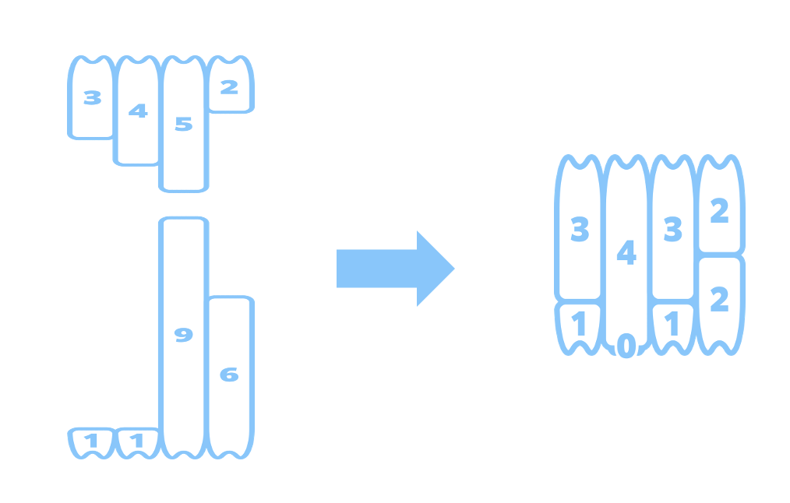
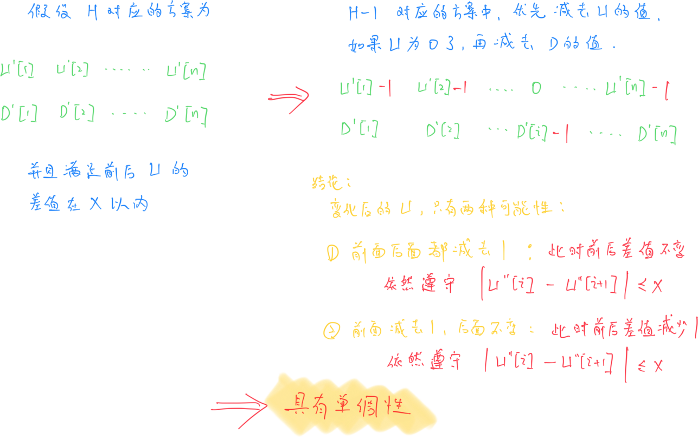

# **A - Strictly Increasing?**

Problem：[A - Strictly Increasing?](https://atcoder.jp/contests/abc395/tasks/abc395_a)

判断数组是否为严格递增。

并不是很难，直接比较前后两个数字即可。时间复杂度为 $O(n)$。

```c++
// Problem: https://atcoder.jp/contests/abc395/tasks/abc395_a

#include <bits/stdc++.h>
using namespace std;
typedef long long LL;
typedef pair<int, int> PII;

const int N = 110;
int n;
int a[N];

void solve() {
    // 读入数据
    cin >> n;
    for (int i = 0; i < n; i++)
        cin >> a[i];

    // 开始遍历每个数
    bool flag = false;
    for (int i = 1; i < n; i++)
        // 只要出现 前面的数字 大于等于 后面的数字，flag 标记
        if (a[i - 1] >= a[i])
            flag = true;

    // 只要有标记，说明不严格递增
    if (flag)
        cout << "No" << endl;
    // 否则就严格递增
    else
        cout << "Yes" << endl;
}

int main() {
    cin.tie(0);
    ios_base::sync_with_stdio(false);
    solve();
    return 0;
}
```

# **B - Make Target**

Problem：[B - Make Target](https://atcoder.jp/contests/abc395/tasks/abc395_b)

模拟题找规律。

## 题目：

给定数字 N，输出 N*N 的，下面形式的模式：

```c++
###########
#.........#
#.#######.#
#.#.....#.#
#.#.###.#.#
#.#.#.#.#.#
#.#.###.#.#
#.#.....#.#
#.#######.#
#.........#
###########
```

## 约束条件：

$1 \leq N \leq 50$

## 思路：

### 思路 1：

按照题目的描述编写代码即可。

对于 $i = 1,2,...,N$ ，那么 $j = N+1-i$。

根据题意，进行下面操作：

- 若 $i \le j$：从 $(i,i)$ 到 $(j,j)$ 矩形内填充颜色。$i$ 为偶数，填充白色 `.`；若 $i$ 为奇数，填充黑色`#`。

- 若 $i > j$：不进行任何操作

时间复杂度为 $O(n^3)$

```c++
// Problem: https://atcoder.jp/contests/abc395/tasks/abc395_b

#include <bits/stdc++.h>
using namespace std;
typedef long long LL;
typedef pair<int, int> PII;

const int N = 55;
char res[N][N];
int n;

void solve() {
    cin >> n;

    for (int i = 1; i <= n; i++) {
        int j = n + 1 - i;
        if (i > j)
            break;
        // 涂满(i,i) 到 (j,j) 区域
        char c = (i & 1) ? '#' : '.';
        for (int x = i; x <= j; x++)
            for (int y = i; y <= j; y++)
                res[x][y] = c;
    }

    for (int i = 1; i <= n; i++) {
        for (int j = 1; j <= n; j++)
            cout << res[i][j];
        cout << endl;
    }
}

int main() {
    cin.tie(0);
    ios_base::sync_with_stdio(false);
    solve();
    return 0;
}
```

### 思路 2：

描边。

每个点只会被遍历一遍。

时间复杂度 $O(n^2)$

```c++
// Problem: https://atcoder.jp/contests/abc395/tasks/abc395_b

#include <bits/stdc++.h>
using namespace std;
typedef long long LL;
typedef pair<int, int> PII;

const int N = 55;
int n;
char res[N][N];

void solve() {
    cin >> n;

    for (int i = 1; i <= n; i++) {
        // 预处理出来 j 的值
        int j = n + 1 - i;
        // 如果越界
        if (i > j)
            break;
        // 确定要填充的符号
        char c = (i & 1) ? '#' : '.';
        // 填充四条边
        for (int k = i; k <= j; k++) {
            // (i,i) -> (i,j) 上边界
            // (i,i) -> (j,i) 左边界
            res[i][k] = res[k][i] = c;
            // (i,j) -> (j,j) 右边界
            // (j,i) -> (j,j) 下边界
            res[k][j] = res[j][k] = c;
        }
    }

    // 输出结果
    for (int i = 0; i < n; i++) {
        for (int j = 0; j < n; j++)
            cout << res[i][j];
        cout << endl;
    }
}

int main() {
    cin.tie(0);
    ios_base::sync_with_stdio(false);
    solve();
    return 0;
}
```

### 思路 3：

推公式。

时间复杂度 $O(n^2)$。虽然时间复杂度是相同的，但显然这种方法我们将空间复杂度直接降到了 $O(1)$

```c++
// Problem: https://atcoder.jp/contests/abc395/tasks/abc395_b

#include <bits/stdc++.h>
using namespace std;
typedef long long LL;
typedef pair<int, int> PII;

const int N = 55;
int n;

void solve() {
    cin >> n;

    for (int i = 1; i <= n; i++) {
        for (int j = 1; j <= n; j++) {
            // 看当前点距离上下左右四条边界，哪条最近
            int id = min({i, j, n - i + 1, n - j + 1});
            // 确定奇偶性，从而确定符号
            cout << ((id & 1) ? '#' : '.');
        }
        cout << endl;
    }
}

int main() {
    cin.tie(0);
    ios_base::sync_with_stdio(false);
    solve();
    return 0;
}
```

# **C - Shortest Duplicate Subarray**

Problem：[C - Shortest Duplicate Subarray](https://atcoder.jp/contests/abc395/tasks/abc395_c)

## 题目：

长度为 N 的整数序列 $A = (A_1,A_2,\dots,A_N)$

找到含有重复元素的最短连续区间，输出长度。

## 约束条件：

$1 \leq N \leq 2 \times 10^5$

$1 \leq A_i \leq 10^6 \ (1 \leq i \leq N)$

## 思路：

我们可以知道，最短子区间中，一定存在 $A_L = A_R$ 这个硬性条件。那么每次进来一个新的数，我们只需要对比一下跟上一个数字相同的位置，计算区间距离即可。

使用一个数组就可以随时维护相同数字的上一次出现位置。时间复杂度为 $O(N)$。

```c++
// Problem: https://atcoder.jp/contests/abc395/tasks/abc395_b

#include <bits/stdc++.h>
using namespace std;
typedef long long LL;
typedef pair<int, int> PII;

const int M = 1e6 + 10;
int n;
int a;
int res;
int ls[M];  // v 最后出现的位置

void solve() {
    // ls 初始化
    memset(ls, -1, sizeof ls);
    // 读入数据
    cin >> n;
    // 预设一个正无穷值
    res = 1e9;
    // 开始遍历每个数
    for (int i = 0; i < n; i++) {
        cin >> a;
        // 如果这个数出现过
        if (ls[a] != -1) {
            // 更新长度值
            res = min(res, i - ls[a] + 1);
        }
        // 更新当前数字出现的位置
        ls[a] = i;
    }

    // 输出结果
    cout << (res == 1e9 ? -1 : res) << endl;
}

int main() {
    cin.tie(0);
    ios_base::sync_with_stdio(false);
    solve();
    return 0;
}
```

# **D - Pigeon Swap**

Problem：[D - Pigeon Swap](https://atcoder.jp/contests/abc395/tasks/abc395_d)

## 题目：

有 n 只鸽子，编号 1~n。有 n 个笼子，编号 1~n。

最开始，鸽子 i 在笼子 i 中。

接下来维护 Q 次操作：

- 将鸽子 a 放入笼子 b 中
- 将笼子 a 的鸽子全部放入笼子 b 中
- 询问鸽子 a 所在笼子的位置

## 约束条件：

$1 \leq N \leq 10^6$

$1 \leq Q \leq 3 \times 10^5$

## 思路：


# **E - Flip Edge**

Problem：[E - Flip Edge](https://atcoder.jp/contests/abc395/tasks/abc395_e)

## 题目：

给定一个 N 节点 M 条边的有向图。1 为初始点，N 为终点。

每次可以做两种操作：

- 沿着一条边走过去，花费 1
- 同时反转整个图的边，花费 X

求从 1 到 N 的最短路。

## 约束条件：

$2 \leq N \leq 2 \times 10^5$

$1 \leq M \leq 2 \times 10^5$

$1 \leq X \leq 10^9$

$1 \leq u _ i \leq N \ (1 \leq i \leq M)$

$1 \leq v _ i \leq N \ (1 \leq i \leq M)$

## 思路：

分层图建图的模板题。


# **F - Smooth Occlusion**

Problem：[F - Smooth Occlusion](https://atcoder.jp/contests/abc395/tasks/abc395_f)

二分，贪心，主元法

## 题目：

高桥有 2N 颗牙齿。上牙 N 颗，下牙 N 颗。

从左边数，上牙第 $i$ 颗牙齿长度为 $U_i$，下牙第 $i$ 颗牙齿长度为 $D_i$

同时满足下面条件，说明牙齿长得很好：

- 存在整数 H，使得 $U_i + D_i = H$
- 每个整数 i 都有$|U_i - U_{i+1} |\le X$

可以进行多次下面的操作：

- 花费代价 1，使某一个牙齿长度减 1

求为了使牙齿整齐排列，至少需要花费的代价。

## 约束条件：

$2 \leq N \leq 2 \times 10^5$

$1 \leq U _ i \leq 10^9 \ (1 \leq i \leq N)$

$1 \leq D _ i \leq 10^9 \ (1 \leq i \leq N)$

$1 \leq X \leq 10^9$

## 示例：



## 思路：

### 思路 1：二分

如果能够确定 $H$，那么总花费一定是 $\sum^n_{i=1} (U[i]+D[i])-nH$。可以发现这个公式中，前半部分求和的部分是不变的，唯一的变量就是 $H$。那么希望总花费尽可能小，就一定要找到最大的 $H$。

那么可以发现 H 实际上具有单调性。

> 单调性：如果 $H$ 能满足要求，那么 $H-1$ 一定能满足要求，那么所有小于 $H$ 的值都能满足要求。
>
> 上面的结论并不那么显然。下面简单证明一下：
>
> 
>
> 

#### 问题描述：

所以我们就可以把问题变成了一个二分的判定性问题。

我们定义一下这个判定性问题：

> 我们要找到变化后的序列 $U^{\prime}$ 满足下面条件：
>
> - 条件 1：$U^{\prime}[i] + D^{\prime}[i] = H$
> - 条件 2：$|U^{\prime}[i] - U^{\prime}[i+1]| \le X$

#### 条件 1 的处理：

对于条件 1，我们进行如下变形：

$U'[i] + D'[i] = H \Rightarrow  D'[i] = H - U'[i] $

同时满足下面条件：
$$
\begin{align*}
U'[i] &\leq U[i] &\quad D'[i] &\leq D[i] \\
\Rightarrow U'[i] &\leq U[i] &\quad H - U'[i] &\leq D[i] \\
\Rightarrow U'[i] &\leq U[i] &\quad H - D[i] &\leq U'[i] \\
&\Rightarrow \max(H - D[i], 0) \leq U'[i] \leq U[i] \\
&\Rightarrow L[i] \leq U'[i] \leq R[i] &
\end{align*}
$$
通过上面的推理，我们可以发现实际上 $U^{\prime}[i]$ 是存在一个范围的，这个范围由初始值来约束。

#### 条件 2 的处理：

条件 2 比较难处理。但是我们可以做下面的推导：

当 $i=1$ 时 ，有： $L[1] \leq U'[1] \leq R[1]$

当 $i=2$ 时 ，

- 首先有固定的约束条件：$L[2] \leq U'[2] \leq R[2]$

- 其次有引入的约束条件 2 ：$U'[1] - X \leq U'[2] \leq U'[1] + X$

将上面的两个约束条件合并起来，有新的约束条件为：

$\max(H - D[2], 0 , U'[1] - X) \leq U'[2] \leq \min( U[2] , U'[1] + X)$

当 $i=3$ 时 …………………………

从上面的公式推导就可以发现，每次更新 $U'[i]$ 时候，是需要用到上一次的 $U'[i-1]$ 来更新当前的范围的。

#### 可以使用的结论：

为了判别值为 $H$ 时候，序列 $U'[i]$ 是否满足要求，只需要从前往后遍历每一个值，保证下面不等式成立即可：
$$
\begin{equation*}
\max(H - D[i], 0 , U'[i-1] - X) \leq U'[i] \leq \min( U[i] , U'[i-1] + X)
\end{equation*}
$$
总时间复杂度为 $O(n\log n)$

#### 代码实现：

```c++
// Problem: https://atcoder.jp/contests/abc395/tasks/abc395_f

#include <bits/stdc++.h>
using namespace std;
typedef long long LL;
typedef pair<int, int> PII;

const int N = 2e5 + 10;
LL U[N], D[N];
LL n, X;

bool chk(LL H) {
    // L[i]: max(H-D[i] , 0)
    // R[i]: U[i]
    LL lst_L = max(H - D[1], 0ll), lst_R = U[1];
    for (int i = 2; i <= n; i++) {
        // 使用了下面的两个条件：
        // 条件 1：max(H-D[i] ,0) <= U'[i] <= U[i]
        // 条件 2：lst_L - X <= U'[i] <= lst_R + X
        lst_L = max({lst_L - X, H - D[i], 0ll});
        lst_R = min(U[i], lst_R + X);
        if (lst_L > lst_R)
            return false;
    }
    return true;
}

void solve() {
    // 变量初始化
    LL l = 0, r = 2e9;  // 左右范围
    LL res = -1;        // 结果
    LL sm = 0;          // 求和

    // 读入数据
    cin >> n >> X;
    for (int i = 1; i <= n; i++) {
        // 读入 U 和 D 的值
        cin >> U[i] >> D[i];
        // 更新 右范围 和 总和
        r = min(r, U[i] + D[i]);
        sm += U[i] + D[i];
    }

    // 二分
    while (l <= r) {
        LL mid = (l + r) >> 1;
        if (chk(mid))
            res = mid, l = mid + 1;
        else
            r = mid - 1;
    }

    // 输出结果
    cout << sm - n * res << endl;
}

int main() {
    cin.tie(0);
    ios_base::sync_with_stdio(false);
    solve();
    return 0;
}
```

### 思路 2：贪心

Reference：[F - Smooth Occlusion 解説 by MMNMM](https://atcoder.jp/contests/abc395/editorial/12345)

### 思路 3：差分约束

Reference：[F - Smooth Occlusion 解説 by MMNMM](https://atcoder.jp/contests/abc395/editorial/12345)
