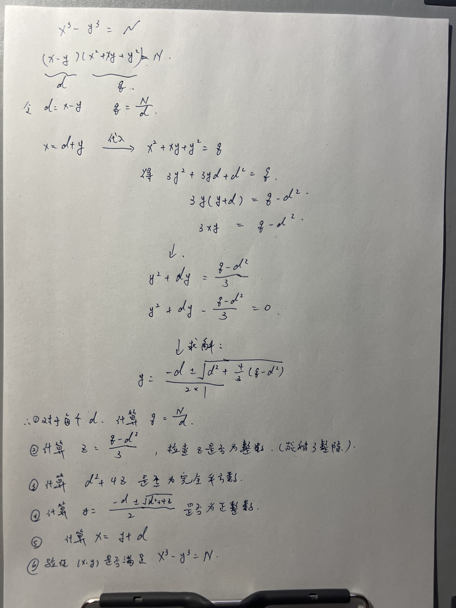

# **A - Thermometer**

Problem：[A - Thermometer](https://atcoder.jp/contests/abc397/tasks/abc397_a)

## 题目：

模拟。

非常简单的签到题。

题目中已经明说了小数只有一位，所以这里用 `double` 或者 `float` 都可以，一般更推荐使用 `double`。

```c++
// Problem: https://atcoder.jp/contests/abc397/tasks/abc397_a

#include <bits/stdc++.h>
using namespace std;
typedef long long LL;
typedef pair<int, int> PII;

void solve() {
    double a;
    cin >> a;
    if (a >= 38.0)
        cout << 1 << endl;
    else if (a < 37.5)
        cout << 3 << endl;
    else
        cout << 2 << endl;
}

int main() {
    cin.tie(0);
    ios_base::sync_with_stdio(false);
    solve();
    return 0;
}
```

# **B - Ticket Gate Log**

Problem：[B - Ticket Gate Log](https://atcoder.jp/contests/abc397/tasks/abc397_b)

贪心。

思路也非常的简单。

```c++
// Problem: https://atcoder.jp/contests/abc397/tasks/abc397_b

#include <bits/stdc++.h>
using namespace std;
typedef long long LL;
typedef pair<int, int> PII;

string s;
void solve() {
    cin >> s;
    int res = 0;
    for (int i = 0; i < s.size(); i++) {
        if (s[i] == 'i' && i + 1 < s.size() && s[i + 1] == 'o') {
            i++;
            continue;
        }
        res += 1;
    }
    cout << res << endl;
}

int main() {
    cin.tie(0);
    ios_base::sync_with_stdio(false);
    solve();
    return 0;
}
```

# **C - Variety Split Easy**

Problem：[C - Variety Split Easy](https://atcoder.jp/contests/abc397/tasks/abc397_c)

## 题目：

（题目是 F 题的简化版）

给定长度为 N 的整数序列 $A = (A_1, A_2, \ldots, A_N)$。

在中间某一位置，将 A 分割为两个非空集合。求两个集合不同整数计数之和的最大值。

## 约束条件：

$2 \leq N \leq 3 \times 10^5$

$1 \leq A_i \leq N$

## 思路：

### 思路 1：

简单来说需要解决下面几个问题：

1. 如何求出集合中的不同整数的个数？

   使用 `unordered_set` 就可以去除重复数字，得到集合的大小。

2. 如何维护集合中各个元素的个数？

   使用 `cnt` 数组来维护。index 是元素的值，value 是元素的个数。

时间复杂度 $O(n)$。

```c++
// Problem: https://atcoder.jp/contests/abc397/tasks/abc397_c

#include <bits/stdc++.h>
using namespace std;
typedef long long LL;
typedef pair<int, int> PII;

const int N = 3e5 + 10;
int num[N], cnt[N];                      // b 表示右边集合中，各个元素的个数
unordered_set<int> num_left, num_right;  // 左边集合，右边集合
int n, x;

void solve() {
    cin >> n;
    for (int i = 1; i <= n; i++) {
        cin >> x;
        num[i] = x;           // 保存数字
        cnt[x]++;             // 记录右边集合数字出现的次数
        num_right.insert(x);  // 将元素插入右边的集合
    }

    int res = 0;
    // 遍历每一个数字
    for (int i = 1; i <= n; i++) {
        x = num[i];          // 获取当前数字
        num_left.insert(x);  // 将当前数字插入左边集合
        cnt[x]--;            // 右边集合中数量减少 1
        // 如果当前元素恰好被清空，就从右边集合中清除当前数字
        if (cnt[x] == 0 && num_right.count(x) > 0)
            num_right.erase(x);
        // 记录答案
        res = max(res, (int)(num_left.size() + num_right.size()));
    }

    cout << res << endl;
}

int main() {
    cin.tie(0);
    ios_base::sync_with_stdio(false);
    solve();
    return 0;
}
```

### 思路 2：

提前预处理出来 `pre` 和 `suc` 数组，分别表示“从前往后”和“从后往前”看，截止每个位置的不重复数字的个数。

时间复杂度 $O(n)$

```c++
// Problem: https://atcoder.jp/contests/abc397/tasks/abc397_c

#include <bits/stdc++.h>
using namespace std;
typedef long long LL;
typedef pair<int, int> PII;

const int N = 3e5 + 10;
int num[N];  // 记录原始数组
// 记录，从“前往后看”和从“后往前看”，截止每个位置的不重复数字个数
int pre[N], suc[N];
unordered_set<int> s;
int n, x;

void solve() {
    // 读入数据
    cin >> n;
    for (int i = 1; i <= n; i++)
        cin >> num[i];

    // 从前往后看
    for (int i = 1; i <= n; i++) {
        s.insert(num[i]);
        pre[i] = s.size();
    }
    // 清空 set
    s.clear();
    // 从后往前看
    for (int i = n; i >= 1; i--) {
        s.insert(num[i]);
        suc[i] = s.size();
    }

    // 开始求前后集合的最大值
    int res = 0;
    for (int i = 1; i <= n - 1; i++)
        res = max(res, pre[i] + suc[i + 1]);

    cout << res << endl;
}

int main() {
    cin.tie(0);
    ios_base::sync_with_stdio(false);
    solve();
    return 0;
}
```

# **D - Cubes**

Problem：[D - Cubes](https://atcoder.jp/contests/abc397/tasks/abc397_d)

## 题目：

给定正整数 N。求满足 $x^3-y^3=N$ 的正整数对 $(x,y)$。如果不存在，输出 `-1`

## 约束条件：

$1 \leq N \leq 10^{18}$

## 思路：




# E

Problem：

## 题目：

## 约束条件：

## 思路：


# **F - Variety Split Hard**

Problem：[F - Variety Split Hard](https://atcoder.jp/contests/abc397/tasks/abc397_f)

## 题目：

给定长度为 N 的整数序列 $A = (A_1, A_2, \ldots, A_N)$。

在中间某两个位置，将 A 分割为三个非空集合。求三个集合不同整数计数之和的最大值。

## 约束条件：

$3 \leq N \leq 3 \times 10^5$

## 思路：

C 题中只切了一刀，分割为了两个集合。

本题中是切了两刀，分割为了三个集合。
