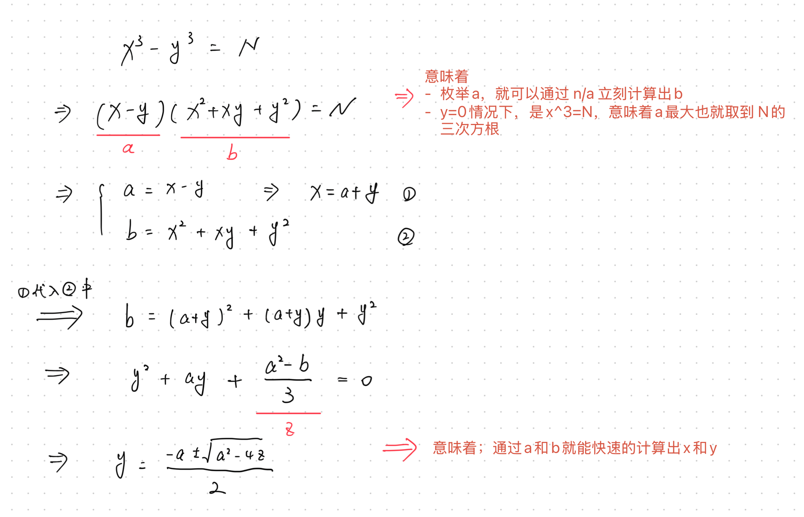
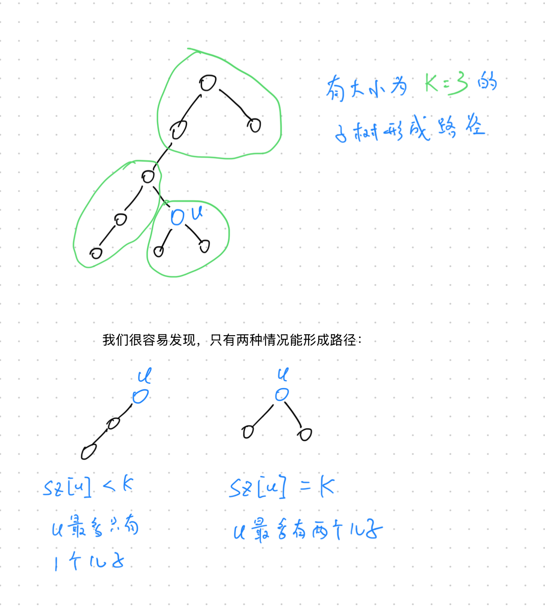

# **A - Thermometer**

Problem：[A - Thermometer](https://atcoder.jp/contests/abc397/tasks/abc397_a)

## 题目：

模拟。

非常简单的签到题。

题目中已经明说了小数只有一位，所以这里用 `double` 或者 `float` 都可以，一般更推荐使用 `double`。

```c++
// Problem: https://atcoder.jp/contests/abc397/tasks/abc397_a

#include <bits/stdc++.h>
using namespace std;
typedef long long LL;
typedef pair<int, int> PII;

void solve() {
    double a;
    cin >> a;
    if (a >= 38.0)
        cout << 1 << endl;
    else if (a < 37.5)
        cout << 3 << endl;
    else
        cout << 2 << endl;
}

int main() {
    cin.tie(0);
    ios_base::sync_with_stdio(false);
    solve();
    return 0;
}
```

# **B - Ticket Gate Log**

Problem：[B - Ticket Gate Log](https://atcoder.jp/contests/abc397/tasks/abc397_b)

贪心。

思路也非常的简单。

```c++
// Problem: https://atcoder.jp/contests/abc397/tasks/abc397_b

#include <bits/stdc++.h>
using namespace std;
typedef long long LL;
typedef pair<int, int> PII;

string s;
void solve() {
    cin >> s;
    int res = 0;
    for (int i = 0; i < s.size(); i++) {
        if (s[i] == 'i' && i + 1 < s.size() && s[i + 1] == 'o') {
            i++;
            continue;
        }
        res += 1;
    }
    cout << res << endl;
}

int main() {
    cin.tie(0);
    ios_base::sync_with_stdio(false);
    solve();
    return 0;
}
```

# **C - Variety Split Easy**

Problem：[C - Variety Split Easy](https://atcoder.jp/contests/abc397/tasks/abc397_c)

## 题目：

（题目是 F 题的简化版）

给定长度为 N 的整数序列 $A = (A_1, A_2, \ldots, A_N)$。

在中间某一位置，将 A 分割为两个非空集合。求两个集合不同整数计数之和的最大值。

## 约束条件：

$2 \leq N \leq 3 \times 10^5$

$1 \leq A_i \leq N$

## 思路：

### 思路 1：

简单来说需要解决下面几个问题：

1. 如何求出集合中的不同整数的个数？

   使用 `unordered_set` 就可以去除重复数字，得到集合的大小。

2. 如何维护集合中各个元素的个数？

   使用 `cnt` 数组来维护。index 是元素的值，value 是元素的个数。

时间复杂度 $O(n)$。

```c++
// Problem: https://atcoder.jp/contests/abc397/tasks/abc397_c

#include <bits/stdc++.h>
using namespace std;
typedef long long LL;
typedef pair<int, int> PII;

const int N = 3e5 + 10;
int num[N], cnt[N];                      // b 表示右边集合中，各个元素的个数
unordered_set<int> num_left, num_right;  // 左边集合，右边集合
int n, x;

void solve() {
    cin >> n;
    for (int i = 1; i <= n; i++) {
        cin >> x;
        num[i] = x;           // 保存数字
        cnt[x]++;             // 记录右边集合数字出现的次数
        num_right.insert(x);  // 将元素插入右边的集合
    }

    int res = 0;
    // 遍历每一个数字
    for (int i = 1; i <= n; i++) {
        x = num[i];          // 获取当前数字
        num_left.insert(x);  // 将当前数字插入左边集合
        cnt[x]--;            // 右边集合中数量减少 1
        // 如果当前元素恰好被清空，就从右边集合中清除当前数字
        if (cnt[x] == 0 && num_right.count(x) > 0)
            num_right.erase(x);
        // 记录答案
        res = max(res, (int)(num_left.size() + num_right.size()));
    }

    cout << res << endl;
}

int main() {
    cin.tie(0);
    ios_base::sync_with_stdio(false);
    solve();
    return 0;
}
```

### 思路 2：

提前预处理出来 `pre` 和 `suc` 数组，分别表示“从前往后”和“从后往前”看，截止每个位置的不重复数字的个数。

时间复杂度 $O(n)$

```c++
// Problem: https://atcoder.jp/contests/abc397/tasks/abc397_c

#include <bits/stdc++.h>
using namespace std;
typedef long long LL;
typedef pair<int, int> PII;

const int N = 3e5 + 10;
int num[N];  // 记录原始数组
// 记录，从“前往后看”和从“后往前看”，截止每个位置的不重复数字个数
int pre[N], suc[N];
unordered_set<int> s;
int n, x;

void solve() {
    // 读入数据
    cin >> n;
    for (int i = 1; i <= n; i++)
        cin >> num[i];

    // 从前往后看
    for (int i = 1; i <= n; i++) {
        s.insert(num[i]);
        pre[i] = s.size();
    }
    // 清空 set
    s.clear();
    // 从后往前看
    for (int i = n; i >= 1; i--) {
        s.insert(num[i]);
        suc[i] = s.size();
    }

    // 开始求前后集合的最大值
    int res = 0;
    for (int i = 1; i <= n - 1; i++)
        res = max(res, pre[i] + suc[i + 1]);

    cout << res << endl;
}

int main() {
    cin.tie(0);
    ios_base::sync_with_stdio(false);
    solve();
    return 0;
}
```

# **D - Cubes**

Problem：[D - Cubes](https://atcoder.jp/contests/abc397/tasks/abc397_d)

## 题目：

给定正整数 N。求满足 $x^3-y^3=N$ 的正整数对 $(x,y)$。如果不存在，输出 `-1`

## 约束条件：

$1 \leq N \leq 10^{18}$

## 思路：

> Tips：`long long` 的最大值是 $2^{63}-1 \approx 9\times 10^{18}$

如果直接枚举 x 和 y 的话，时间复杂度大约为 ${\sqrt[3] {10^{18}}}^2 \approx 10^{12}$，肯定是不能被接受的。理想的时间复杂度应该是 $10^6$ 或者 $10^6 \log 10^6$。

那么最好的思路应该是：**枚举一个数，然后快速的算出另一个数，判断是否满足条件。**

推导思路如下：



通过上面的流程，就可以在枚举 a 的情况下，快速计算出 b，同时快速计算出 x 和 y 的值。（注意流程中的几个隐藏条件即可）

```c++
// Problem: https://atcoder.jp/contests/abc397/tasks/abc397_d

#include <bits/stdc++.h>
using namespace std;
typedef long long LL;
typedef pair<int, int> PII;

LL N;

void solve() {
    cin >> N;

    // 开始枚举 a
    for (LL a = 1; a * a <= N / a; a++) {
        // 判断是否存在 b
        if (N % a == 0) {
            LL b = N / a;

            // 判断 z 是否是个整数
            LL z = a * a - b;
            if (z % 3 == 0) {
                z /= 3;
                // 判断 y 是否存在
                if (a * a - 4 * z >= 0) {
                    LL root = sqrt(a * a - 4 * z);
                    LL y = (-a + root) / 2;
                    if (y > 0 && (-a + root) % 2 == 0) {
                        LL x = y + a;
                        // 输出答案，结束程序
                        if (x * x * x - y * y * y == N) {
                            cout << x << " " << y << endl;
                            return;
                        }
                    }
                }
            }
        }
    }

    cout << -1 << endl;
}

int main() {
    cin.tie(0);
    ios_base::sync_with_stdio(false);
    solve();
    return 0;
}
```

## 补充题目：

Problem：[D - I hate Factorization](https://atcoder.jp/contests/abc166/tasks/abc166_d)

这道题目和本题类似，但是难度大大降低。

我们首先考虑一个数列：$n^5-(n-1)^5$

简单计算一下这个数列，可以得到下列数据：

```
n = 1: value = 1
n = 2: value = 31
n = 3: value = 211
n = 4: value = 781
……………………
n = 118: value = 953097211
n = 119: value = 985959031
```

从上面可以知道，**前后两个数的五次方之间的差，第一次超过 `1e9` 是在下标为 `120` 的时候。**

如果两个数之间差距越大，那么他们五次方的差超过 1e9 的速度就越快。从上可以知道，实际上我们仅仅遍历 `[-120,120]` 之间的数其实就够枚举出答案了。

使用最暴力的全枚举，或者引入 map 预先保存预处理的五次方值，均可以解出本题。

```c++
// Problem: https://atcoder.jp/contests/abc166/tasks/abc166_d

#include <bits/stdc++.h>
using namespace std;
typedef long long LL;
typedef pair<int, int> PII;

LL X;
void solve() {
    cin >> X;

    // 预处理出来范围内的 五次方值
    unordered_map<LL, LL> mp;
    for (int a = -120; a < 121; a++)
        mp[1ll * a * a * a * a * a] = a;

    // 看一下能不能找到配对的值
    for (pair<LL, LL> d : mp) {
        LL b5 = d.first, b = d.second;
        if (mp.count(X + b5)) {
            LL a = mp[X + b5];
            cout << a << " " << b << endl;
            return;
        }
    }
}

int main() {
    cin.tie(0);
    ios_base::sync_with_stdio(false);
    solve();
    return 0;
}
```

# **E - Path Decomposition of a Tree**

Problem：[E - Path Decomposition of a Tree](https://atcoder.jp/contests/abc397/tasks/abc397_e)

树状 DP + DFS

## 题目：

给定一棵树，有 $NK$ 个节点，编号为 $1,2,…, NK$。有 $NK-1$ 条无向边。

判断这棵树是否能被分解为 N 条长度为 K 的路径。

更准确的说，是否存在一个 $N\times K$ 的矩阵 P，满足：

- 矩阵的所有元素是 $1\sim NK$ 的一种排列。
- 矩阵中的元素中，$P_{i,j}$ 和 $P_{i,j+1}$ 之间有边相连。（即矩阵中每一行，前后两个节点间都有边）

## 约束条件：

$1 \leq N$

$1 \leq K$

$NK \leq 2 \times 10^5$

$1 \leq u_i < v_i \leq NK$

## 思路：

详细思路如下图所示：



```c++
// Problem: https://atcoder.jp/contests/abc397/tasks/abc397_e

#include <bits/stdc++.h>
using namespace std;
typedef long long LL;
typedef pair<int, int> PII;

const int NK = 2e5 + 10;

vector<int> G[NK];
int n, k, sz[NK];

// 输出 No 并直接结束程序
void NO() {
    cout << "No" << endl;
    // 直接结束程序
    exit(0);
}

void dfs(int u, int fa) {
    sz[u] = 1;
    int son = 0;
    // 遍历 u 的所有子节点
    for (int v : G[u])
        if (v != fa) {
            dfs(v, u);
            // 如果子节点尺寸还有剩余
            if (sz[v]) {
                son++;
                sz[u] += sz[v];
            }
        }

    // 如果 sz[u]<k，说明此时 u 只能形成单链结构
    if (sz[u] < k) {
        // 如果 u 是根节点 或 u 有超过 2 个儿子
        if (u == 1 || son > 1)
            NO();
    }
    // 如果 sz[u]==k，说明此时 u 可以有两个儿子
    else if (sz[u] == k) {
        if (son > 2)
            NO();
        // 清空该子树
        sz[u] = 0;
    }
    // 直接判断不成立
    else
        NO();
}

void solve() {
    // 读入数据 并 建图
    cin >> n >> k;
    for (int i = 1; i < n * k; i++) {
        int u, v;
        cin >> u >> v;
        G[u].push_back(v), G[v].push_back(u);
    }

    // 1号节节点为根节点，0为虚拟父节点
    dfs(1, 0);

    cout << "Yes" << endl;
}

int main() {
    cin.tie(0);
    ios_base::sync_with_stdio(false);
    solve();
    return 0;
}
```

# **F - Variety Split Hard（TODO）**

Problem：[F - Variety Split Hard](https://atcoder.jp/contests/abc397/tasks/abc397_f)

线段树

## 题目：

给定长度为 N 的整数序列 $A = (A_1, A_2, \ldots, A_N)$。

在中间某两个位置，将 A 分割为三个非空集合。求三个集合不同整数计数之和的最大值。

## 约束条件：

$3 \leq N \leq 3 \times 10^5$

## 思路：

C 题中只切了一刀，分割为了两个集合。

本题中是切了两刀，分割为了三个集合。
